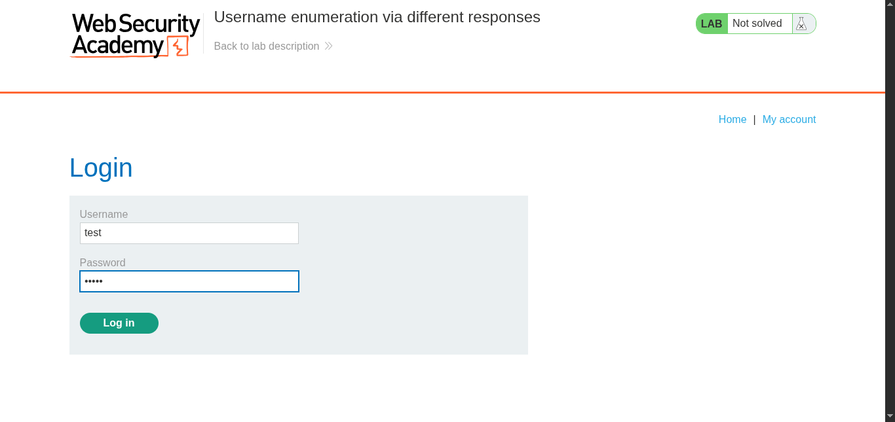
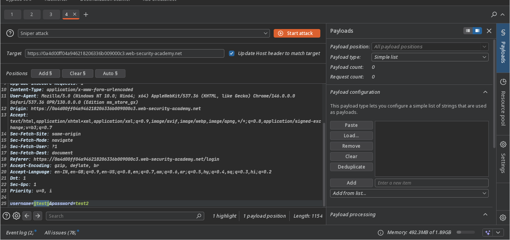
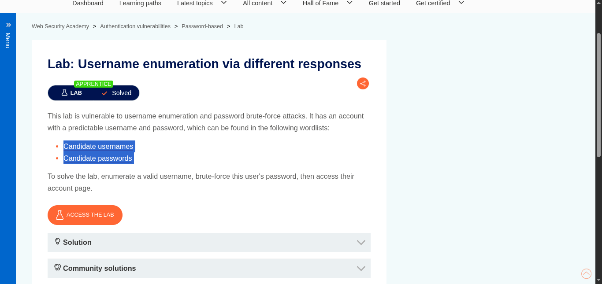
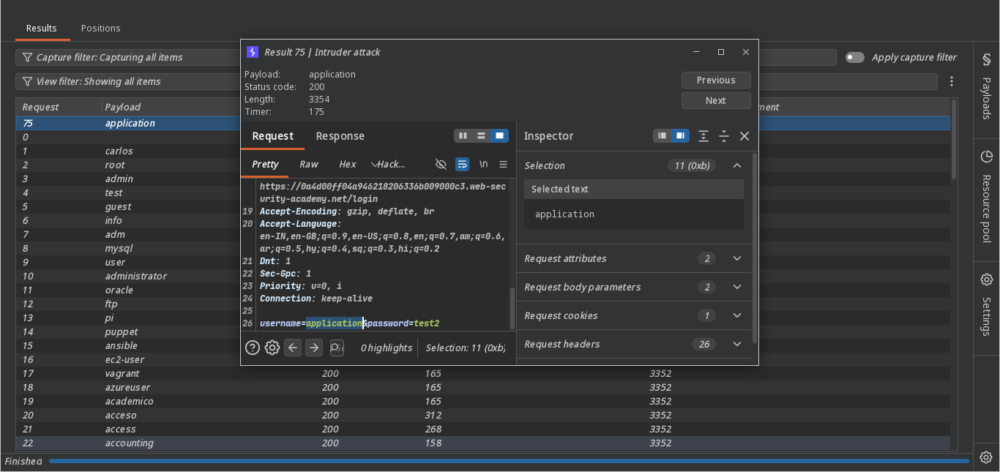
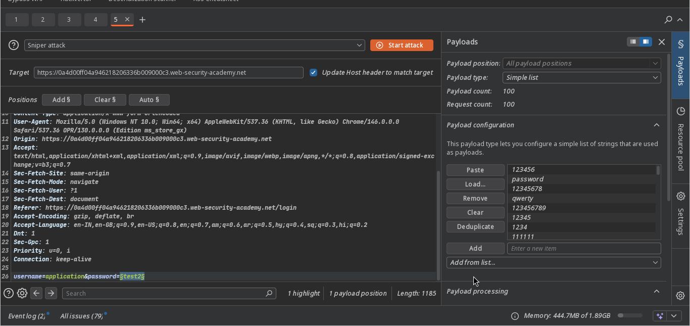
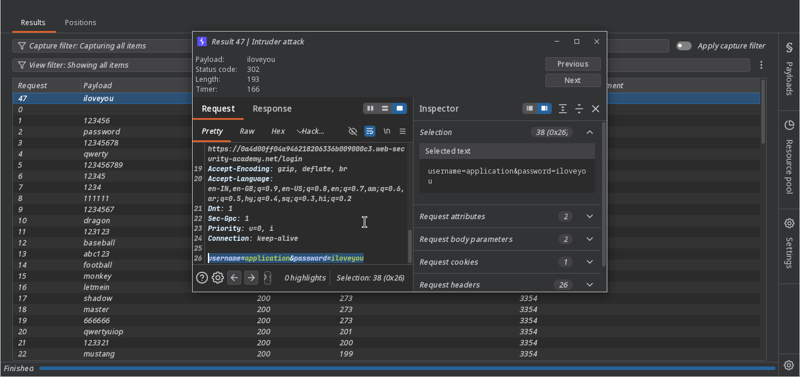
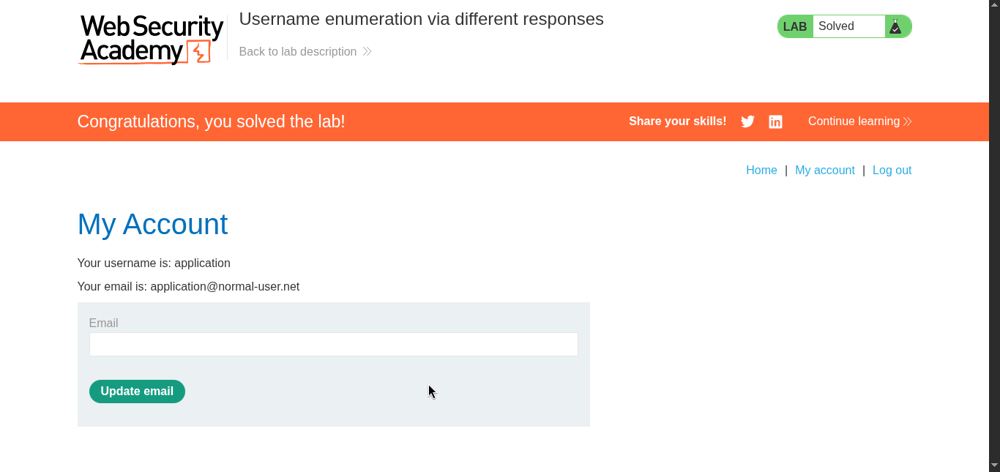

>>> Target -> Lab: Username enumeration via different responses

----
**Vulnerability**: No rate limiting
**Goal**: Enumerate a valid username, brute-force its password, and log in.

----

### Steps:
1. #### Open the lab and perform a test login.
   

2. #### Capture the request in Burp Suite and send it to Intruder.

3. #### First, enumerate usernames:
   
   - The lab provides username and password wordlists:
   

4. #### Identify the valid username:
     

5. #### Then brute-force the password for this username in Intruder:
    

6. #### The valid username and password are:
    - `application`:`iloveyou`
    
7. #### Log in with these credentials.

8. #### The lab is solved.
    

