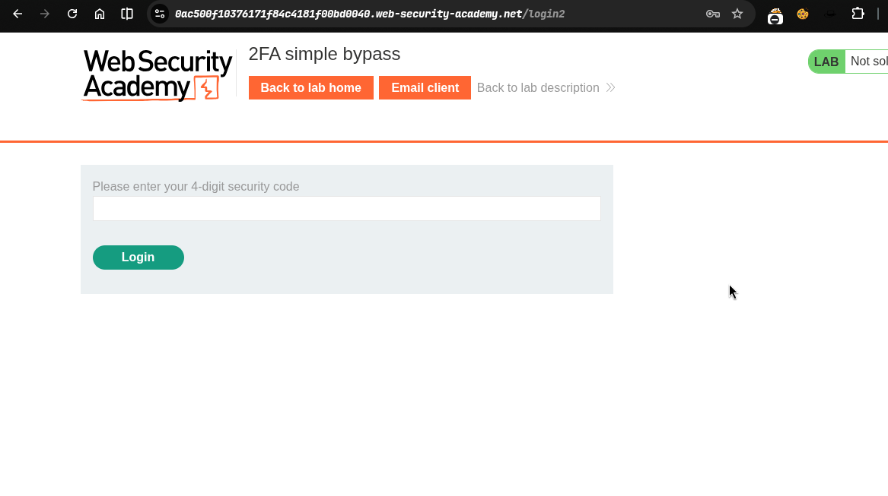
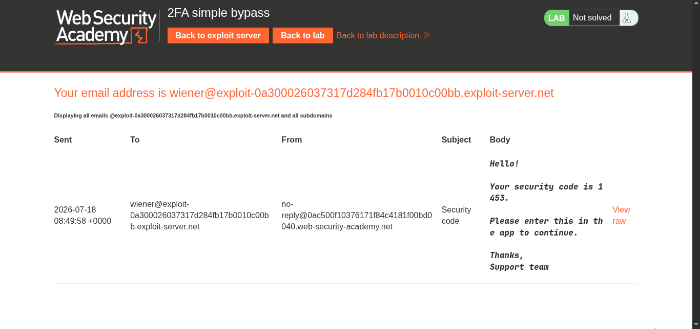
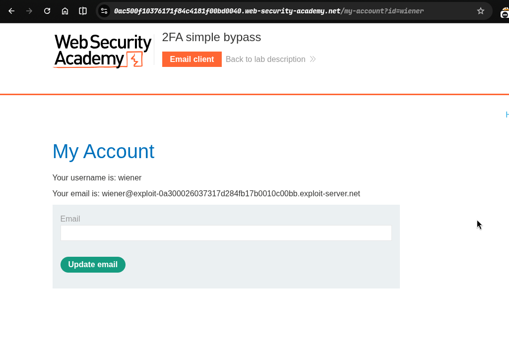
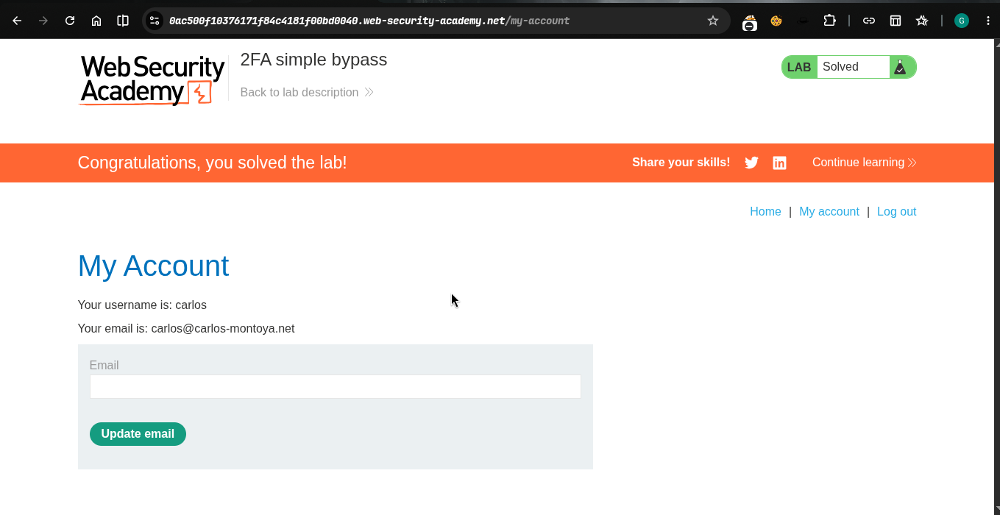

>> Target -> Lab: 2FA simple bypass

---- 

**Vulnerability**: Broken authentication (2FA bypass via forced browsing)
**Goal**: Access Carlos's account page by bypassing 2FA.

----

### Steps:
1. #### Open the lab.
2. #### Log in with your credentials (`wiener:peter`) and note the 2FA verification URL.
      - 

3. #### Note the authenticated `/my-account` URL after completing your own 2FA: 
4. #### Log out.
5. #### Log in with the victim's credentials (`carlos:montoya`).
6. #### At the 2FA verification prompt, manually navigate to `/my-account`.
7. #### The page loads without 2FA, so the lab is solved.
    

>>> ### See `poc.py` to automate this attack.
