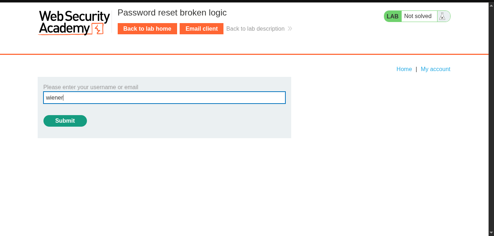
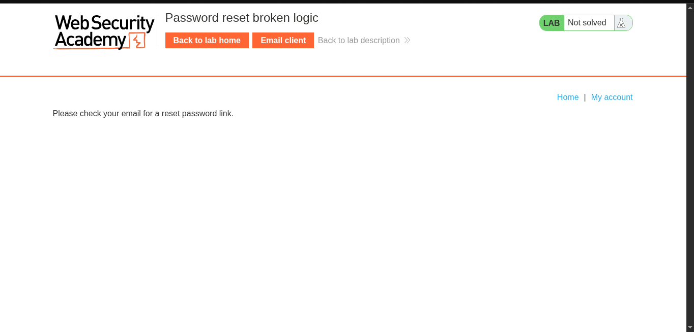
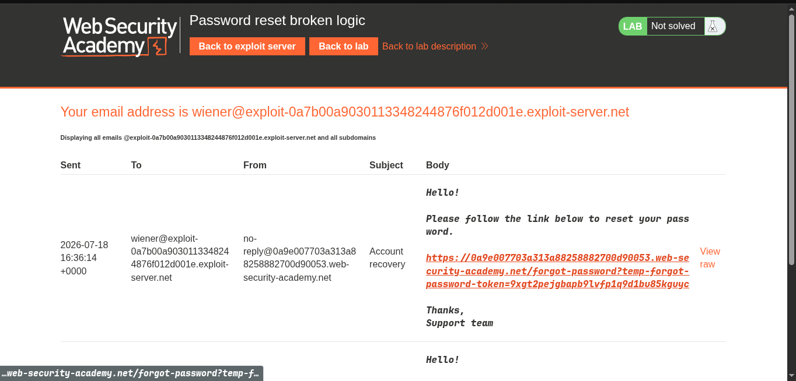
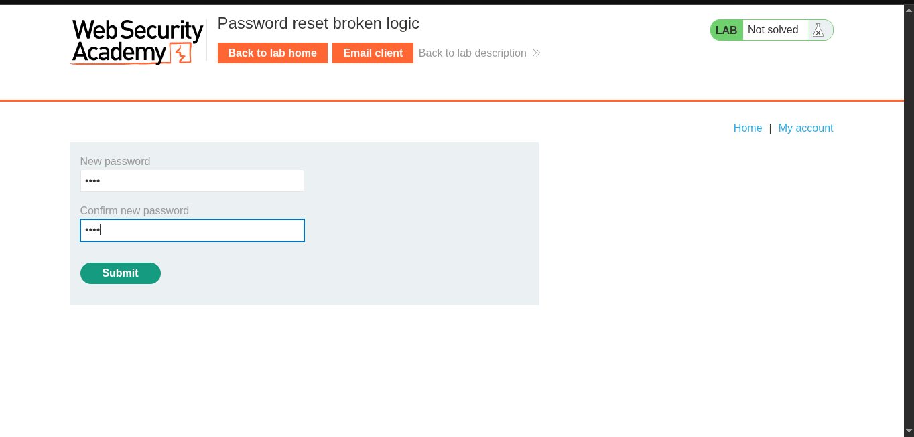
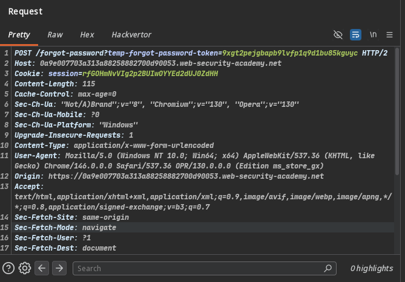
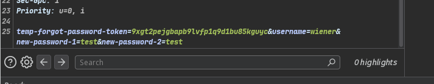
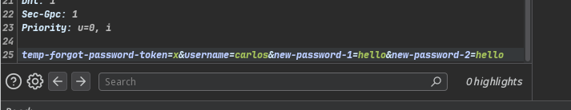
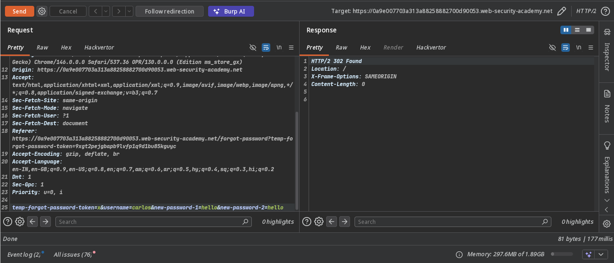
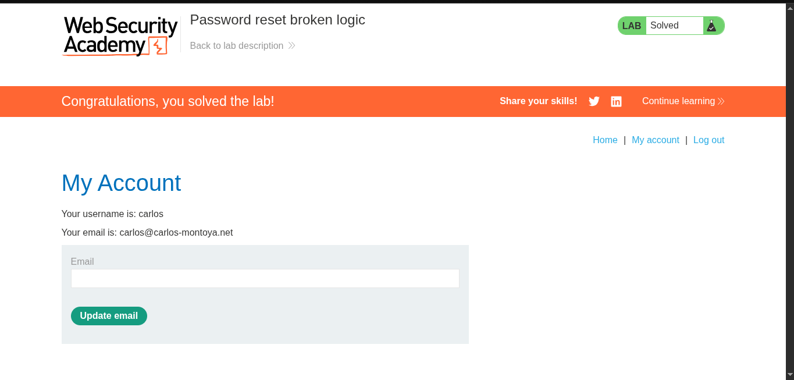

>> Target -> Lab: Password reset broken logic

---- 
**Vulnerability**: Password-reset logic flaw  
**Goal**: Reset Carlos's password, then log in and access the My account page.

---

### Steps: 
1. #### Open the lab.
2. #### Request a password reset for the Wiener account to understand the flow:
     
3. #### Confirm that the password-reset link is sent by email:
     
4. #### Check the email:
     
5. #### Open the reset link and reset the password:
    

6. #### Inspect this request in Burp Proxy and send it to Repeater:
    - 
    - 
7. #### Change `username=wiener` to `username=carlos` (the server does not validate the token value).
8. #### Replace the temporary token with a random value and change Carlos's password:
    - 
    - 
     **Change the temporary-token value in both locations.**

9. #### Log in with Carlos's new password.
10. #### The lab is solved:
     

>> ### See `poc.py` to automate this attack.
