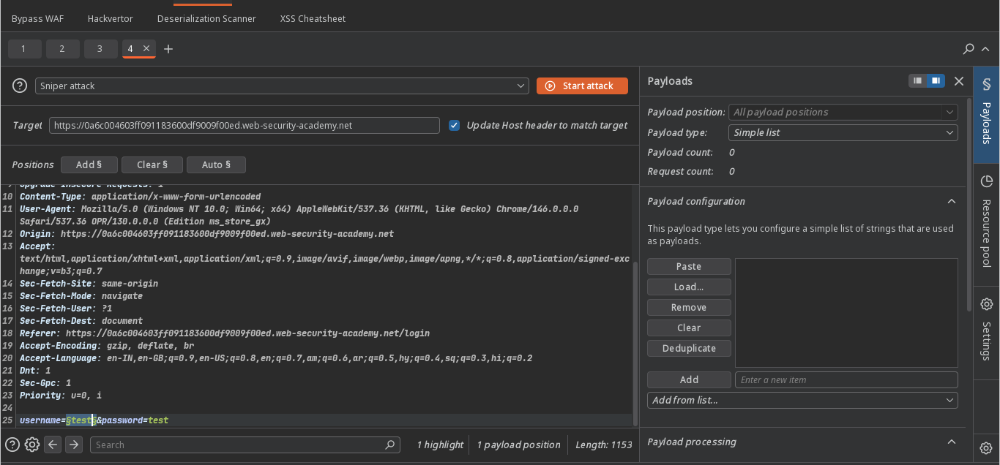
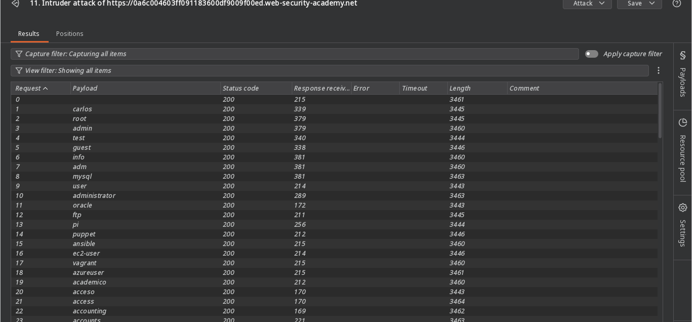
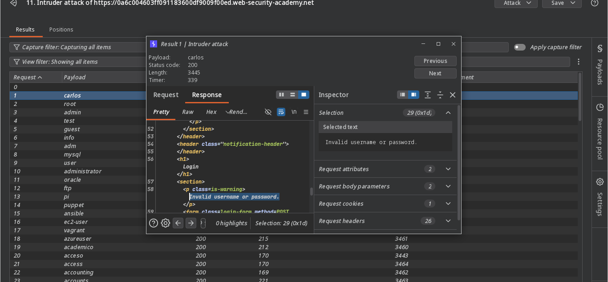
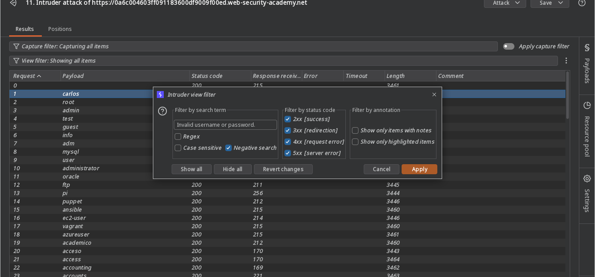
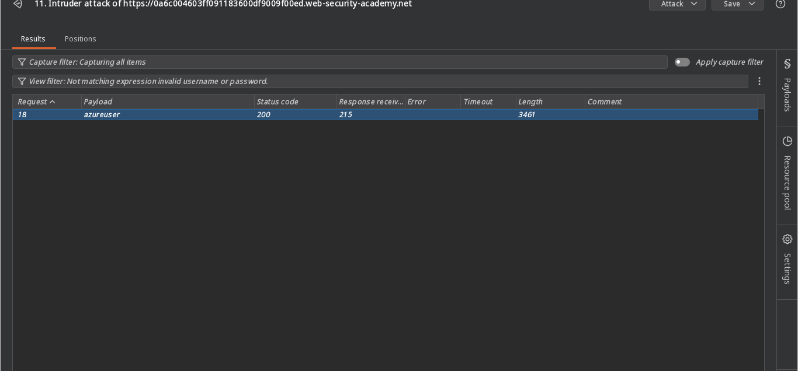
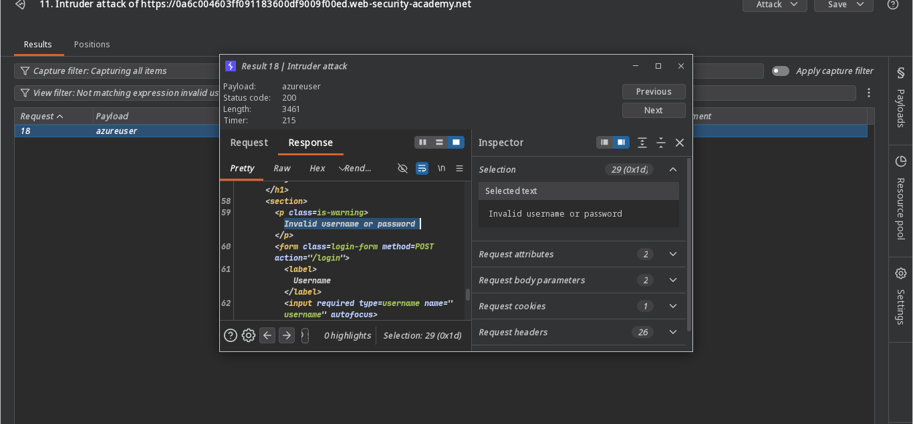
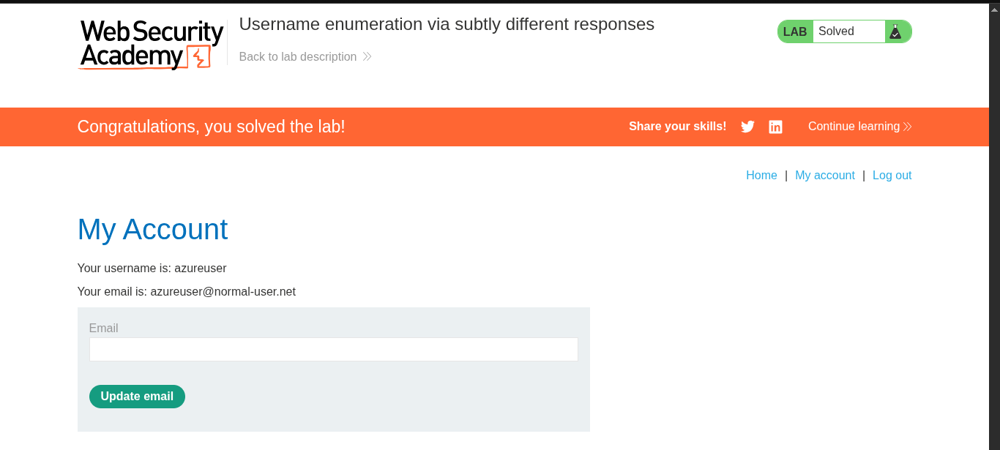

>> ### Target -> Lab: Username enumeration via subtly different responses

---
**Vulnerability**: Username Enumeration
**Goal**: Find a valid username, brute-force its password, log in, and solve the lab.

### Steps:
1. #### Open the lab and perform a test login.
2. #### Send the request to Burp Intruder:
    

3. #### Brute-force usernames: 
    - The lab already provides a username list.
4. #### All responses have status code `200`, but their lengths differ. Check the difference for each username.
5. #### Identify the response difference: 
    - Apply a filter for the difference: .
    - The filtered result identifies the valid username: 
    - The difference is shown here: 
    - The valid response contains a trailing period (`.`).
    >> Now brute-force the password for this username using the provided password list. In Intruder, a `302` status code indicates valid credentials.
    >> Note: Your username and password may differ, but the enumeration and brute-force logic is the same.

6. #### Log in with the discovered credentials.
7. #### The lab is solved:
    - 
