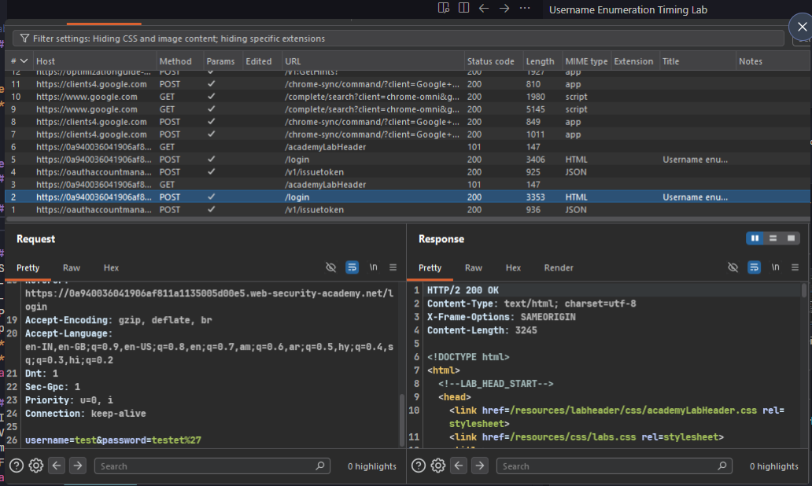
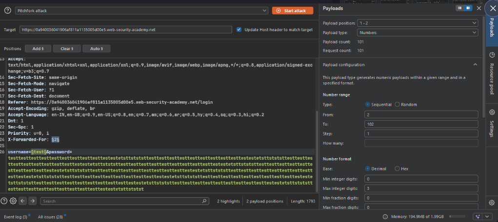
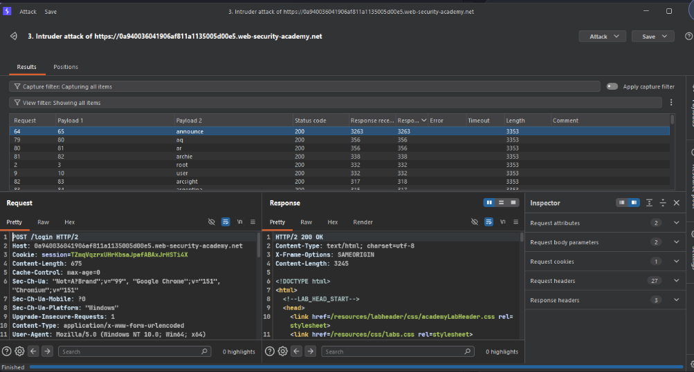
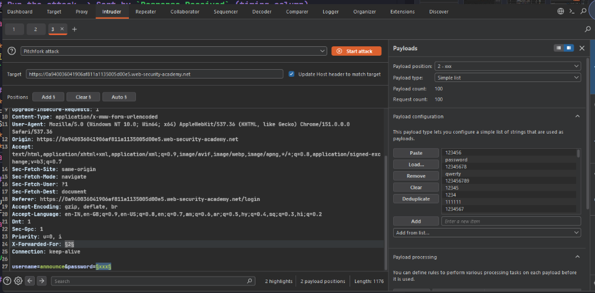
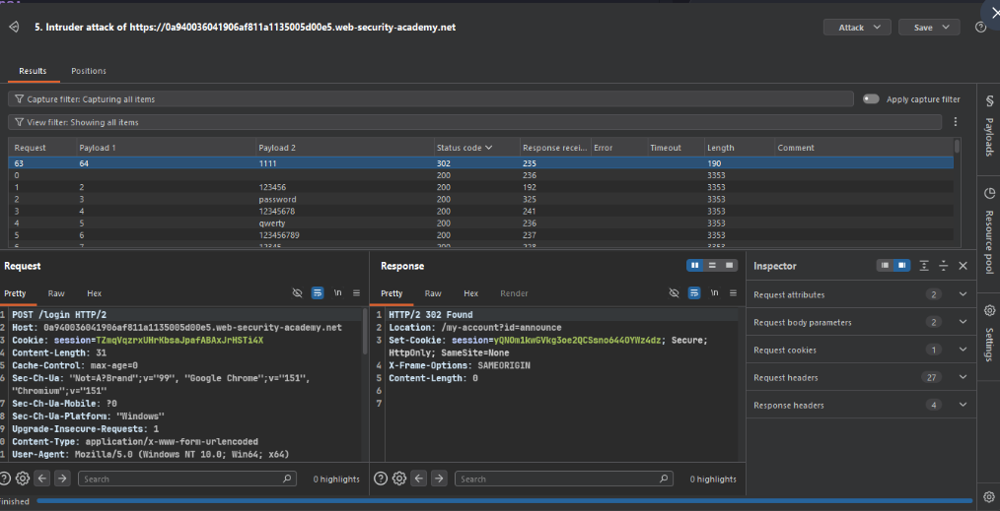
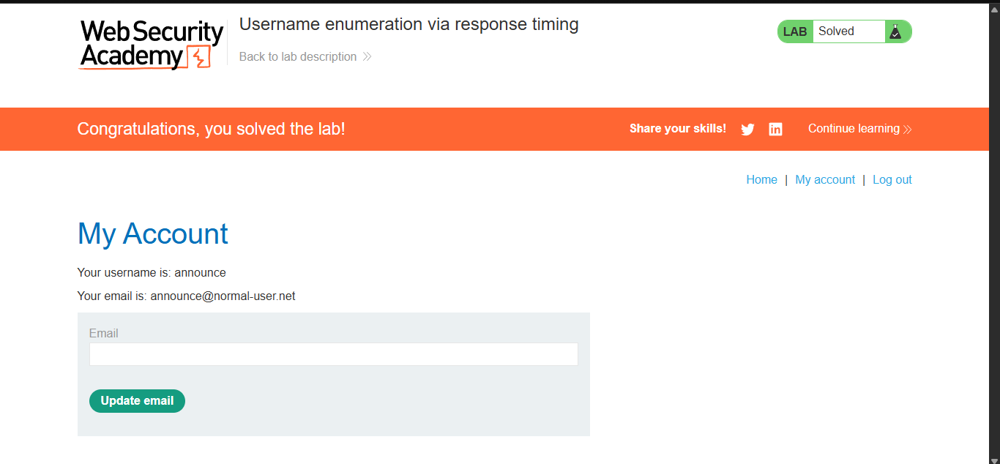

>> #### Target -> Lab: Username enumeration via response timing

---
**Vulnerability**: username and password brute force via response timing  
**Goal**: Log in with credentials.  

---

### ⚠️ Why Burp Suite Proxy + `X-Forwarded-For` was needed?

This lab has **IP-based brute force protection** enabled:  
- Multiple wrong login attempts from the same IP → server **blocks for 30 minutes**  
- This protection also triggers when logging in directly through the browser  
- So trying `announce:1111` directly in the browser results in **"You are blocked"** error

**Solution → Intercept the login request in Burp Suite Proxy and manually add `X-Forwarded-For` header:**
```
X-Forwarded-For: 1.2.3.4
```
- The server treats this header as the **client's real IP address**  
- Using a **different fake IP** in each request makes the server think it's a different user  
- This effectively **bypasses the rate-limit** and allows login  

> **Root Cause:** The server blindly trusts the `X-Forwarded-For` header without validation — this is a misconfiguration.

---

### Steps:
1. #### Open the lab and perform a test login.

2. #### Capture the login request in Burp Proxy → HTTP history.
    

3. #### Send this request into Burp -> Intruder -> Pitchfork attack:
    - Set **2 payload positions**:  
      - Position `§1§` → `X-Forwarded-For:` header (for IP rate-limit bypass)  
      - Position `§2§` → `username=` field  
    - Password field → fill with very long string (100+ chars) for timing amplification  
    - **Payload 1** (X-Forwarded-For) → Numbers: From `2`, To `102`, Step `1`  
    - **Payload 2** (username) → Simple list → load provided username wordlist  
    

4. #### Run the attack and sort by `Response Received` (the timing column).
    - Invalid usernames → response time ~300-350ms  
    - Valid username → response time **spikes to 3000ms+** (bcrypt hashing takes time!)  
    - Found valid username → `announce`  
    

    > **Why timing works?** → Server only runs bcrypt password hash if username exists. Long password = more hash time = detectable delay.  
    > `X-Forwarded-For` random IP → bypasses IP-based brute force protection.

5. #### Now brute-force the password with the valid username `announce`:
    - **Attack type**: Pitchfork  
    - Fix `username=announce` in body  
    - Set position `§xxx§` on `password=` field  
    - **Payload 1** (X-Forwarded-For) → Numbers: From `2`, To `102`, Step `1`  
    - **Payload 2** (password) → Simple list → load provided password wordlist  
    

6. #### In results -> filter/sort by `Status code` -> look for `302` redirect
    - `302 Found` with `Location: /my-account?id=announce` = valid credentials found!  
    - Found password → `1111`  
    

    >> Note: `Your username and password may differ, but the enumeration and brute-force logic is the same.`

7. #### Log in with `announce:1111`; direct browser login will be blocked.
    - Turn ON Burp Suite Proxy intercept  
    - Intercept the login request → manually add:  
      ```
      X-Forwarded-For: 99.99.99.99
      ```
    - Forward the request → Lab Solved ✅  
    
