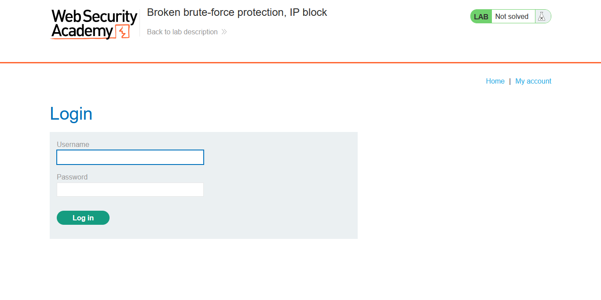
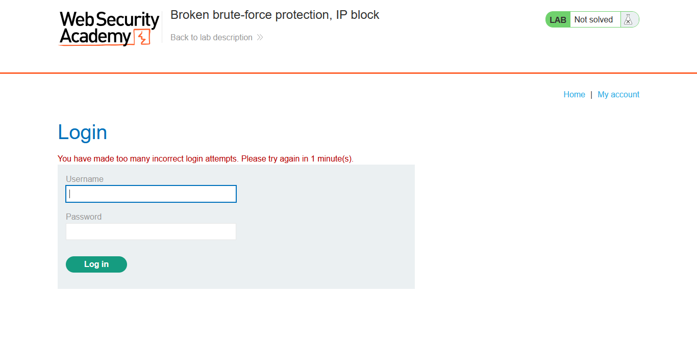
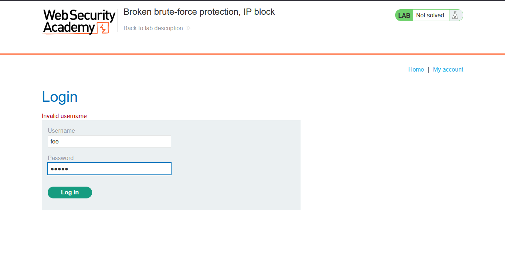
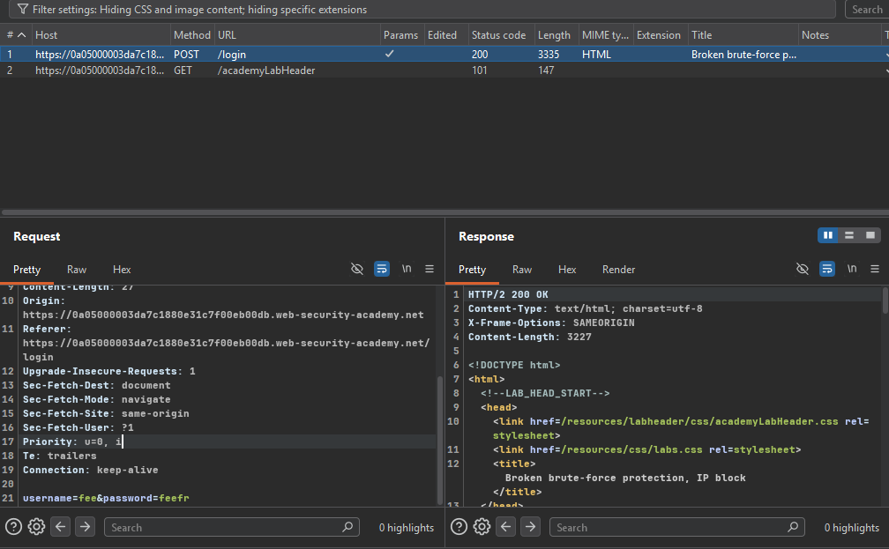
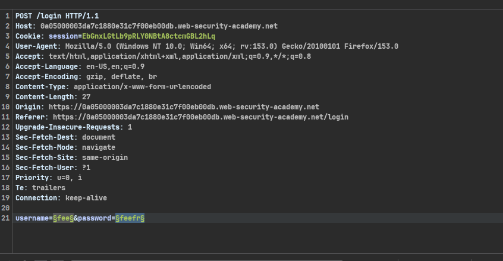
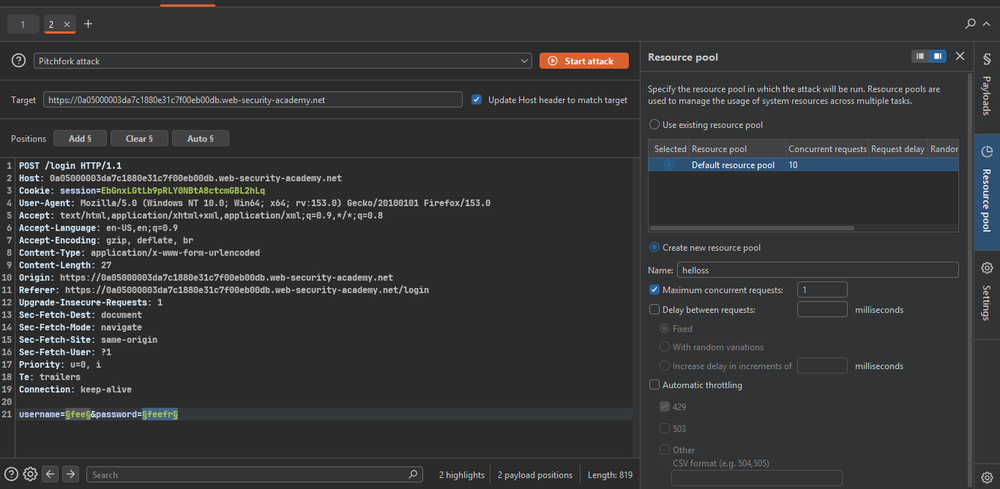
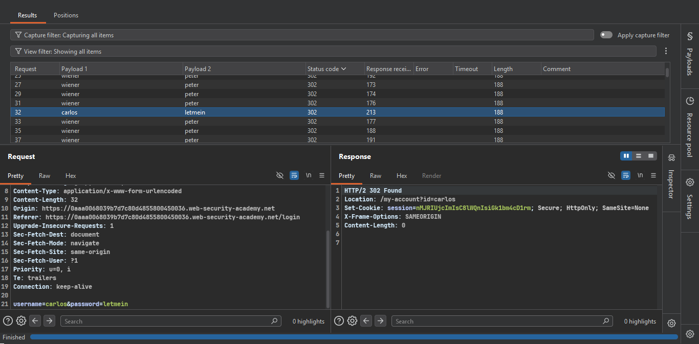
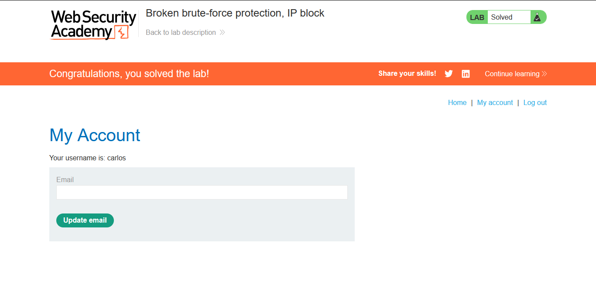

>> ###  Target Lab: Broken brute-force protection, IP block


```
**Vulnerability**
:This lab is vulnerable because of a logic flaw in its password brute-force protection.

**Goal**
:Obtain Carlos's password by brute-forcing the login page and bypassing the IP block.

```


### Steps:
1. #### Open the lab.
2. #### Try random credentials on the login page.
    - 
3. #### After a 3 to 4  attempts, the server will block your IP address for 1 minute.
    - 

4. #### After the block, I noticed that logging in with my own valid credentials resets the failed login counter, allowing me to bypass the IP block. 

5. #### Submit random credentials and capture the request in Burp Suite.
    - 
    - 

6. #### Send the request to Intruder and set payload positions for the username and password fields.
    - 

7. #### Set the payloads for the username and password fields.
    - use username.txt 
    - password.txt wordlists provided in the lab.

8. #### Why and How the Payload Lists Were Built

    **Why:**
    The server blocks the IP after 3 failed logins in a row. But logging in successfully resets that counter back to 0. So the plan is: send my own valid login right before every guess against `carlos`. This way the counter never reaches 3, and the IP never gets blocked.

    **How:**
    Two payload lists were created, aligned line by line:

Username list         Password list
--------------         --------------
wiener          →      peter        (my valid login, resets counter)
carlos          →      123456       (1st guess)
wiener          →      peter        (resets counter)
carlos          →      password     (2nd guess)
wiener          →      peter        (resets counter)
carlos          →      12345678     (3rd guess)
...


9. #### Configure a new resource pool.
    - 

10. ####   Why the Resource Pool Was Set to 1.

```md

    - Burp Intruder normally sends multiple requests at the same time (in parallel) to make attacks faster. But for this attack, the **order of requests matters** — each valid login (`wiener`) must reach the server *before* the next guess (`carlos`) is sent, so the counter resets at the right time.

    - If requests were sent in parallel, they could arrive at the server out of order (e.g., two `carlos` guesses arriving back-to-back before the `wiener` reset request completes), which would break the reset pattern and could still trigger the IP block.

    - To prevent this, assign the attack to a **Resource Pool** with **Maximum concurrent requests = 1**. This forces Burp to send one request at a time and wait for each response before sending the next, guaranteeing the sequence: reset → guess → reset → guess.

```

11. #### Run the attack and look for a `302` redirect in the results.
    - 

12. #### Use the discovered password to log in as Carlos and solve the lab.
    - 
