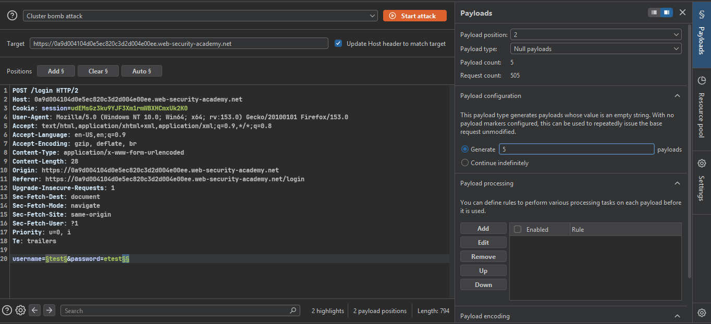
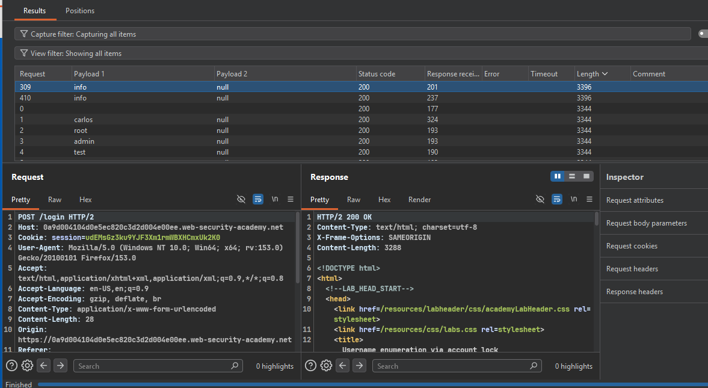
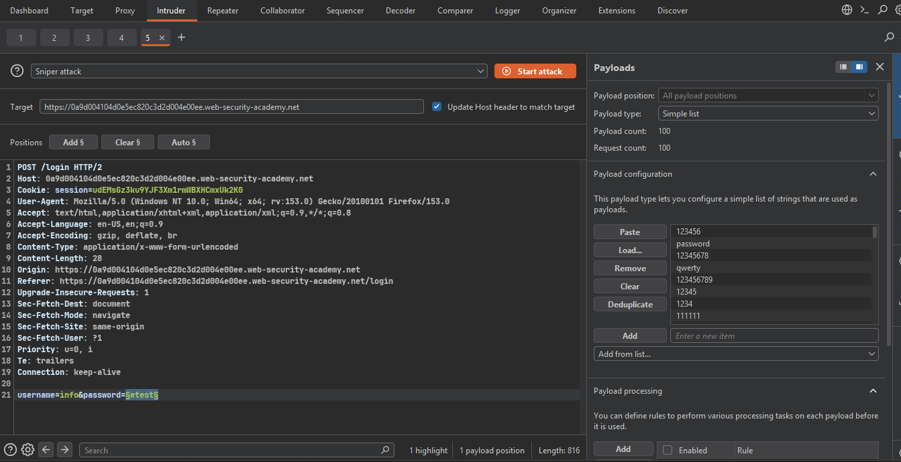
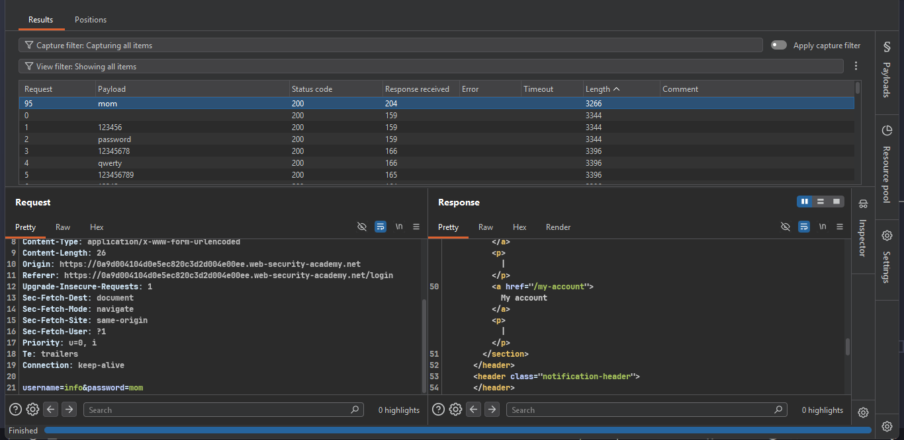
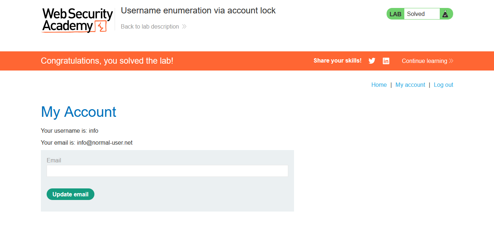

>> ###  Target Lab: Username enumeration via account lock

```
**Vulnerability:**
- This lab is vulnerable to username enumeration. It uses account locking, but this contains a logic flaw.

**Goal:**
- To solve the lab, enumerate a valid username, brute-force this user's password, then access their account page. 


```

###  Steps:
1. #### Open the lab.
2. #### Submit random credentials on the login page and capture the request in Burp Suite.
3. #### Send the request to Intruder and set a username list as the payload.
    - The lab provides the username and password lists.
4. #### set payload with cluster bomb 
    - 

```markdown 
- Password left as "Null payload": we don't need real guesses here,
- just enough failed attempts to trigger the account lock.
-  Null payload = sends the same empty-password request 5 times per username.
-  Even a correct password wouldn't matter, since Position 2 stays empty/null.
-  Cluster bomb chosen because it tries every username with all 5 attempts
- (not aligned pairs like Pitchfork) - needed to lock every real username.

```

5. #### Start the attack and check each username's response length.
    - 

6. #### Once you have a valid username, brute-force the password.
    -  

7. #### Log in with the valid username and password, then open the account page.
    - 

8. #### Congratulations! You have successfully completed the lab.
    - 


Important note: `If valid credentials do not immediately open the account page, submit them three or four more times. Then inspect and render the response after the brute-force attack.`
