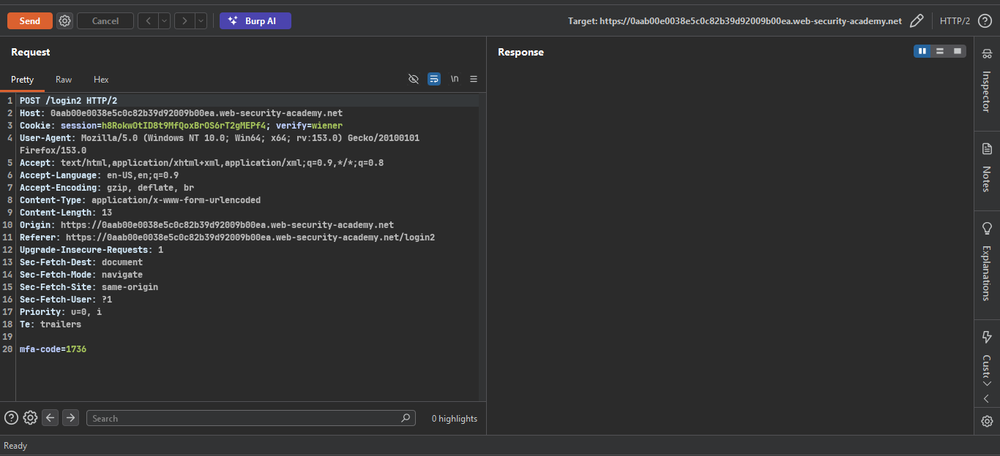
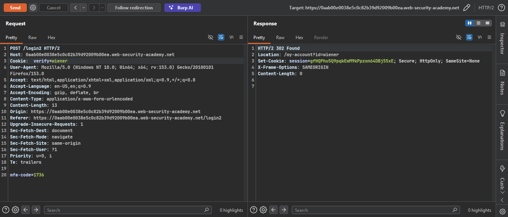
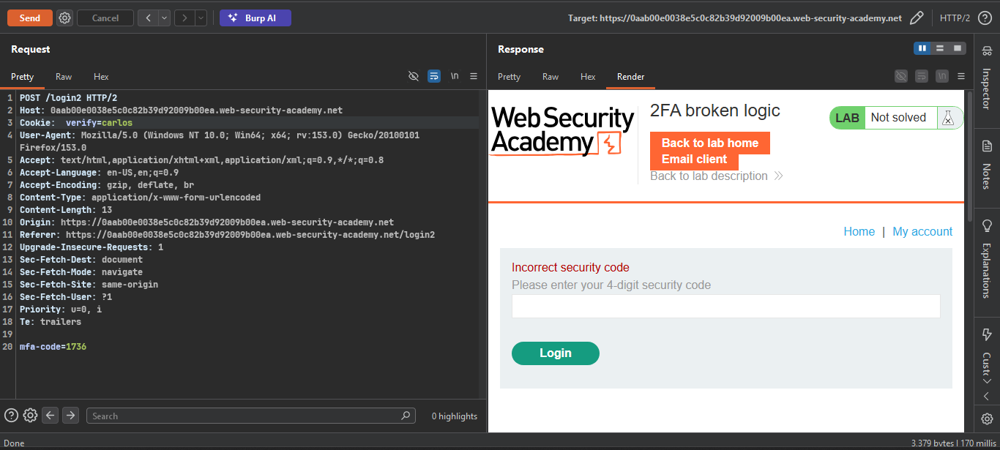
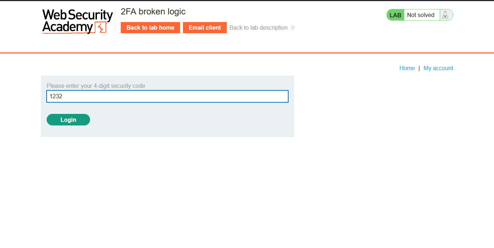
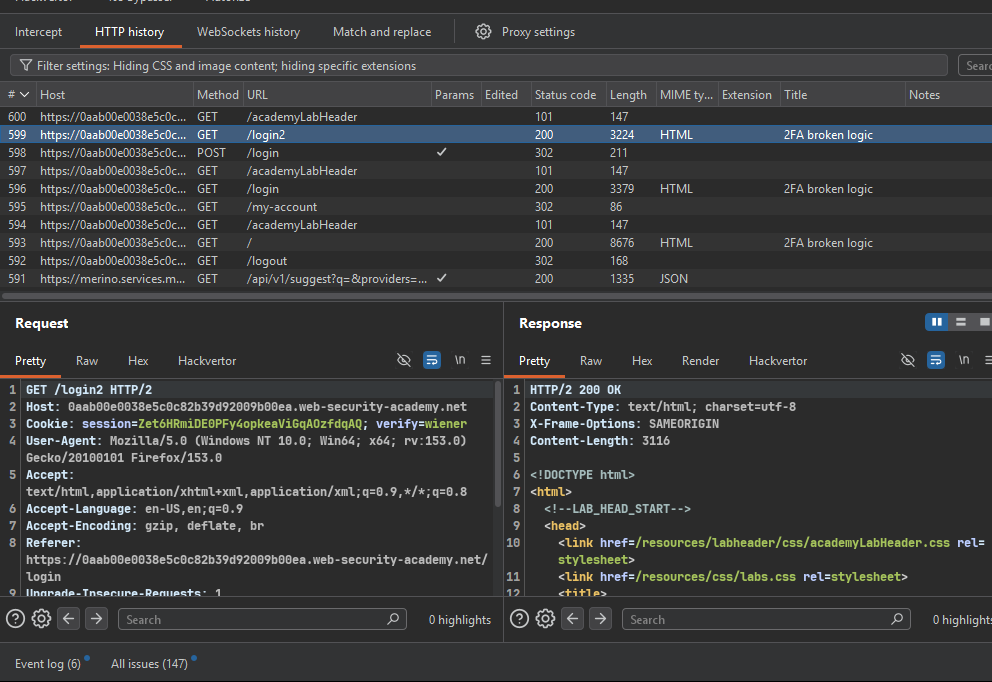
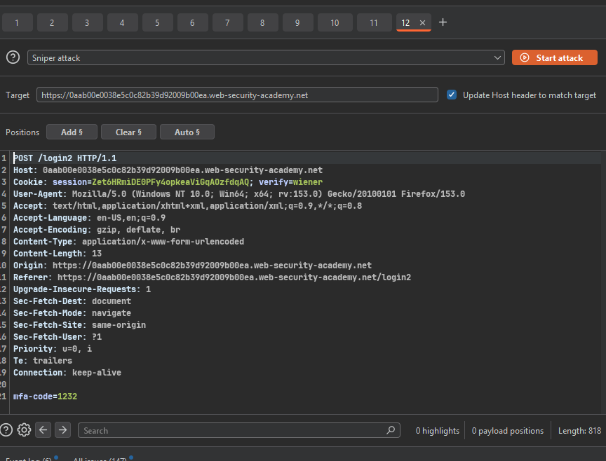
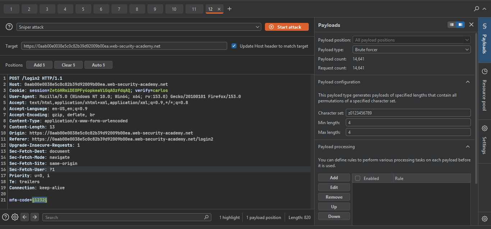
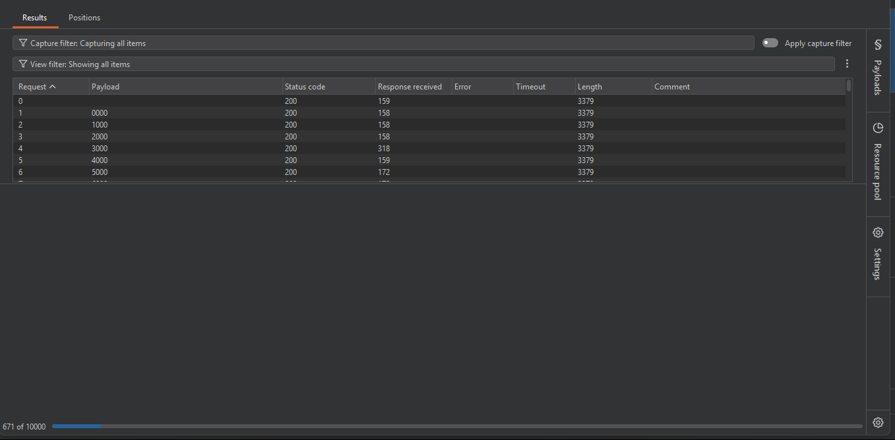
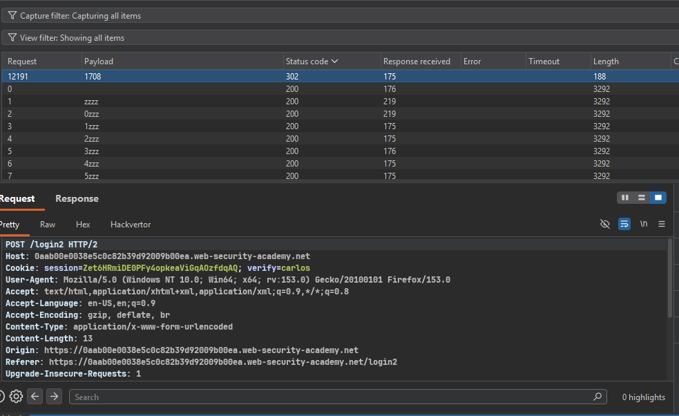
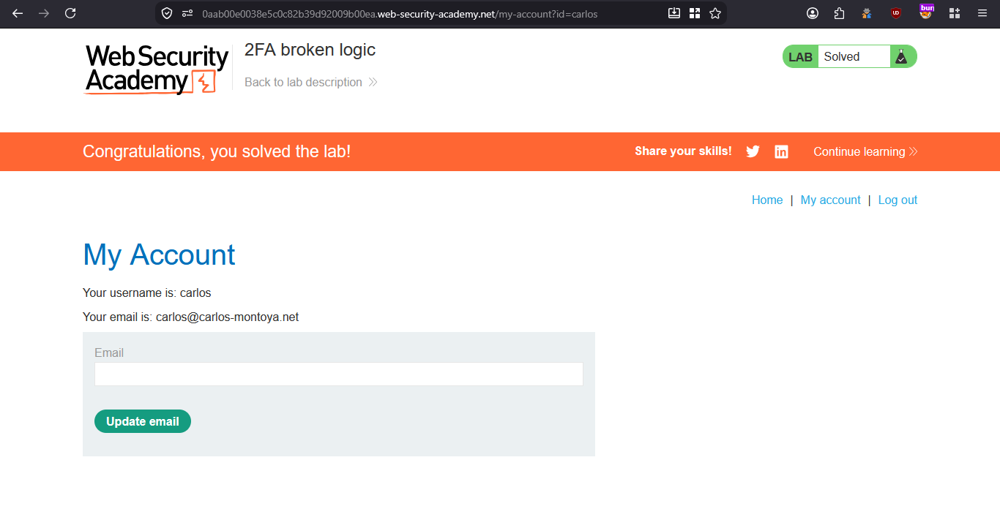

>> ### Target Lab: 2FA broken logic

```
**Vulnerability:**
- This lab's two-factor authentication is vulnerable due to its flawed logic.

**Goal:**
- To solve the lab, access Carlos's account page. 


```


### Steps:
1. #### Open the lab.
2. #### Log in with the credentials `wiener:peter`.
3. #### Capture the requests in Burp Suite.
    - 
    - try to remove session cookie and send 
    -  no cookie needed
    - log out wiener account and play in burp with login2 request

4. #### Change the verification username from `wiener` to `carlos` and send the request.
    - 
    - The code is incorrect, but the request redirects to Carlos's page.
    - After changing `wiener` to `carlos`, the server generates a new code for Carlos's account.
    - Log in again with the Wiener account and submit an incorrect code for the valid pending 2FA session.
    -  The test code is incorrect.

5. #### Send the `login2` request with the fake code to Intruder and brute-force the MFA code.
    - 
    - 
    -  set payload and change wiener to carlos and start attack

6. #### Wait while Intruder brute-forces the code.
    - 


7. #### After some time, the correct code will be found and the request will redirect to Carlos's page (`302 Found`).
    - 
    - right click on the page and SHOW RESPONSE IN BROWSER 

8. #### You will see Carlos's page, which confirms that you have solved the lab.
    - 


