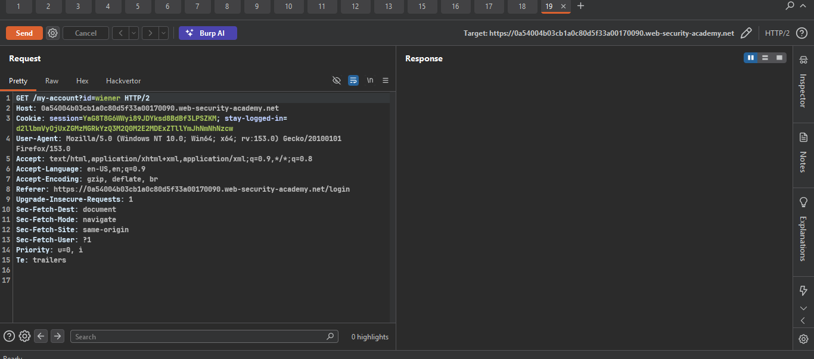
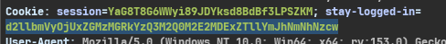
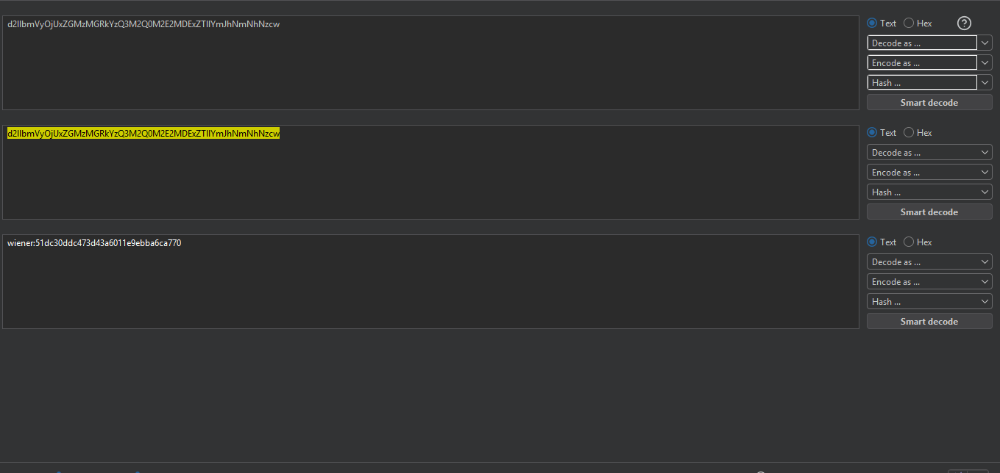
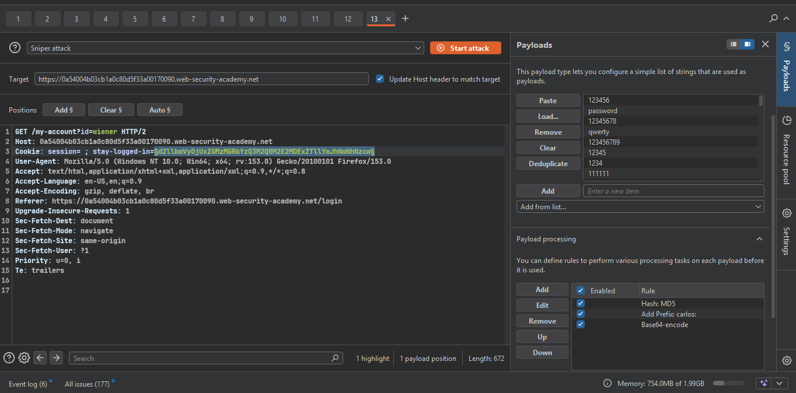
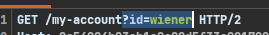
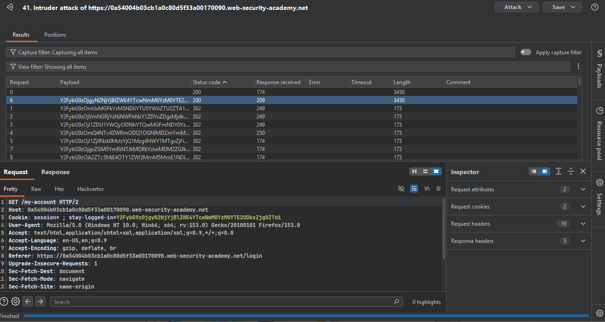
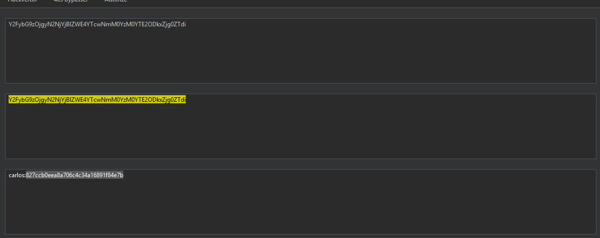
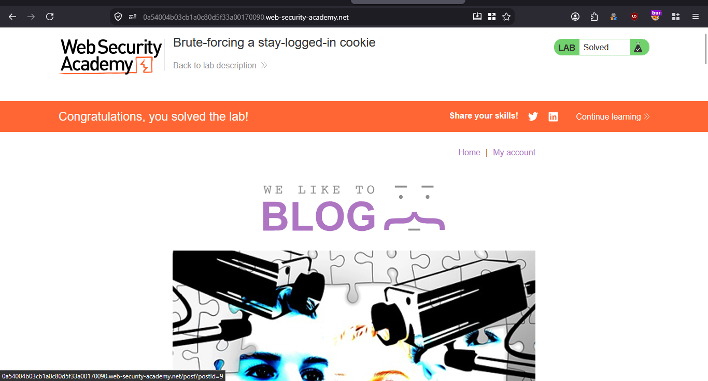

>>> ### Target Lab: Brute-forcing a stay-logged-in cookie

---
**Vulnerability:**
- This lab allows users to stay logged in after closing their browser session. The cookie used for this functionality is vulnerable to brute-forcing.

**Goal**
- To solve the lab, brute-force Carlos's cookie and access his My account page.

---

### Steps:
1. #### Open the lab.
2. #### Log in with `wiener:peter` and capture the request in Burp Suite.
    - 
3. #### I see stay log in value 
    - 
    - Decode the value from Base64.
    - 
    - wiener and password (md5 hash)
    ```like this base64(wiener:md5(peter))```

4. #### Send the request to Intruder for brute-forcing.
    - 
    - remove session cookie and add stay-logged-in cookie
    - remove ?id=wiener -> 
    - Paste the password list provided by the lab.
    - and add processing rules
    - start attack and check the response

5. #### and now 
    - 
    - A `200 OK` response indicates that the lab is solved and Carlos's page is accessible.
    - double check -> 
    - solve the lab

- 


``check`` POC.py

```python 


python .\POC.py "https://0a7200470423125282db33c6005e0047.web-security-academy.net"
Brute-force Carlos's password
Carlos's password: `matrix`

```
