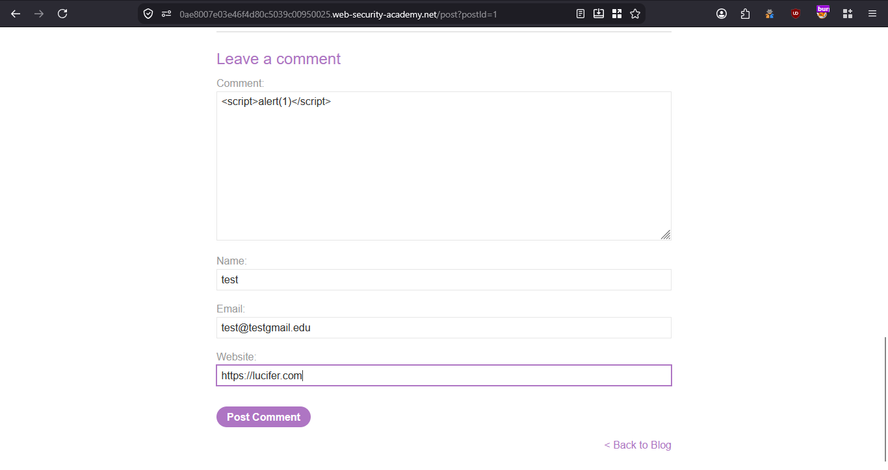
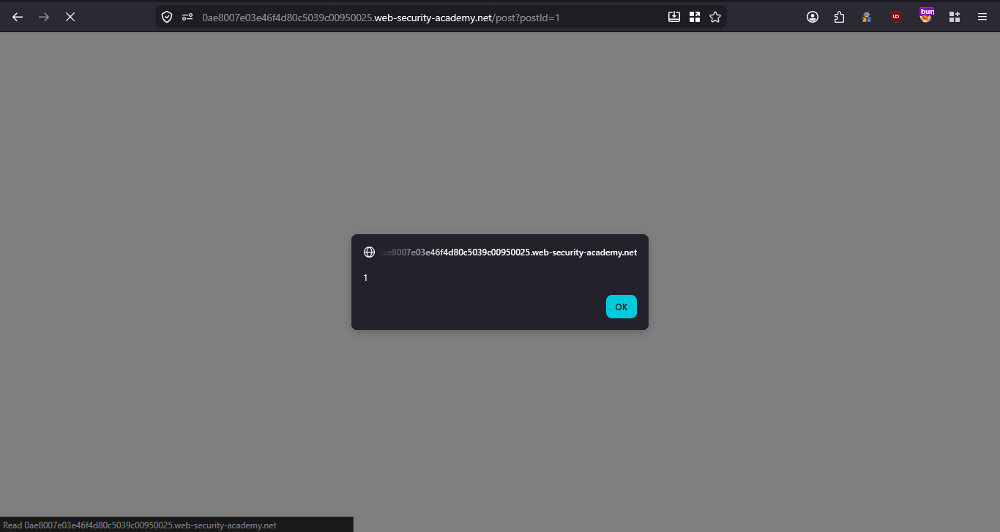
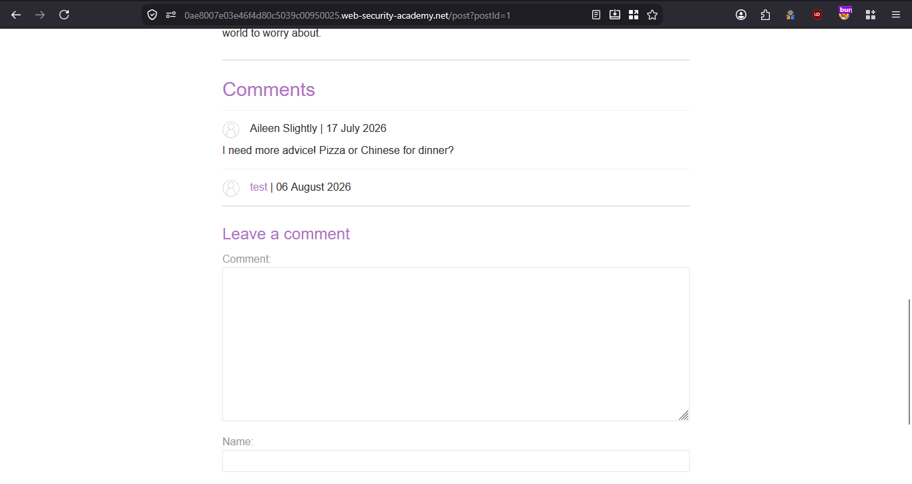
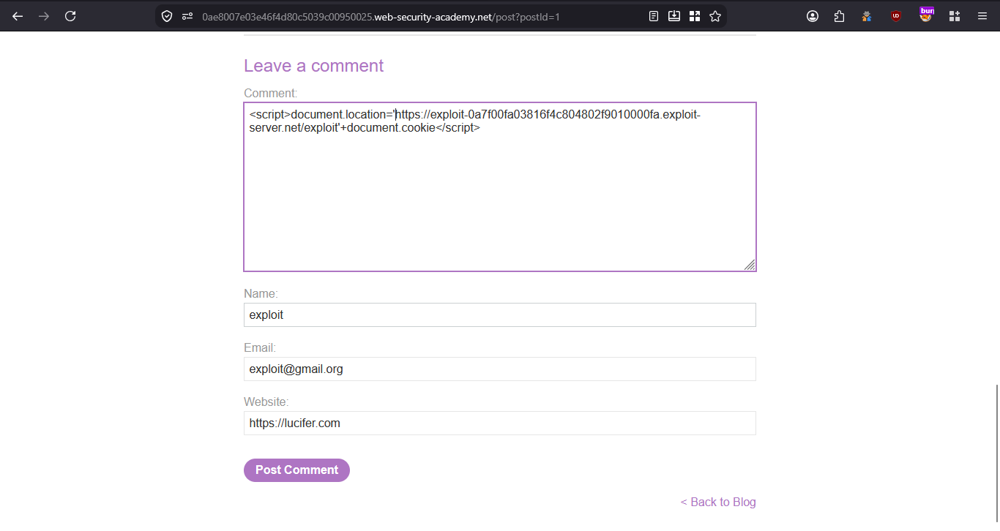
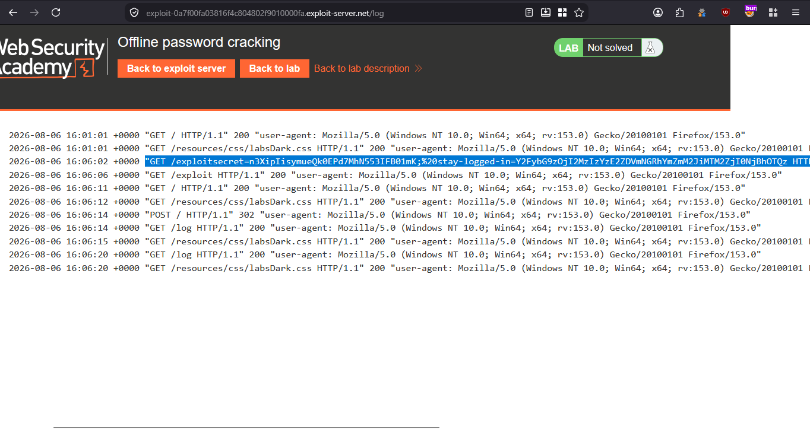
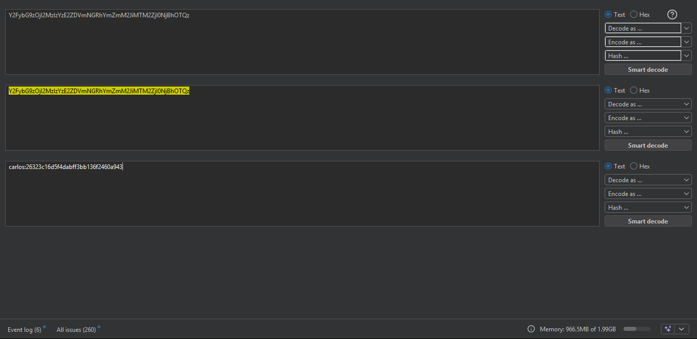
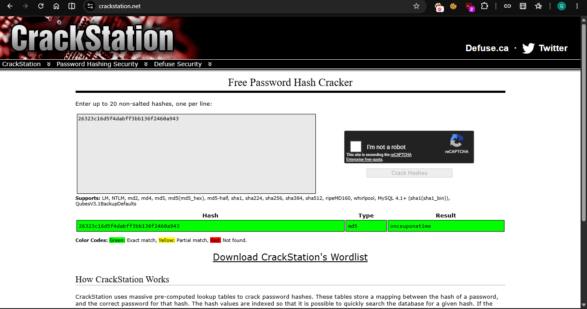
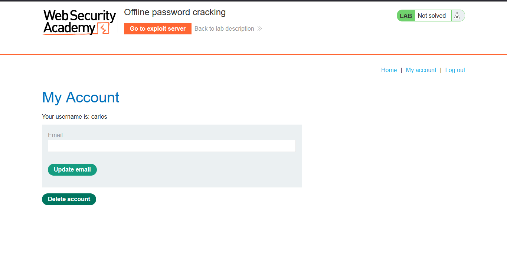
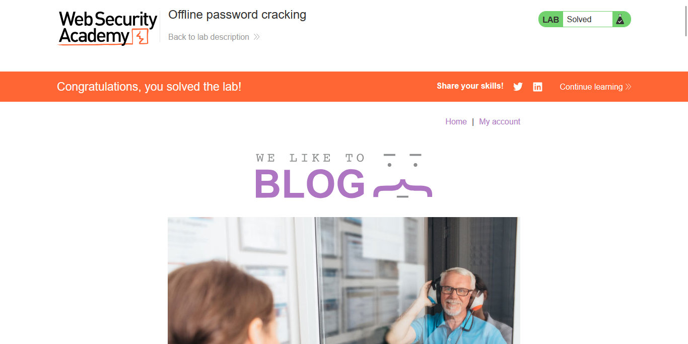

>> Target Lab: Offline password cracking

--- 
**Vuln**
This lab stores the user's password hash in a cookie. The lab also contains an XSS vulnerability in the comment functionality.

**Goal**
To solve the lab, obtain Carlos's stay-logged-in cookie and use it to crack his password. Then, log in as carlos and delete his account from the "My account" page. 

---

### Steps:
1. #### Open the lab.
2. #### Log in with the credentials `wiener:peter`.
3. #### Open any post's comment section and test a basic XSS payload.
    - 
    - 
    - The comment contains stored XSS: 

4. #### Steal Carlos's cookie through XSS.
    - 
    - After injecting the payload, check the Exploit Server access log and wait for Carlos to visit the page.
    - When Carlos visits the page:
    - 
    - decode stay-logged-in value
    - 
    - We now have Carlos's credentials.
    - decode password hash 
    - 

5. #### Log in with Carlos's credentials and delete his account.
    - 

6. #### The lab is solved.
    - 
