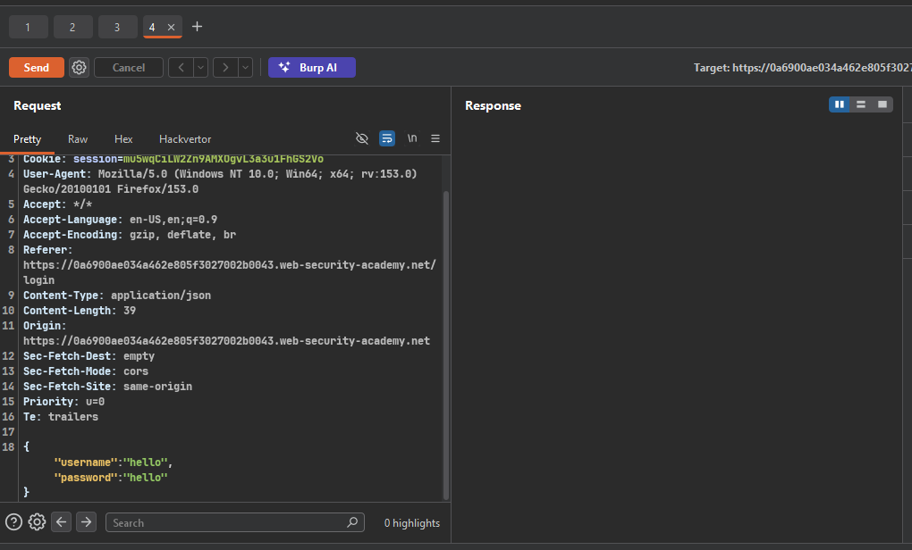
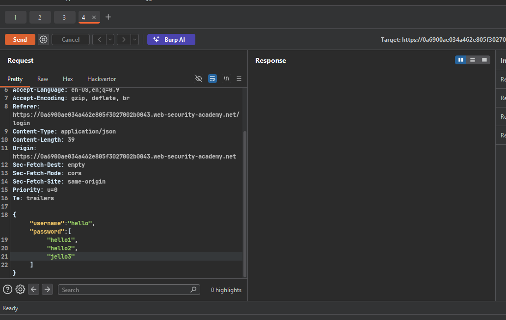
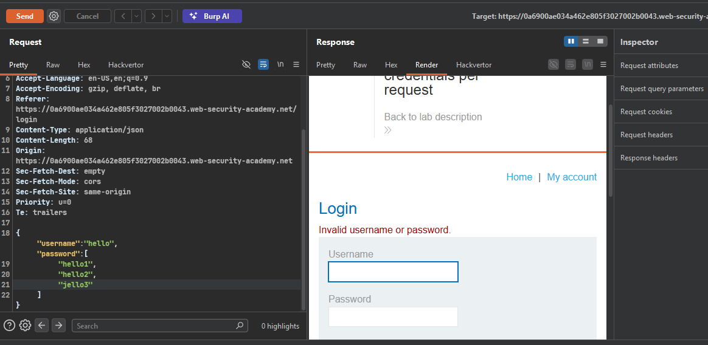
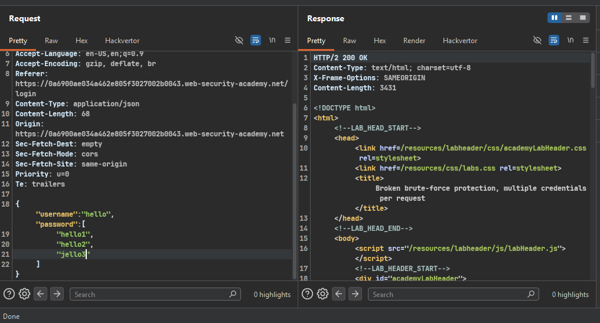
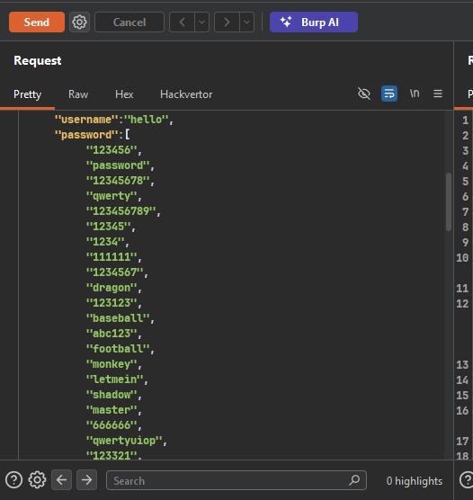
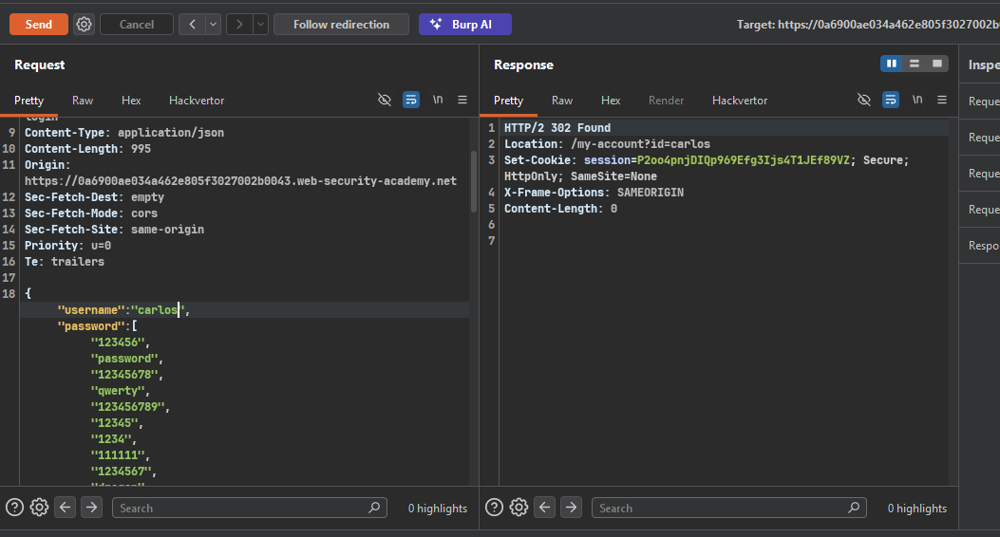
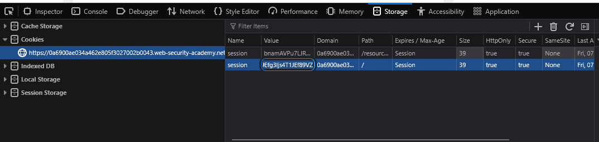
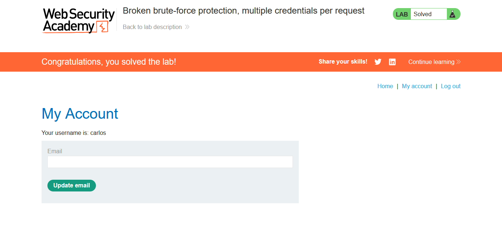

>> ### Target Lab: Broken brute-force protection, multiple credentials per request

---

**Vulnerability**
- This lab is vulnerable due to a logic flaw in its brute-force protection.

**Goal**
- Brute-force Carlos's password, then access his account page.

---

### Steps:
1. #### Open the lab.
2. #### Click My account, submit a random value, and capture the request in Burp Suite.
    - 
    - The login request contains credentials in JSON format.

3. #### Add another value to the password field.
    - 
    - Send the request and render the response.
    -  - Invalid credentials.
    - The response is `200 OK`, which exposes the logic flaw.
    - 

4. #### Add all passwords provided by the lab to the password array.
    - 
    - Change the username to `carlos` and send the request.
    - 
    - copy session cookie -> on 302 response `P2oo4pnjDIQp969Efg3Ijs4T1JEf89VZ`
    - and paste in browser cookie  
    -  
    - Click My account to view Carlos's account page.

5. #### Congratulations! You have successfully brute-forced Carlos's password and accessed his account page.
    - 
