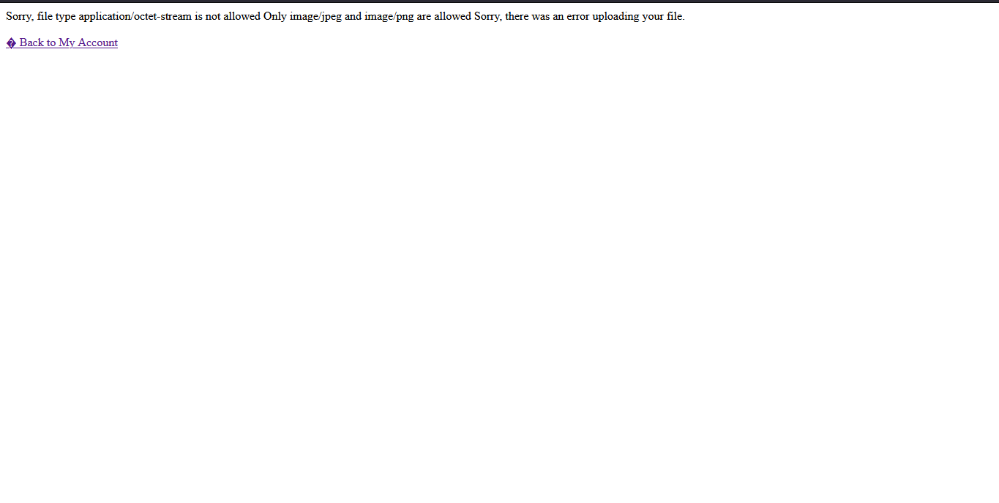
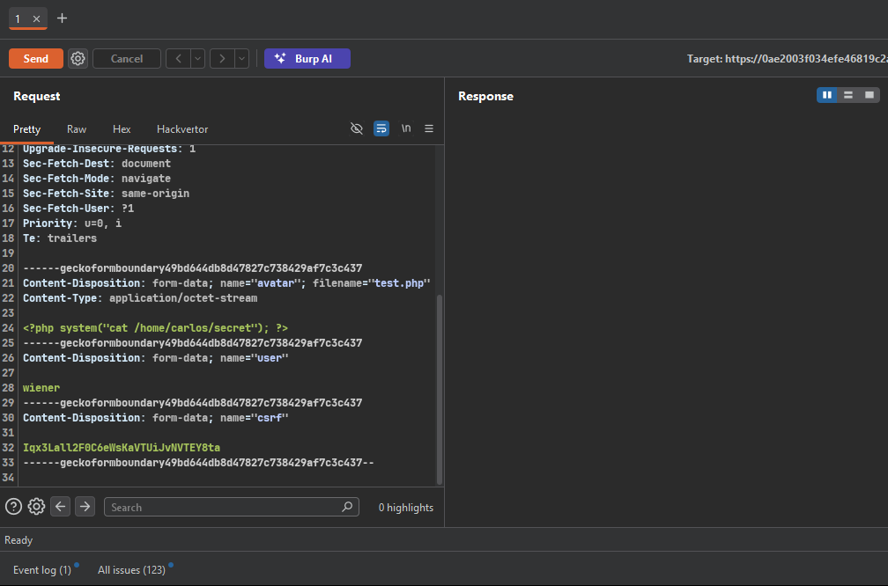
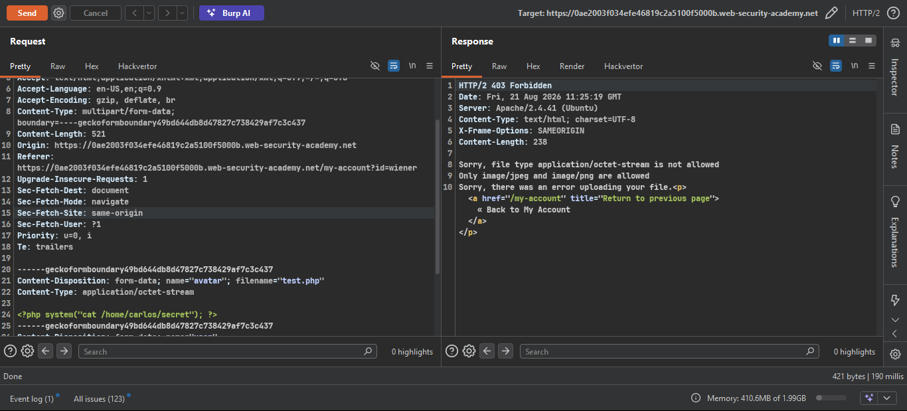
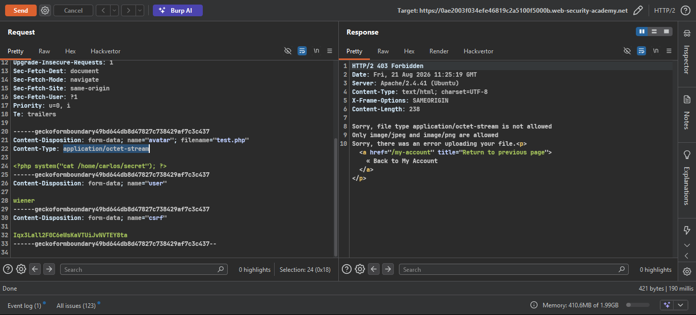
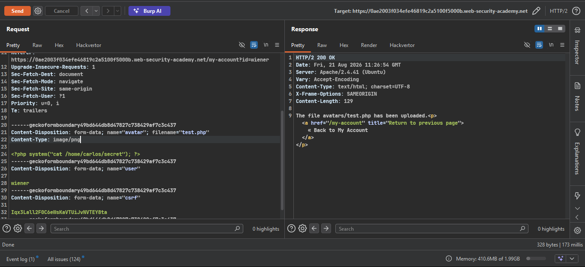
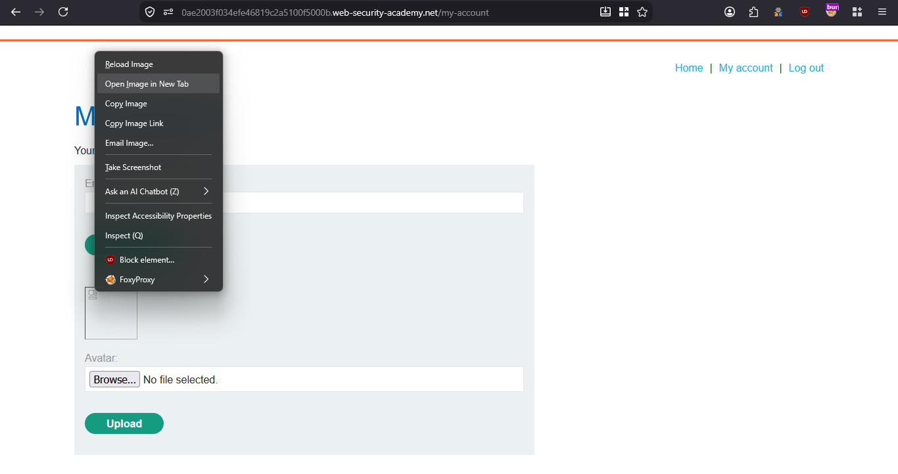
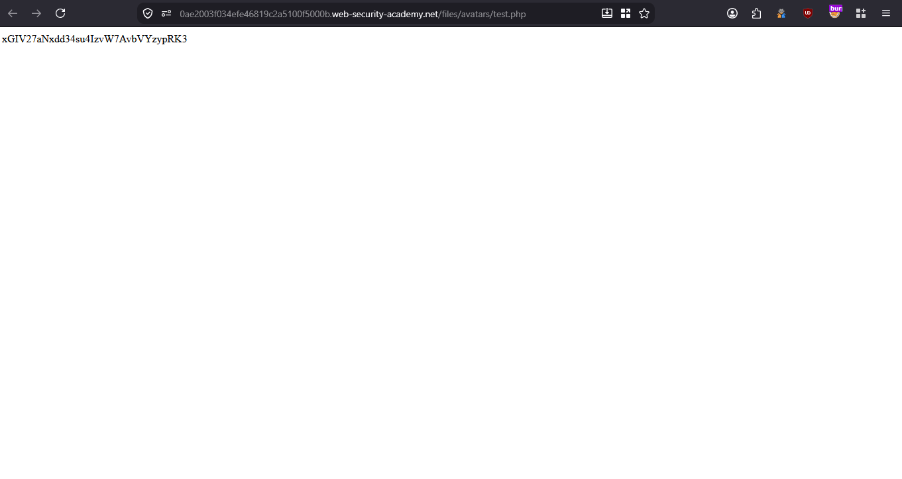
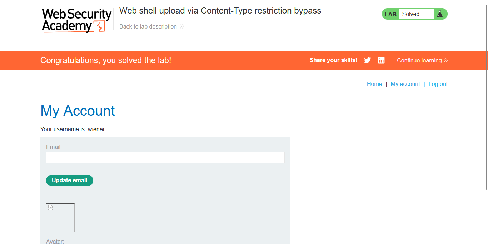

# Lab: Web shell upload via Content-Type restriction bypass


---

**Vuln**
- Server trusts the user-controlled `Content-Type` header instead of validating the actual file content, allowing file type restrictions to be bypassed.

**Goal**
- Upload a PHP web shell by spoofing the `Content-Type` header, read `/home/carlos/secret`, and submit the secret.

---

### Steps

1. **Access the lab** and log in using the credentials `wiener:peter`.

2. **Navigate to your account page** and attempt to upload a PHP web shell directly.

```php
<?php system("cat /home/carlos/secret"); ?>
```

- The server rejects it — only image file types are allowed.

   

3. **Intercept the upload request in Burp Suite** and send it to Repeater.

   
   

4. **Modify the `Content-Type` header** in the multipart form data.
   - Change `Content-Type: application/x-php` → `Content-Type: image/jpeg`
   - The server trusts the `Content-Type` header without verifying the actual file content.

   

   - After changing the Content-Type to `image/jpeg`, the server accepts the file.

   

5. **Execute the web shell** by navigating to the uploaded file URL.
   - Right-click on the avatar image and open it in a new tab to trigger the PHP execution.

   
   

   The contents of `/home/carlos/secret` are now visible in the response.

6. **Submit the secret** using the button in the lab banner to solve the lab.

   

### Files Used

| File | Purpose |
|------|---------|
| `test.php` | Web shell — `<?php system("cat /home/carlos/secret"); ?>` |
| `POC.py` | Automated exploit script |

---

### Key Takeaway

> The server only validated the `Content-Type` header provided by the client, not the actual file content or extension. Since `Content-Type` is fully attacker-controlled, bypassing this restriction is trivial. Proper file upload validation should inspect the **magic bytes** (file signature) of the uploaded content, not trust client-supplied headers.
