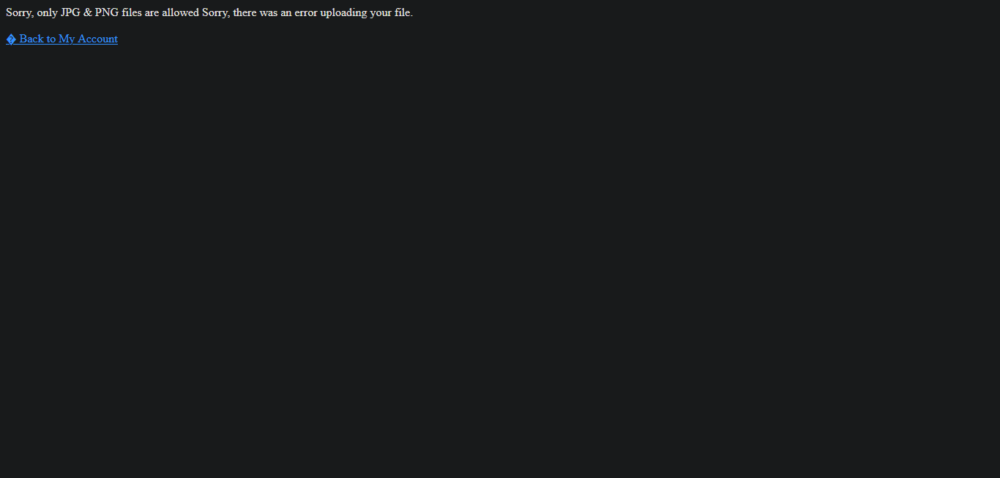
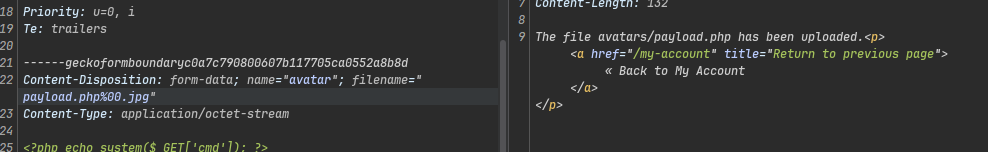
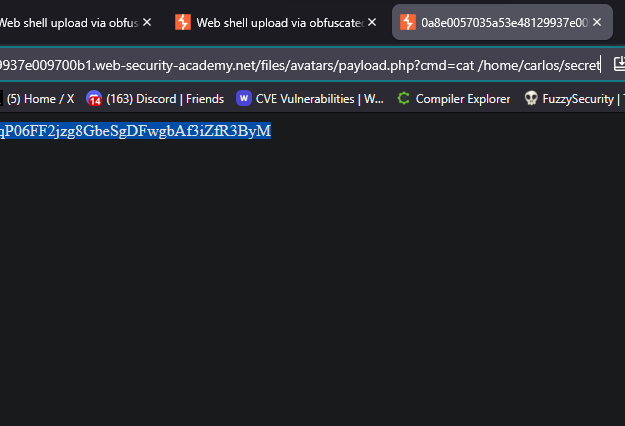
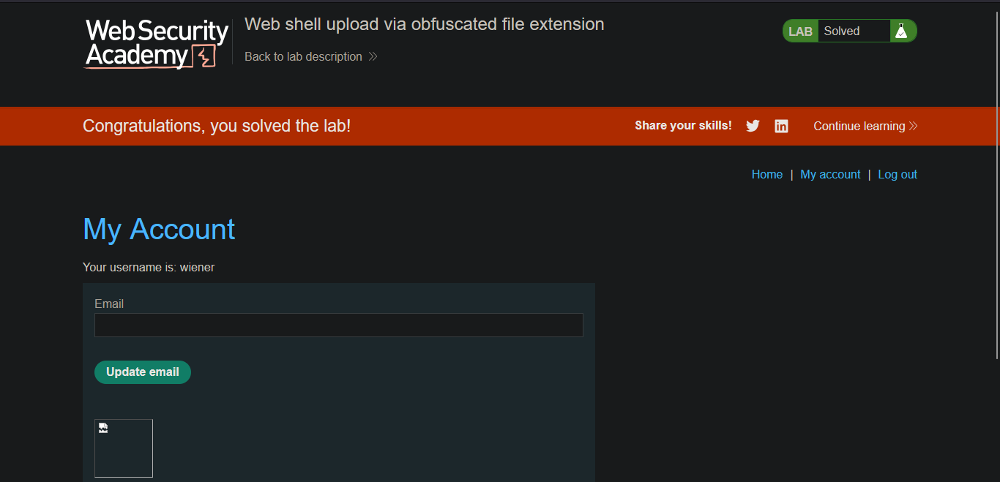

>> Lab: Web shell upload via obfuscated file extension

--- 
**Vuln**
- This lab contains a vulnerable image upload function. Certain file extensions are blacklisted 

**Goal**
-  To solve the lab, upload a basic PHP web shell, then use it to exfiltrate the contents of the file /home/carlos/secret. Submit this secret using the button provided in the lab banner.

**Creds**
- `wiener:peter`

--- 

### Steps: 
1. **Open The lab And Login With creds...**
2. **try simple php payload file**
   - 
   - but lab this allowed only JPG and PNG Image File Only 

3. **So i try to this**
   - 
   - File is Uploaded and after null bytes sever ignore everything 
  ```text
  Why server ignore everything after null bytes ?? 
  Answer: Because the underlying C runtime treats %00 (null byte) as the
  end-of-string terminator — anything after it is silently discarded when  
  the filename is passed to OS-level file functions.
  ```

4. **Read secret key**
   - 
   - submit key 
  
5. solve the lab 
   - 

---

### POC Script
- **Script:** [`POC.py`](./POC.py)
- **Technique:** Null Byte Injection — filename `payload.php%00.jpg` bypasses blacklist; C runtime truncates to `payload.php`

```bash
# Usage
python POC.py <lab-url>

# Example
python POC.py "https://<your-lab-id>.web-security-academy.net"
```
