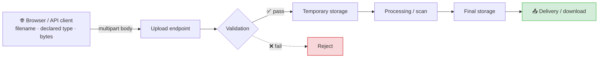
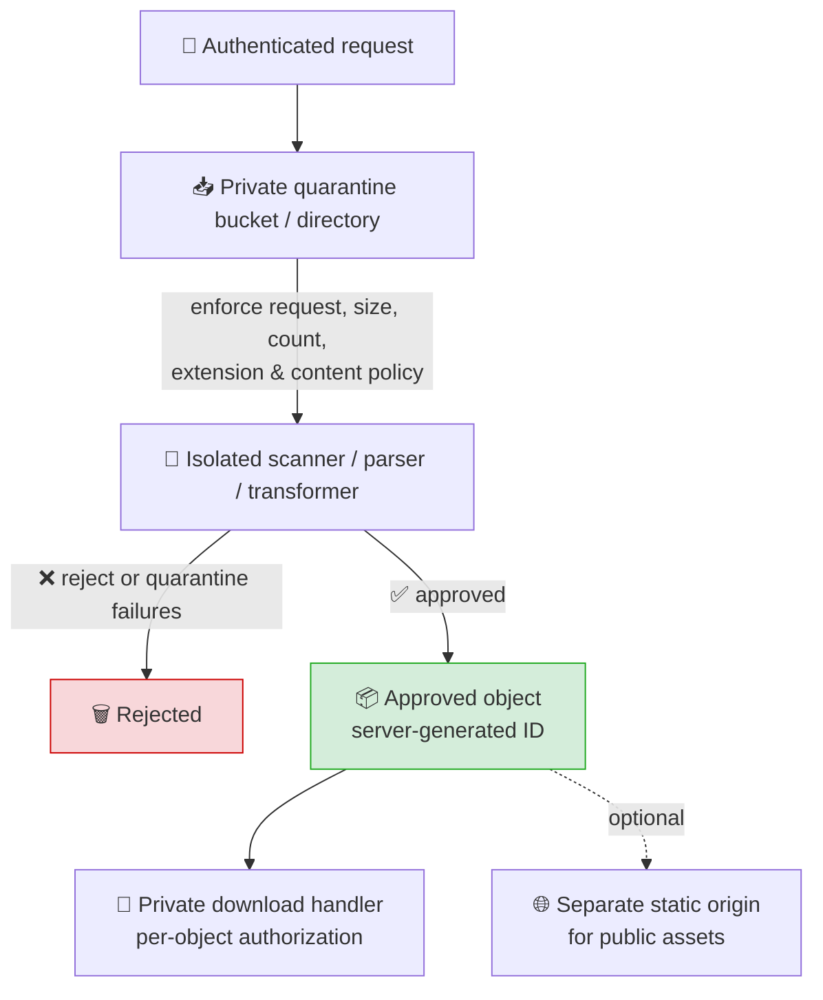

# 🗂️ File Upload Vulnerabilities


> Practical study notes for authorised security testing and PortSwigger Web Security Academy labs. Upload testing can create persistent content and consume storage; work only within scope and use harmless proof files.

**Icon legend:** 💥 offensive technique · 🔒 defensive control · 🚨 scope / caution reminder · ✅ good evidence · ⚪🟢🟡🟠🔴 relative risk

---

## 📑 Contents

1. [🧭 Overview](#-overview)
2. [🔄 The Upload Life Cycle](#-the-upload-life-cycle)
3. [🎯 Impact and Severity](#-impact-and-severity)
4. [🔎 Where Vulnerabilities Arise](#-where-vulnerabilities-arise)
5. [🧪 Authorised Testing Workflow](#-authorised-testing-workflow)
6. [🔓 Validation Weaknesses](#-validation-weaknesses)
7. [💥 Common Bypass Techniques (Offensive Reference)](#-common-bypass-techniques-offensive-reference)
8. [🚫 Non-RCE Upload Risks](#-non-rce-upload-risks)
9. [📚 Known Real-World Cases](#-known-real-world-cases)
10. [🔒 Secure Design and Remediation](#-secure-design-and-remediation)
11. [🧩 PortSwigger Lab Map](#-portswigger-lab-map)
12. [🔗 References](#-references)

---

## 🧭 Overview

A **file upload vulnerability** exists when an application accepts a user-supplied file but does not safely control its name, type, contents, size, processing, storage, or delivery. The most severe outcome is server-side code execution, but it is not the only outcome. An upload can also enable stored cross-site scripting (XSS), file overwrite, path traversal, parser compromise, malware distribution, or denial of service.

This weakness is commonly mapped to [CWE-434: Unrestricted Upload of File with Dangerous Type](https://cwe.mitre.org/data/definitions/434). The central question is not simply **"Can I upload this file?"** but:

> **What does the system do with the file after it accepts it?**



> 🚨 Every arrow in that diagram is a boundary that needs its own control — a pass at one stage proves nothing about the next.

### The fields are independent

Do not assume any of these agree. A robust implementation checks the properties it actually needs.

| Property | Usually supplied or derived by | Why it is not enough by itself |
| --- | --- | --- |
| Filename | Client request | May contain misleading extensions or path-like text. |
| `Content-Type` part header | Client request | Fully attacker-controlled; it is only a hint. |
| Magic bytes / signature | File bytes | Helps identify formats, but some formats can be polyglot or malformed. |
| Parsed structure | Trusted server-side parser | Stronger evidence, but the parser itself must be safely configured and patched. |
| Stored object key / path | Server | Must not be derived directly from the client filename. |
| Response headers | Server / CDN | Decide whether a browser renders, downloads, or executes content. |

---

## 🔄 The Upload Life Cycle

Treat upload security as a pipeline, not a single validation check.

| # | Stage | Security question | Example failure |
| --- | --- | --- | --- |
| ① | Access control | Who may upload, replace, retrieve, or delete? | One tenant can replace another tenant's document. |
| ② | Request handling | Are size, count, and streaming limits enforced before disk exhaustion? | Many oversized uploads exhaust workers or temporary storage. |
| ③ | Classification | Does the file match a narrow business allowlist? | The server trusts a client-supplied image MIME type. |
| ④ | Processing | Is parsing, conversion, or archive extraction isolated? | A document processor parses hostile input with excessive privileges. |
| ⑤ | Storage | Is the final name generated and outside executable web paths? | The client chooses a path or overwrites an existing object. |
| ⑥ | Delivery | Is content served safely and only to authorised users? | An HTML or SVG upload renders inline on the application origin. |
| ⑦ | Lifecycle | Can files be quarantined, removed, and audited? | A flagged file remains publicly accessible through a stable URL. |

> 🚨 **Why a browser-side `accept` attribute is not a security control:** HTML controls such as `accept="image/*"`, client-side JavaScript checks, and mobile-app restrictions improve usability only. An attacker can make the same HTTP request directly or alter it in an intercepting proxy. The server must enforce every security decision.

---

## 🎯 Impact and Severity

Impact depends on the accepted format, the follow-up processing, the location where the object is stored, and how it is delivered. Do not label every file-type bypass as critical.

| Confirmed capability | Typical outcome | Risk |
| --- | --- | --- |
| Upload rejected safely | No issue shown | ⚪ None |
| Unexpected file accepted but isolated, non-executable, and inaccessible | Defence gap; impact unproven | 🟢 Informational–Low |
| Attacker-controlled content delivered inline on the application origin | Stored XSS or client-side content injection | 🟠 Medium–High |
| Client-controlled filename can overwrite another object or escape storage | Integrity loss, disclosure, possibly code execution | 🔴 Medium–Critical |
| File is parsed by a vulnerable or over-privileged component | Format-specific server-side impact | 🟡 Context-dependent |
| Server-side executable content is accepted and executed | Remote code execution | 🔴 Critical |
| Uploads or archives exhaust disk, CPU, memory, or workers | Denial of service | 🟠 Medium–High |

Severity also changes with authentication, tenant isolation, public reachability, service privileges, network controls, and whether a user must open the content. Record those facts rather than inferring them.

---

## 🔎 Where Vulnerabilities Arise

### Features worth reviewing

```text
Profile photos · support attachments · document portals · media libraries
Bulk imports · CMS assets · product images · avatar APIs · backup restores
Email attachments · archive extraction · URL-to-file importers · WebDAV / PUT
```

### Useful places to inspect

| Surface | What to look for |
| --- | --- |
| Upload request | `multipart/form-data` fields, filename, MIME header, file bytes, hidden metadata. |
| API documentation | JSON/base64 upload fields, presigned object-storage flows, chunked/resumable endpoints. |
| Response | Generated file URL, object ID, status, errors, and whether the original name is reflected. |
| Retrieval endpoint | Authentication checks, `Content-Type`, `Content-Disposition`, `X-Content-Type-Options`, cache headers. |
| Processing job | Image thumbnails, OCR, document conversion, archive extraction, antivirus, previews. |
| Storage naming | Predictable paths, user IDs, original names, collision behaviour, replacement semantics. |
| Alternate methods | Documented `PUT`, WebDAV, import, or administrative endpoints—only where authorised. |

---

## 🧪 Authorised Testing Workflow

Use a controlled, evidence-first approach. Do not begin with executable content or large payloads.

### 1️⃣ Establish a clean baseline

Upload a normal, harmless file that the feature is designed to accept. Preserve:

- The raw request and response.
- The returned object ID or URL.
- The file as downloaded back from the application.
- Response headers for retrieval and any preview.
- The account and tenant used, plus applicable upload limits.

### 2️⃣ Map the pipeline

Determine whether the application renames the object, creates thumbnails, scans it asynchronously, stores it in object storage, or exposes it through a download handler. A `201 Created` response means only that the ingest endpoint accepted the request; it does **not** prove final storage or exposure.

### 3️⃣ Change one property at a time

Use a benign marker file and alter one field per request:

| Controlled variation | What it tests |
| --- | --- |
| Filename extension | Whether extension validation is server-side and exact. |
| Declared part `Content-Type` | Whether the server incorrectly trusts a client claim. |
| File signature / structure | Whether the server performs real type validation. |
| Filename characters | Normalisation, collision, and path-handling behaviour. |
| File dimensions or page count | Business and resource limits. |
| Archive metadata, if archives are intentionally supported | Safe extraction and decompressed-size controls. |

Avoid combining multiple bypass ideas in the first request. A rejected combined payload does not explain which control worked; an accepted combined payload does not explain which control failed.

### 4️⃣ Verify the post-upload behaviour

Retrieve the resulting object through the normal application path. Compare it with the original and inspect response headers.

```http
Content-Type: image/png
Content-Disposition: attachment; filename="download.png"
X-Content-Type-Options: nosniff
```

These headers are useful signals, not an absolute guarantee. For example, `attachment` reduces inline rendering but does not replace correct storage, authorization, or content validation.

### 5️⃣ Confirm impact safely

Use the least invasive proof that establishes the issue:

| Suspected issue | Safe confirmation |
| --- | --- |
| MIME validation weakness | A harmless file whose bytes and declared MIME type disagree, plus evidence it was accepted. |
| Inline active-content risk | A benign, uniquely marked HTML/SVG test rendered only in an authorised lab; verify origin and headers. |
| Filename collision | Two harmless uploads with the same intended name; prove whether the first object changes. |
| Path handling weakness | Use an innocuous marker and verify only expected, authorised locations. Never target system files. |
| Processing risk | Observe controlled processing errors, limits, or job status; do not weaponise parsers. |
| Resource limit weakness | Test modestly and only within agreed limits; stop before service degradation. |

### 6️⃣ Document without overclaiming

Record the exact request, response, retrieval URL, timestamps, account scope, and observed effect. State what was demonstrated and what was **not** demonstrated.

### ✅ False-positive checklist

- [ ] Was the file retrievable after any asynchronous validation completed?
- [ ] Did the server store the changed bytes, rather than only echoing the requested filename?
- [ ] Is the apparent file type derived from a response header, actual content, or browser sniffing?
- [ ] Was a filename/path effect confirmed on disk or through a distinct stored object, not just reflection?
- [ ] Did access control apply equally to upload, preview, download, replace, and delete?
- [ ] Could a CDN cache, thumbnail, or old object explain the observed response?
- [ ] Have I demonstrated a real impact before claiming RCE, XSS, overwrite, or DoS?

### ⚠️ Common False Positives vs Reality

| False Assumption / Observation | Actual Reality | How to Verify Before Claiming a Bug |
| --- | --- | --- |
| **"HTTP 200/201 on `shell.php` means RCE."** | The server accepted the file but saved it with a safe extension (`.bin`, `.txt`), stored it in an object store (e.g. S3) as `application/octet-stream`, or directory execution is disabled (`php_admin_flag engine off`). | Send a harmless marker (`<?php echo 'MARKER_'.md5(1); ?>`) and retrieve the URL. If the browser displays the raw PHP source or prompts to download, RCE is **not** achieved. |
| **"Response reflects `../../shell.php`, so path traversal works."** | The backend sanitized the path (e.g. using `basename()`) during storage and merely echoed the client's input string in the JSON response or upload confirmation. | Confirm the file exists outside the upload root via secondary access, LFI, or directory listing. Never report traversal on reflected text alone. |
| **"Uploading `.php` to Node.js / Python / Go causes RCE."** | Modern application runtimes (Express, Django, Flask, FastAPI, Go) do not execute PHP scripts. The file will only be served as static text or downloaded. | Test for vulnerabilities native to that stack: template injection (if `.ejs`/`.j2` are processed) or source code overwrite (`app.js`, `main.py`). |
| **"`GIF89a;` prefix bypassed image validation, so it is a polyglot."** | Naive magic bytes pass simple signature inspections, but fail format-aware parsers (`getimagesize()`, `exif_imagetype()`, or GD/Imagick re-encoding) and do not render as valid images. | Check if backend image processors accept the file. For deep validation, generate structural polyglots via ExifTool. |
| **"Uploaded SVG/HTML file proves Stored XSS."** | If served with `Content-Disposition: attachment`, `X-Content-Type-Options: nosniff`, or from an isolated sandbox domain (e.g. `*.user-content.com`), JavaScript cannot access the session or main origin DOM. | Open the retrieval URL in a browser. Verify the response `Origin`, active cookies, and whether scripts execute in the context of the main app origin. |
| **"File was immediately accessible, so scanner is bypassed."** | The file was accessible during a temporary pre-scan buffer, but a background queue deletes or quarantines it seconds later. | Check persistence after several seconds/minutes. A transient file that is reliably deleted before any user can trigger it is not a permanent bypass. |

---

## 🔓 Validation Weaknesses

### 1. Extension-only checks

An extension allowlist is useful, but it should be applied to a decoded, normalised filename and should not be the only control. Denylists are fragile because dangerous formats and server mappings vary by stack.

> 💥 **How this gets bypassed in practice:** case variation (`shell.PHp`), double extensions (`shell.php.jpg`), alternate script extensions a denylist forgot (`.phtml`, `.pht`, `.phar`, `.php3`–`.php8`, `.phps`, `.phtm`, `.asa`, `.cer`, `.asax`, `.ashx`, `.jspx`), trailing characters or NTFS streams stripped before storage (`shell.php.`, `shell.php `, `shell.php::$DATA`), delimiter truncation (`shell.asp;.jpg` on IIS 6), and null byte injection on legacy runtimes (`shell.php%00.jpg`). See [Bypass Techniques](#-common-bypass-techniques-offensive-reference) for the full table.

> 🔒 **Defensive expectation:** allow only business-required extensions, generate the storage name server-side, and verify the actual content before final storage.

### 2. Trusting the client `Content-Type`

The MIME type in a multipart part is chosen by the client. It can inform a user experience but cannot establish trust.

> 💥 **How this gets bypassed in practice:** leave the extension and bytes as a script, and simply change the multipart `Content-Type` header to `image/jpeg` or `image/png`. If the server's only check is that header, the request is accepted; whether it is then *dangerous* depends on what happens at storage and delivery (PortSwigger Lab 2).

> 🔒 **Defensive expectation:** detect type from bytes with a maintained library and parse/re-encode formats when suitable. Treat a MIME mismatch as a policy decision, not proof that a file is safe.

### 3. Weak content checks

Checking only a few signature bytes is stronger than checking a filename but still insufficient alone. Some formats can contain multiple valid interpretations, and metadata may carry content that becomes dangerous later.

> 💥 **How this gets bypassed in practice:** a polyglot file — e.g. a valid `GIF89a` header immediately followed by PHP code — passes a "does it start with the right magic bytes" check while remaining interpretable as script if the extension/handler allow it. However, format-aware parsers (e.g. `getimagesize()`) reject naive prefixes, requiring true polyglots with payloads injected into metadata (e.g. EXIF via ExifTool in PortSwigger Lab 6). The same idea applies to SVG files carrying an XXE entity or inline `<script>`.

> 🔒 **Defensive expectation:** use a format-aware parser, impose limits, and for images consider decode-and-reencode. Keep parsers patched and isolated.

### 4. Unsafe filename and path handling

Client filenames can contain traversal-like segments, separators, reserved names, unusual Unicode, or names that collide after normalisation. Different layers may canonicalise text differently.

> 💥 **How this gets bypassed in practice:** raw or encoded traversal in the filename field (`..%2fshell.php`, `..%2f..%2fshell.php`) to escape restricted upload directories where script execution is disabled and drop the shell into an executable parent folder (PortSwigger Lab 3); Windows reserved device names (`CON`, `PRN`, `NUL`, `COM1`) on Windows-backed storage; and re-uploading an identical name to probe overwrite behaviour.

> 🔒 **Defensive expectation:** never use the original name as a filesystem path or object key. Generate an opaque identifier, keep the display name as metadata if needed, and enforce tenant ownership at every object operation.

### 5. Executable or configuration-capable storage

A file is dangerous when it lands somewhere that a web server, application runtime, job runner, or configuration loader treats it as code or configuration. This can be caused by a permissive extension mapping, an executable upload directory, or acceptance of server configuration files.

**💥 How this gets bypassed in practice, by stack:**

| Stack | Trick |
| --- | --- |
| Apache + mod_php | Upload an `.htaccess` with `AddType application/x-httpd-php .l33t` into the writable directory, then upload the payload as `.l33t` (PortSwigger Lab 4). |
| IIS / ASP.NET | Upload a crafted `web.config` into the upload directory to remap a normally-safe extension to an executable handler; or use `shell.asp::$DATA` on NTFS. |
| Nginx + php-fpm | 1. **Path-info execution (`cgi.fix_pathinfo=1`):** Upload image `avatar.jpg` with PHP code, request `GET /uploads/avatar.jpg/x.php` (Nginx matches `\.php$`, PHP strips `/x.php` and executes `avatar.jpg`).<br/>2. **Unanchored regex:** `location ~ \.php` (missing `$`) routes `shell.php.jpg` to FastCGI. |
| Tomcat | A reachable `/manager` app with valid credentials allows WAR deployment; otherwise a JSP (`.jsp`, `.jspx`) dropped into a webapps-served upload path is enough. |
| Node.js / Python / Go | Non-PHP runtimes do not execute `.php` files (served as static text). Look for template injection (`.ejs`, `.j2`) or source file overwrites (`app.js`, `main.py`). |

These only matter if the target directory is actually configuration-readable/executable by the server — confirm via retrieval before treating acceptance as proof.

> 🔒 **Defensive expectation:** store uploads outside the web root or on separate object storage; disable execution in any upload-serving location; deny configuration files; and serve content through a controlled download endpoint or a separate origin.

### 6. Time-of-check/time-of-use races

Some systems make an object available before scanning or transformation finishes, or validate one representation but publish another. This creates a window in which unvalidated content may be accessible.

> 💥 **How this gets bypassed in practice:** request the returned object URL/ID in a tight loop immediately after upload. The window is often single-digit milliseconds, so a plain sequential loop can miss it — Burp's Turbo Intruder (single-packet attack) is the more reliable tool here. This is the pattern behind PortSwigger's "upload validation race condition" lab.

> 🔒 **Defensive expectation:** ingest to private quarantine, validate and scan there, then atomically promote only approved objects. Do not expose a predictable public URL before promotion.

---

## 💥 Common Bypass Techniques (Offensive Reference)

This section collects the concrete techniques behind the weaknesses above, so a lab or authorised engagement can be worked end-to-end. Change one variable at a time (per the testing workflow) and confirm through retrieval before claiming impact.

### Extension and MIME bypasses

- **Case variation:** `shell.PHp`, `shell.pHP` — beats case-sensitive denylists.
- **Double extension:** `shell.php.jpg` or `shell.jpg.php` — beats checks that only look at the first or last extension (or where web servers like Apache match any extension in the chain via `AddHandler`).
- **Forgotten script extensions:** PHP (`.phtml`, `.pht`, `.phar`, `.php3`–`.php8`, `.phps`, `.phtm`), ASP/ASP.NET (`.asa`, `.cer`, `.asax`, `.ashx`, `.asmx`, `.cshtml`), JSP (`.jspx`, `.jspf`, `.jsw`), SSI (`.shtml`) — a denylist that only blocks `.php`/`.asp` misses these while the underlying server handler still executes them.
- **Trailing characters / ADS:** `shell.php.`, `shell.php ` (trailing space), `shell.php::$DATA` (NTFS alternate data stream writing to default stream), `shell.asp;.jpg` (IIS 6 delimiter truncation), `shell.jsp;.jpg` (Tomcat path parameter handling) — the OS filesystem strips trailing dots/spaces or stream attributes, or the web server truncates at semicolons prior to handler execution.
- **Null byte injection:** `shell.php%00.jpg` or raw `0x00` in the filename — string truncation upon filesystem write in legacy C-based file APIs and PHP < 5.3.4 (specifically tested in PortSwigger Lab 5).
- **Content-Type spoofing:** keep the payload bytes and extension, change only the multipart header:

  ```http
  Content-Disposition: form-data; name="avatar"; filename="shell.php"
  Content-Type: image/jpeg

  <?php system($_GET['cmd']); ?>
  ```
  (Tested in PortSwigger Lab 2).

### Magic-byte and polyglot files

Prepend or inject a valid file signature so server-side checks pass while the file remains executable or renderable:

```text
# Simple magic-byte prefix (passes naive string/prefix checks):
GIF89a;<?php system($_GET['c']); ?>
```

> [!WARNING]
> **False-Positive Pitfall (Magic Bytes vs Structural Validation):**
> Prepending `GIF89a;` passes simple prefix inspections (e.g. `head -c 6` or naive MIME detectors), but **fails** format-aware parsers such as PHP's `getimagesize()` or `exif_imagetype()` because GIF logical screen descriptors and dimensions are absent.
> For true polyglot files (tested in PortSwigger Lab 6), inject your payload into an image's metadata (EXIF/comment) using ExifTool to maintain valid image headers and structure:
> ```bash
> exiftool -Comment="<?php echo file_get_contents('/home/carlos/secret'); ?>" marker.jpg -o polyglot.php
> ```

- **Valid GIF header followed by PHP:** Passes prefix checks; executes if mapped to PHP.
- **JPEG with payload hidden in EXIF:** Survives structural image validation; executes when given a PHP extension or chained with LFI.
- **Polyglot GIF/JS or PDF/JS files:** Delivers stored XSS if served inline without attachment disposition or `nosniff`.

### Server/stack-specific execution tricks

| Stack | Trick | Caveat |
| --- | --- | --- |
| Apache + mod_php | Upload `.htaccess` with `AddType application/x-httpd-php .l33t` to the writable directory, then upload `shell.l33t`. | PortSwigger Lab 4 technique. Requires `.htaccess` overrides (`AllowOverride All` or `FileInfo`) to be permitted. |
| Apache handler confusion | `shell.php.jpg` may execute if configured via `AddHandler application/x-httpd-php .php` rather than `<FilesMatch \.php$> SetHandler ...`. | Config-dependent; confirm via retrieval. |
| IIS / ASP.NET | Upload a crafted `web.config` to remap an otherwise-safe extension to an executable handler; or use `shell.asp::$DATA` on NTFS. | Needs write access somewhere IIS reads config from. |
| Nginx + php-fpm | 1. **`cgi.fix_pathinfo=1`:** Request `GET /uploads/avatar.jpg/x.php` on an image containing PHP code. Nginx routes to PHP-FPM, which strips `/x.php` and executes `avatar.jpg`.<br/>2. **Unanchored regex:** `location ~ \.php` (missing `$`) matches `shell.php.jpg` and routes to FastCGI. | Config-dependent; verify whether FastCGI is invoked or if Nginx returns static bytes. |
| Tomcat | WAR deploy via a reachable `/manager` with valid creds, or a JSP (`.jsp`, `.jspx`) dropped inside a webapps-served upload directory. | Manager access is itself a separate, high-impact finding — stay in scope. |
| Node.js / Python / Go | Non-PHP runtimes do not execute `.php` files (served as static text). | Check for template injection (`.ejs`, `.pug`, `.j2`) or server file overwrites (`app.js`, `main.py`). |

### SVG and XML-based risks

- `image/svg+xml` containing `<script>` renders as stored XSS if served inline without `nosniff` or attachment disposition:
  ```xml
  <svg xmlns="http://www.w3.org/2000/svg"><script>alert(origin)</script></svg>
  ```
- SVG/XML parsed for thumbnailing can carry an XXE entity:
  ```xml
  <?xml version="1.0" standalone="yes"?>
  <!DOCTYPE test [ <!ENTITY xxe SYSTEM "file:///etc/passwd"> ]>
  <svg width="128px" height="128px" xmlns="http://www.w3.org/2000/svg" version="1.1">
    <text font-size="16" x="0" y="16">&xxe;</text>
  </svg>
  ```
  — confirm with an out-of-band (OOB) DNS ping or harmless authorised read.
- DOCX/XLSX/PPTX are zip containers; malformed relationship or content-type XML inside them has historically been used to smuggle XXE and SSRF payloads through document-processing pipelines.

### Archive-based attacks

- **Zip Slip** — an entry path containing `../` writes outside the intended extraction directory on a naive extractor.
- **Decompression bomb** — a small compressed archive expands enormously; test only within agreed limits and stop before degradation.
- **Symlink entries** in tar-style archives can escape the extraction root.
- If the extraction target sits inside a web-servable path, a planted file becomes directly reachable — this is the archive-specific version of the "storing beneath an executable web path" pattern.

### Race conditions

Request the returned object URL/ID in a tight loop immediately after upload, before asynchronous validation finishes. Windows are often single-digit milliseconds; Burp's Turbo Intruder (single-packet attack) is more reliable than a plain sequential loop.

### Chaining with other bug classes

| Chain | Idea |
| --- | --- |
| Upload → LFI | Direct execution is blocked, but a separate local file inclusion bug lets you include the uploaded file. |
| Upload → IDOR | Predictable object IDs let you read or overwrite another user's file. |
| Upload → SSRF | A "fetch file from URL" import feature reaches internal-only services. |
| Upload → Insecure deserialization | The app deserializes an uploaded object (Java serialized object, Python pickle) instead of just storing bytes. |

### Recon and fuzzing tooling

```text
ffuf / wfuzz        → fuzz allowed extensions and MIME types against the upload endpoint
Burp Repeater        → one controlled variation per request
Burp Turbo Intruder  → single-packet race-condition testing
Upload Scanner (Burp extension) → automates much of the above
SecLists "Upload-Insecure-Files" → reference payload list — read and understand each entry before sending it
```

---

## 🚫 Non-RCE Upload Risks

Avoid treating file upload as synonymous with server-side code execution.

| Risk | Condition that matters | Safer architecture |
| --- | --- | --- |
| Stored XSS | Active content is served inline from the application origin. | Separate upload origin; download as attachment; `nosniff`; restrict active formats. |
| File overwrite | Users control a name/key that collides with an existing object. | Random server-generated keys and authorization checks. |
| Path traversal | A filename influences a filesystem path or extraction target. | Resolve paths beneath a fixed root; reject escapes; never trust archive paths. |
| Archive attacks | Archives are accepted or extracted. | Prefer not to accept archives; otherwise enforce entry count, destination, depth, and decompressed-size limits. |
| Resource exhaustion | Size, count, dimensions, compression, or processing cost is unbounded. | Limits at proxy, app, queue, and worker levels; timeouts and quotas. |
| Malware hosting | Uploaded content can be shared or downloaded by others. | Quarantine, scanning, abuse reporting, authenticated delivery, and retention controls. |
| Parser exposure | The server previews, converts, or indexes untrusted formats. | Patch and sandbox processors; use least privilege and resource controls. |

---

## 📚 Known Real-World Cases

Concrete, citable incidents worth knowing when scoping the "processing" stage of the pipeline — the upload check can pass completely while the *conversion/thumbnailing* step remains vulnerable.

| Name | CVE | Component | What happened |
| --- | --- | --- | --- |
| "ImageTragick" |  | ImageMagick | A crafted image could trigger command execution through a vulnerable coder invoked during processing (e.g. thumbnailing), independent of any upload-time extension/MIME check. |
| ExifTool DjVu RCE |  | ExifTool | Crafted DjVu metadata triggered remote code execution during metadata extraction — relevant to any pipeline that strips or reads EXIF/metadata from uploads. |
| Ghostscript delegate issues | *historical, multiple* | Ghostscript (via ImageMagick) | Historical remote code execution issues in the PostScript/EPS coder path, reachable through ImageMagick's delegate mechanism. |
| Tomcat manager WAR deploy | *misconfiguration, not a CVE* | Tomcat | Not a file-upload *bug* per se, but the classic case of an upload feature (WAR deployment) being reachable with default/weak credentials, leading directly to RCE. |

> 🚨 Treat these as reminders to check library and version in scope, not as a claim that a given target is vulnerable — confirm the specific version and configuration before reporting.

---

## 🔒 Secure Design and Remediation

### Recommended architecture



### 🔒 Defence-in-depth checklist

1. **Minimise accepted formats.** Define a business allowlist of non-executable types and extensions.
2. **Authenticate and authorise.** Apply per-user and per-tenant quotas to upload, retrieve, replace, and delete operations.
3. **Validate before permanent storage.** Enforce request size, file size, count, dimensions/pages, and type using server-side checks.
4. **Generate names.** Use a random or opaque server-generated identifier; preserve the original filename only as carefully handled metadata.
5. **Store safely.** Keep uploads outside the application web root, with no execution permission and least-privilege access.
6. **Process in isolation.** Scan and transform untrusted files in a sandboxed, resource-limited worker; patch all parsers.
7. **Deliver deliberately.** Use accurate response types, `X-Content-Type-Options: nosniff`, safe `Content-Disposition`, and a separate origin where possible.
8. **Handle archives explicitly.** Reject them unless required; otherwise validate every entry and enforce decompression limits before extraction.
9. **Promote atomically.** Make objects public or retrievable only after validation and scanning complete.
10. **Observe and respond.** Log upload decisions, hashes, actor, object ID, scanner result, and retrieval events without logging file contents or secrets.

### Controls mapped to failures

| Failure | Primary control | Supporting controls |
| --- | --- | --- |
| Spoofed MIME type | Server-side content detection | Strict extension allowlist; format parsing |
| Dangerous filename | Generated storage key | Length/character limits; normalisation |
| Script execution | Storage outside web root; execution disabled | Non-executable allowlist; separate origin |
| Stored active content | Download disposition and separate origin | `nosniff`; restrict HTML/SVG where unnecessary |
| Temporary public exposure | Private quarantine and atomic promotion | Unpredictable IDs; scanner status checks |
| Zip bomb / costly transform | Hard resource limits | Queue isolation; quotas; timeouts |
| Cross-tenant access | Object-level authorization | Opaque IDs; audit logging |

---

## 🧩 PortSwigger Lab Map

The `Labs/` directory contains seven folders that align with the PortSwigger Web Security Academy progression. Use the Academy's current lab page as the source of truth for availability and wording.

| Local folder | Focus | 💥 Relevant technique |
| --- | --- | --- |
| `Labs/lab01` | Unrestricted server-side upload | Baseline web shell upload (`shell.php`) to execute commands directly. |
| `Labs/lab02` | Client-declared `Content-Type` restriction | [Content-Type spoofing](#-common-bypass-techniques-offensive-reference) — change multipart header to `image/jpeg`. |
| `Labs/lab03` | Non-executable directory / path traversal | Path traversal (`..%2fshell.php`) to store the web shell in `/files/` where PHP execution is allowed instead of `/files/avatars/`. |
| `Labs/lab04` | Extension blacklist bypass via `.htaccess` | Upload Apache `.htaccess` with `AddType application/x-httpd-php .l33t`, then upload and execute `shell.l33t`. |
| `Labs/lab05` | Obfuscated file extension (null byte) | URL-encoded null byte injection (`shell.php%00.jpg`) to pass extension validation while truncating on storage. |
| `Labs/lab06` | Content validation and polyglot web shell | True polyglot JPEG via ExifTool (`exiftool -Comment='<?php ... ?>' marker.jpg -o polyglot.php`) to pass structural image checks. |
| `Labs/lab07` | Upload validation race conditions | Race condition (Burp Turbo Intruder single-packet attack) accessing `shell.php` before async scan deletes it. |

Suggested order: understand the baseline upload flow first, test validation claims second, then examine storage and delivery. Keep each lab's notes limited to the lab environment and use a distinct harmless marker for every attempt.

---

## 🔗 References

- [PortSwigger Web Security Academy — File upload vulnerabilities](https://portswigger.net/web-security/file-upload)
- [PortSwigger Web Security Academy — File upload learning path](https://portswigger.net/web-security/learning-paths/file-upload-vulnerabilities)
- [OWASP Cheat Sheet Series — File Upload](https://cheatsheetseries.owasp.org/cheatsheets/File_Upload_Cheat_Sheet.html)
- [OWASP Web Security Testing Guide — Test Upload of Malicious Files](https://owasp.org/www-project-web-security-testing-guide/stable/4-Web_Application_Security_Testing/10-Business_Logic_Testing/09-Test_Upload_of_Malicious_Files)
- [HackTricks — File Upload](https://book.hacktricks.xyz/pentesting-web/file-upload) — continuously updated, stack-by-stack bypass reference
- [PayloadsAllTheThings — Upload Insecure Files](https://github.com/swisskyrepo/PayloadsAllTheThings/tree/master/Upload%20Insecure%20Files) — payload list and per-stack notes
- [CWE-434 — Unrestricted Upload of File with Dangerous Type](https://cwe.mitre.org/data/definitions/434)