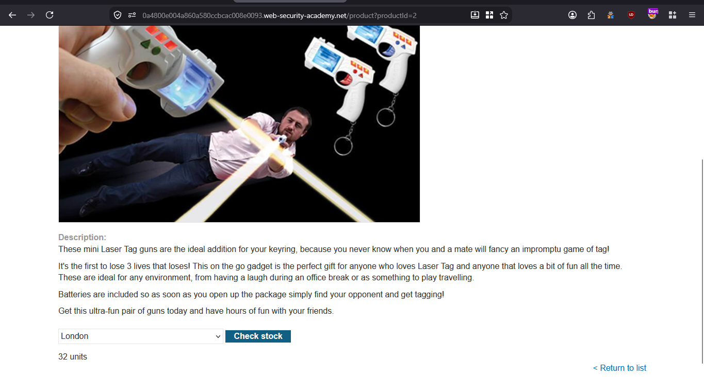
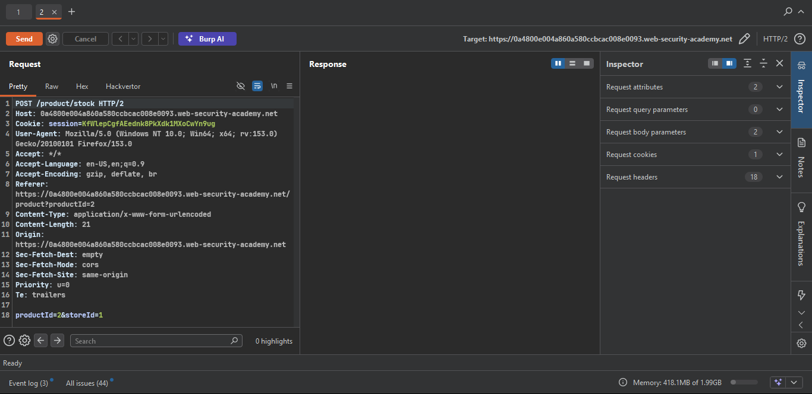
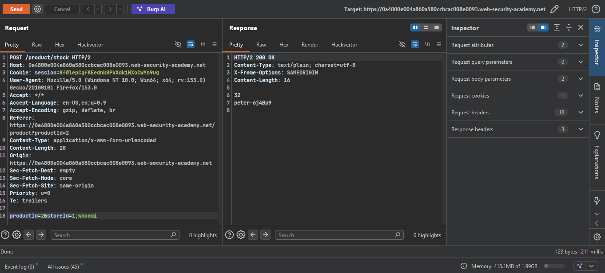
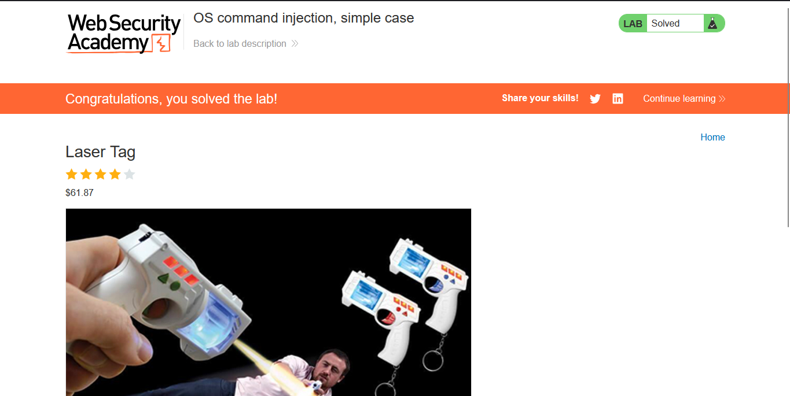

>> Target Lab: OS command injection, simple case

---
**Vuln**
- OS command injection vulnerability in the product stock checker.  

**Goal**
- execute the whoami command to determine the name of the current user. 

---

### Steps:
1. #### Open the lab..
2. #### click any product detail and check stock id  
    - 
    - capture the request in burp suite
    - observe the request
    - send the request to repeater
    - 

3. #### try to simple whoami execution on the stockid parameter.
    - 
    - 200 ok
4. #### Solve the lab
    - 

`Check` POC.py for automation.