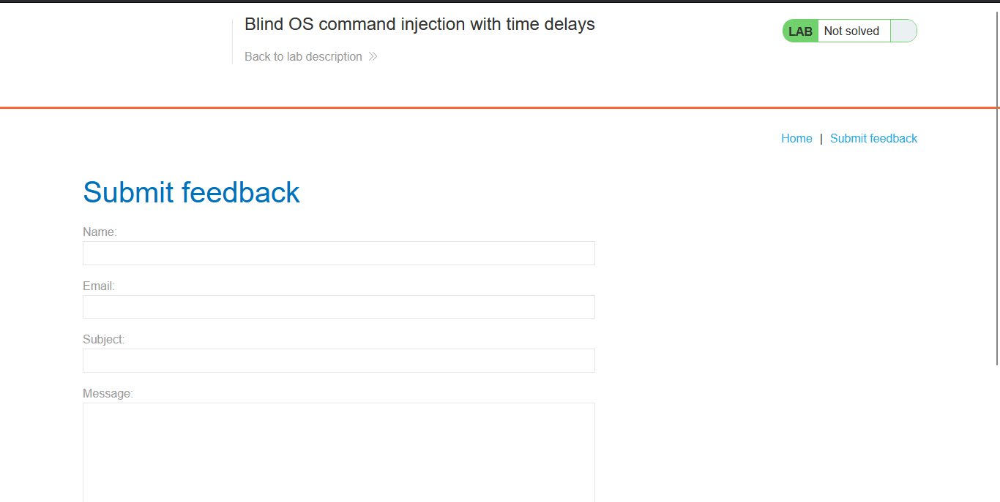
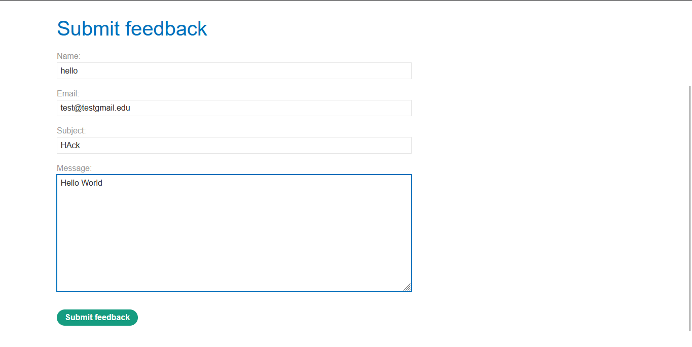
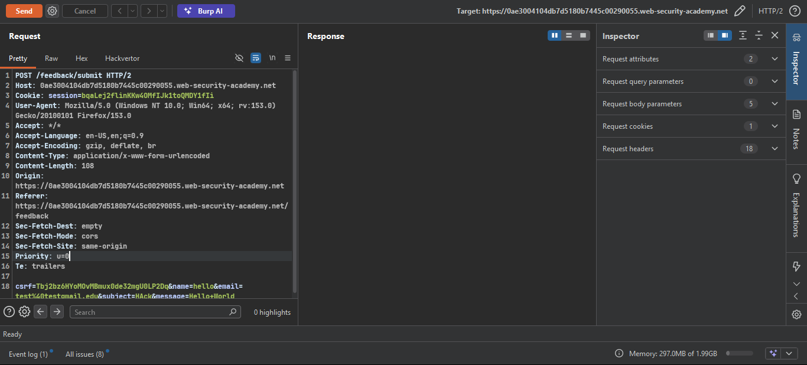
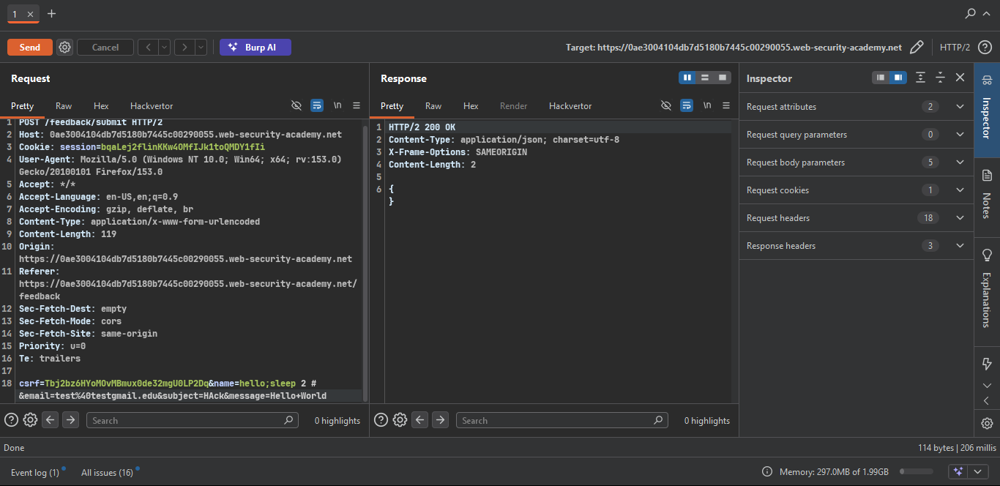
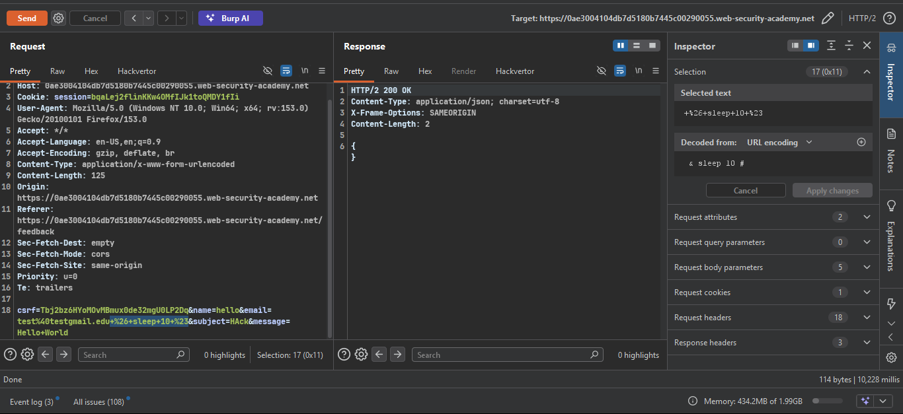
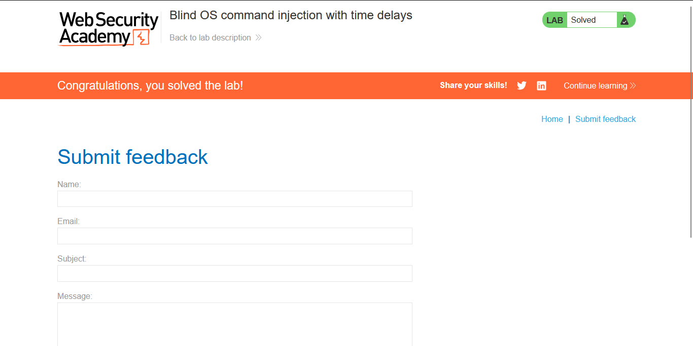

>> Target Lab: Blind OS command injection with time delays

--- 
**Vulnerability**
- Blind OS command injection vulnerability in the feedback function.

**Goal**
- Exploit the blind OS command injection vulnerability to cause a 10-second delay.

---

### Steps:

#### 1. Open the Lab
- Access the lab interface in the browser.

#### 2. Locate the Feedback Feature
- Navigate to the **Submit feedback** page.
- 

#### 3. Intercept and Analyze Request
- Fill out the feedback form with dummy data.
- Capture the POST request in Burp Suite and send it to **Repeater**.
- 
- 

#### 4. Testing for Blind OS Command Injection (Time Delays)
> **Note:** Always URL-encode special characters / spaces in Burp Repeater using `Ctrl + U` before sending.

- **Test Payload:**
  ```bash
  & sleep 10 #
  ```

- **Testing other input fields (e.g., name / subject / message):**
  - Response returns `200 OK` immediately without any delay (Not vulnerable).
  - 

- **Testing the `email` field (Vulnerable Parameter):**
  - Inject the payload into the `email` parameter and URL-encode it (`Ctrl + U`):
    ```http
    email=test@testgmail.edu & sleep 10 #
    ```
    *(URL-encoded in POST body: `email=test%40testgmail.edu+%26+sleep+10+%23`)*
  - 
  - The server delays response by **~10 seconds** (10,000+ ms in Burp Repeater), confirming command execution!
  - 

#### 5. Lab Solved
- The lab is successfully solved once the 10-second delay is triggered.
- 
