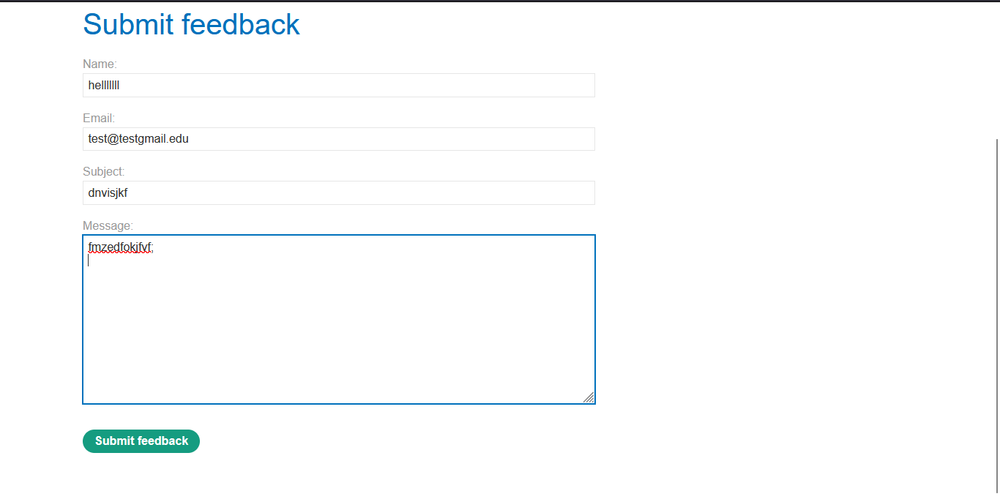
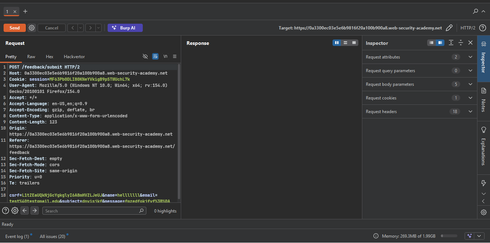
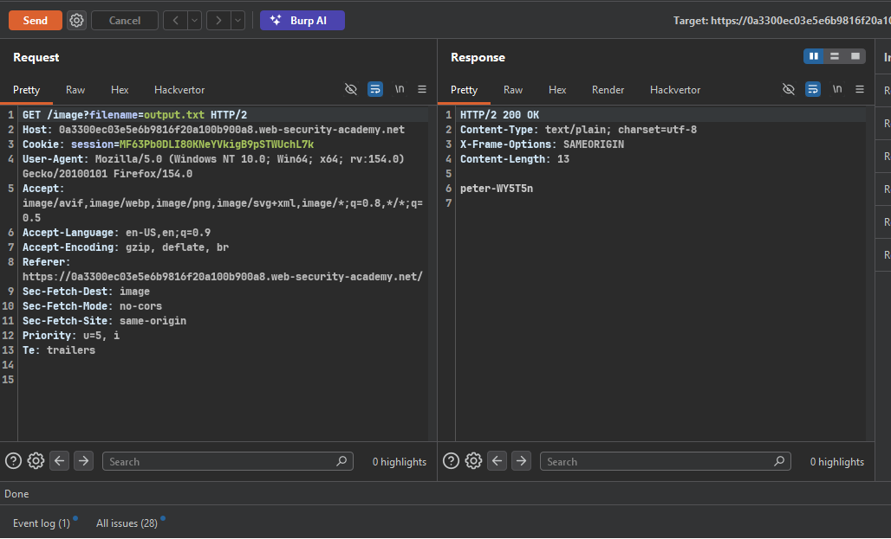
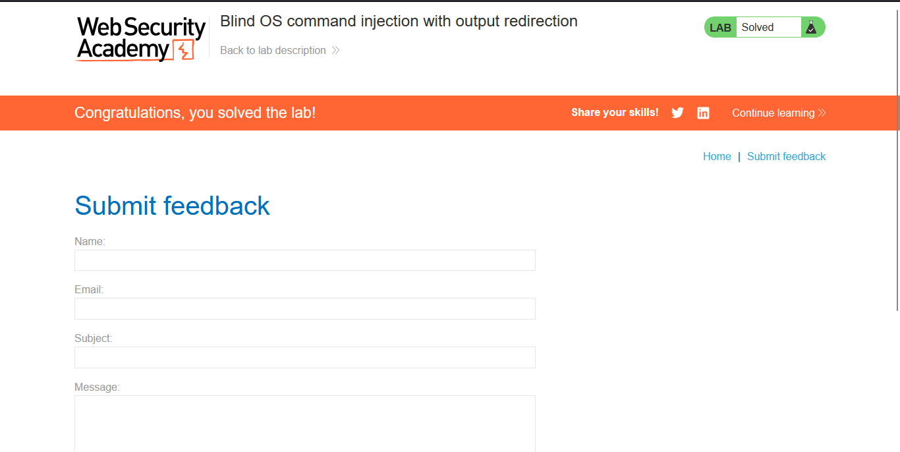

>> Target Lab: Blind OS command injection with output redirection

---
**Vulnerability**
- Blind OS command injection vulnerability in the feedback function.

**Goal**
- Execute the `whoami` command and retrieve the output using output redirection.

---

### Steps:

#### 1. Open the Lab
- Access the lab interface in the browser.

#### 2. Locate the Feedback Feature
- Navigate to the **Submit feedback** page.
- 


#### 3. Intercept and Analyze Request
- Fill out the feedback form with dummy data.
- Capture the POST request in Burp Suite and send it to **Repeater**.
- 
- our vuln endpoint is email field 

#### 4. Identify the Writable Directory
- The lab tells us there's a writable folder at:
**/var/www/images/**
- The application serves product catalog images from this location. We can use output redirection to send the command's output into a file here, then retrieve it via the image loading URL.

#### 5. Inject Command with Output Redirection
> **Note:** Always URL-encode special characters / spaces in Burp Repeater using `Ctrl + U` before sending.

- **Test Payload:**
```bash
  || whoami > /var/www/images/output.txt ||
```

- **Testing other input fields (e.g., name / subject / message):**
  - No change in behavior, response is identical to normal (Not vulnerable).

- **Testing the `email` field (Vulnerable Parameter):**
  - Modify the `email` parameter:
```http
    email=||whoami>/var/www/images/output.txt||
```
  - URL-encode the payload (`Ctrl + U`) before sending.

  - Send the request — nothing visible in the response body (blind injection), but the command executes on the backend.

#### 6. Retrieve the Output via Image Loading Request
- Intercept the request that loads a product image — it uses a `filename` parameter to fetch images.
- Modify the `filename` parameter to point to the file just created:
```http
  filename=output.txt
```
- Forward the request.
- 

#### 7. Confirm Command Execution
- The response body now contains the output of the `whoami` command (e.g., `peter-XXXX` or similar user).

- This confirms successful exploitation of the blind OS command injection via output redirection.

#### 8. Lab Solved
- As soon as the `whoami` output appears in the response, the lab is automatically marked "Solved".
- 