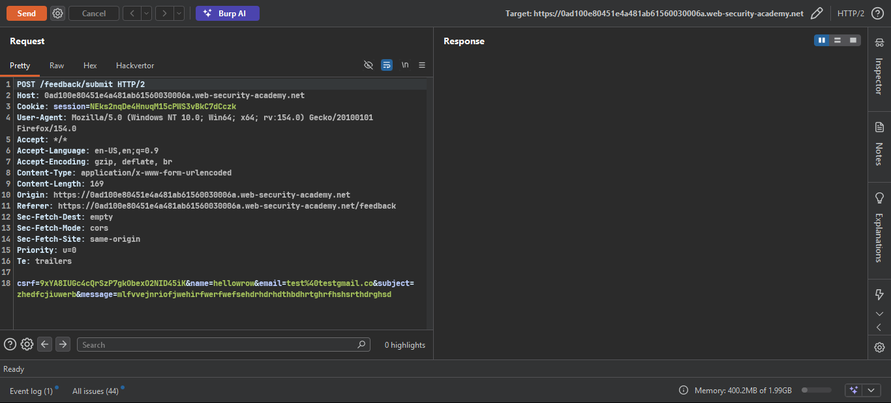
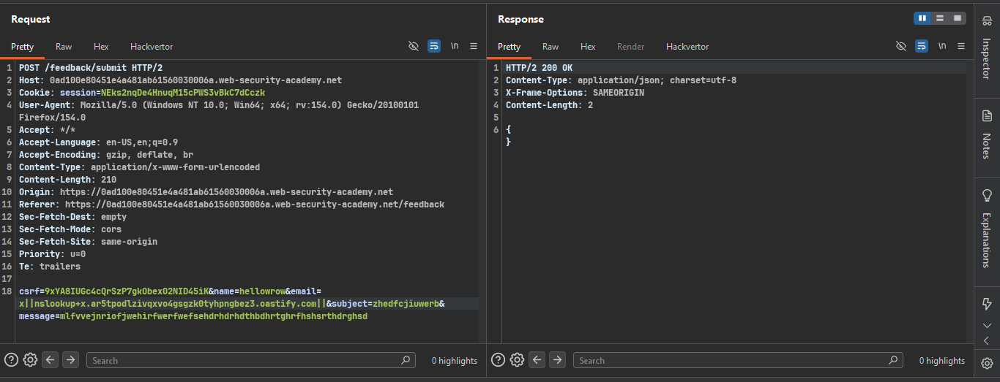
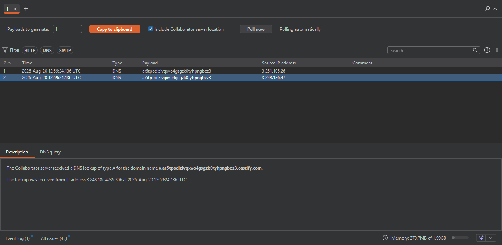
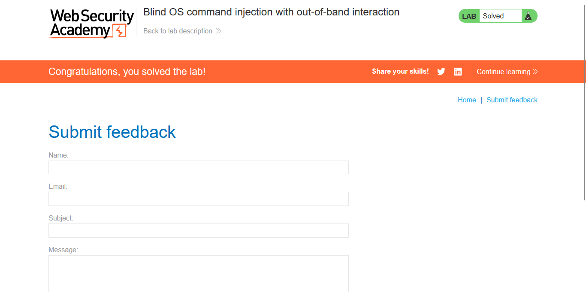

>> Target Lab: Blind OS command injection with out-of-band interaction

---
**Vulnerability**
- Blind OS command injection vulnerability in the feedback function.

**Goal**
- Trigger an out-of-band DNS lookup to Burp Collaborator to confirm command execution.

---

### Steps:

#### 1. Open the Lab
- Access the lab interface in the browser.

#### 2. Intercept the Feedback Request
- Fill out the feedback form with dummy data.
- Capture the POST request in Burp Suite and send it to **Repeater**.
- 

#### 3. Inject OOB Payload in `email` Parameter
- Modify the `email` parameter:
```http
  email=x||nslookup+x.BURP-COLLABORATOR-SUBDOMAIN||
```
- Right-click the payload → **Insert Collaborator payload** (Burp auto-fills your unique Collaborator subdomain).


#### 4. Send the Request
- URL-encode if needed (`Ctrl + U`) and send.
- Response returns normally — no visible output (blind + async execution).
- 

#### 5. Check Burp Collaborator
- Go to **Burp > Collaborator** tab → click **Poll now**.
- A DNS interaction from the target server confirms the command executed.
- 

#### 6. Lab Solved
- Once the DNS lookup is received by Collaborator, the lab is automatically marked "Solved".
- 