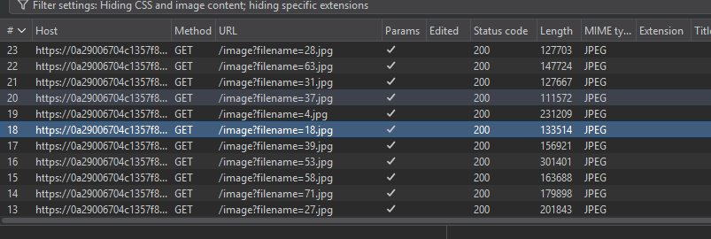
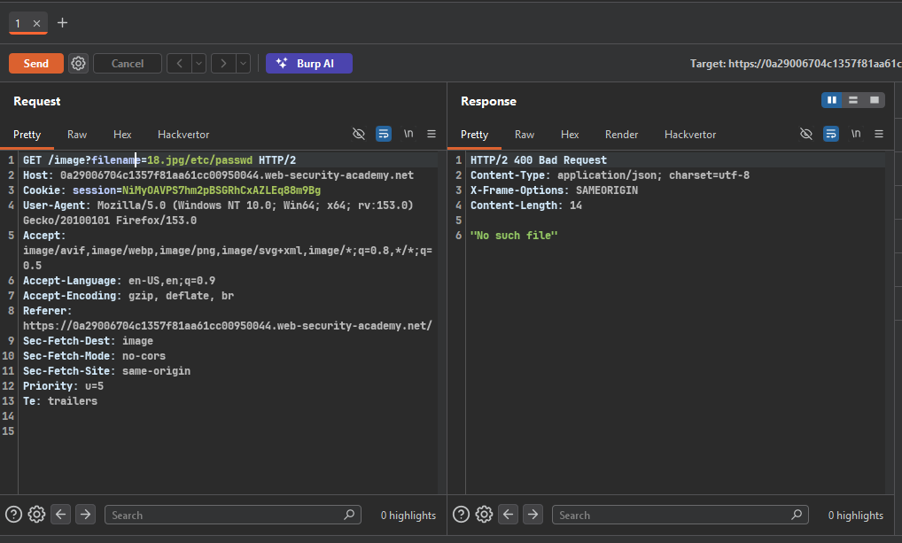
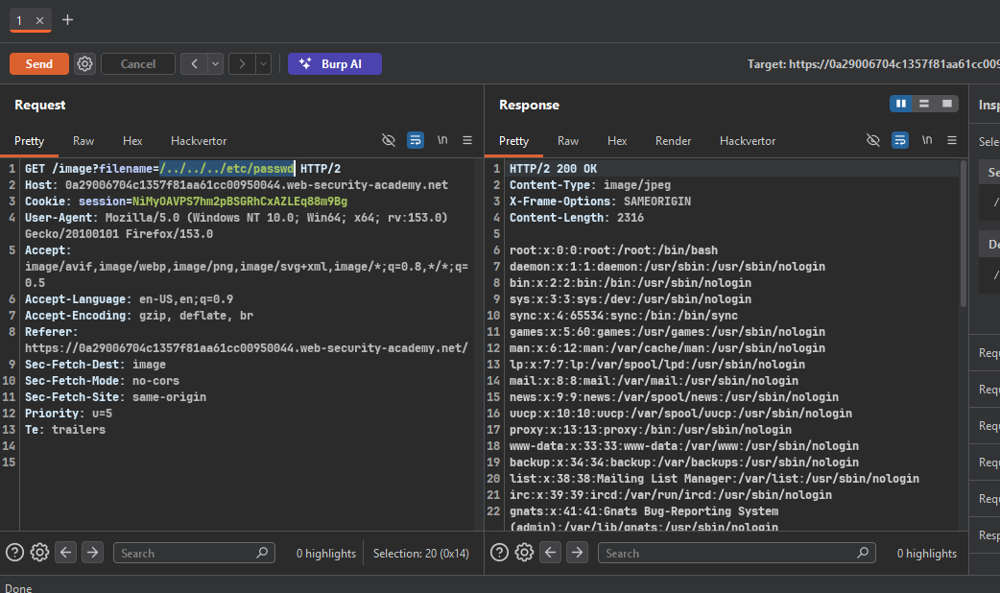

>> ### Target Lab: File path traversal, simple case

--- 
**vuln**
- This lab contains a path traversal vulnerability in the display of product images. 

**Goal**
-  retrieve the contents of the /etc/passwd file.

---

### Steps:
1. #### on burp proxy 
2. #### and open the lab..
3. #### capture page load requests
    - 
    - send any jpg  request to repeater 
4. #### try simple traversal payloads
    - 
    - no such file 
    - try ../etc/passwd
    - nothing work 
    - so i try remove the .jpg suffix and try /../../../etc/passwd
    - yes thats work 
    - 

5. #### Solve the lab 
    - 

`Check` POC.py