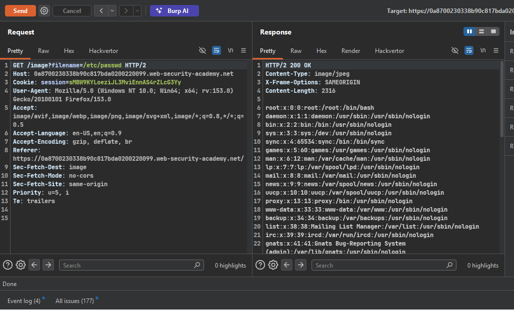
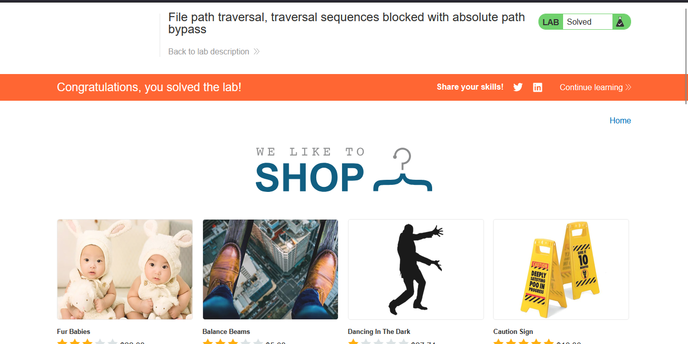

>> Target Lab: File path traversal, traversal sequences blocked with absolute path bypass

---

**Vuln**
- This lab contains a path traversal vulnerability in the display of product images. 
**Goal**
-  retrieve the contents of the /etc/passwd file. 

---

`note:` `The application blocks traversal sequences but treats the supplied filename as being relative to a default working directory.`

#### Steps:
1. #### On burp proxy and see images request in proxy history.
2. #### send simple payload bcz the application blocks traversal sequences but treats the supplied filename as being relative to a default working directory. 
    - /etc/passwd

3. #### we can see the content of /etc/passwd file in response.
    - 

4. #### solve the lab
    - 

`check` POC.py