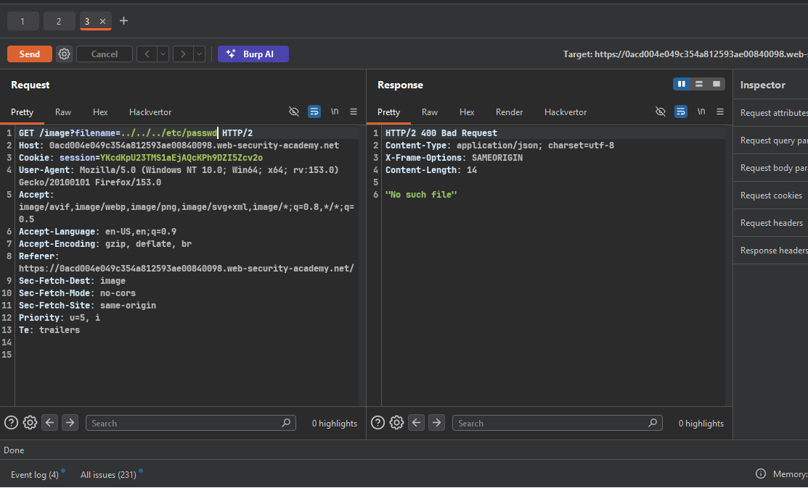
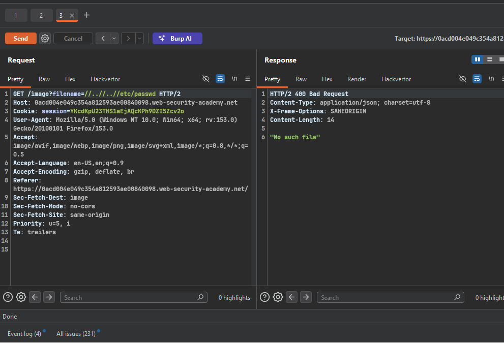
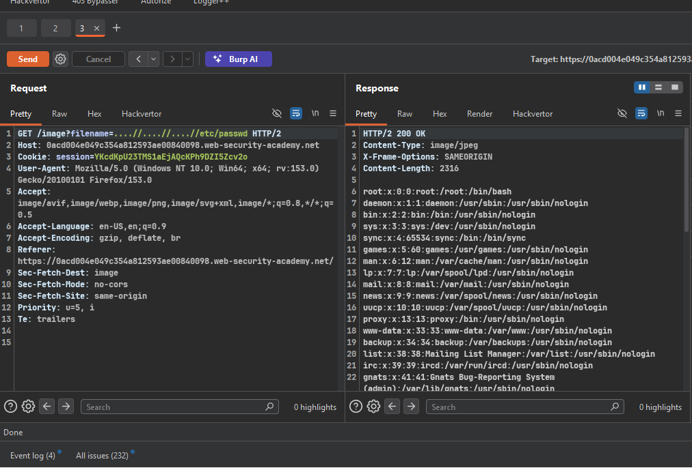

>> ### Target Lab: File path traversal, traversal sequences stripped non-recursively

---

**Vuln**
- in product image 

**Goal**
- Lab: File path traversal, traversal sequences stripped non-recursively

---

### Steps:
1. #### On burp proxy and see images request in proxy history.
2. #### try simple payload 
    - 
    - they did not work 
    - try this 
    - 
    - but they did not work
 
3. #### Try Non-Recursive Filter Bypass — server strips `../` only once (non-recursive)
   - Payload: `....//....//....//etc/passwd`
   - Logic: after removing inner `../`, outer `..` + `/` reforms into `../`
   - Worked!
    - 

4. #### solve the lab
    - 

`check` POC.py