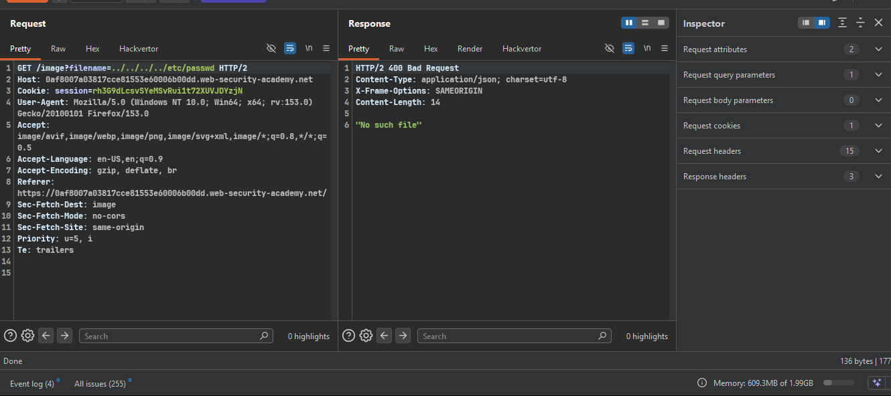
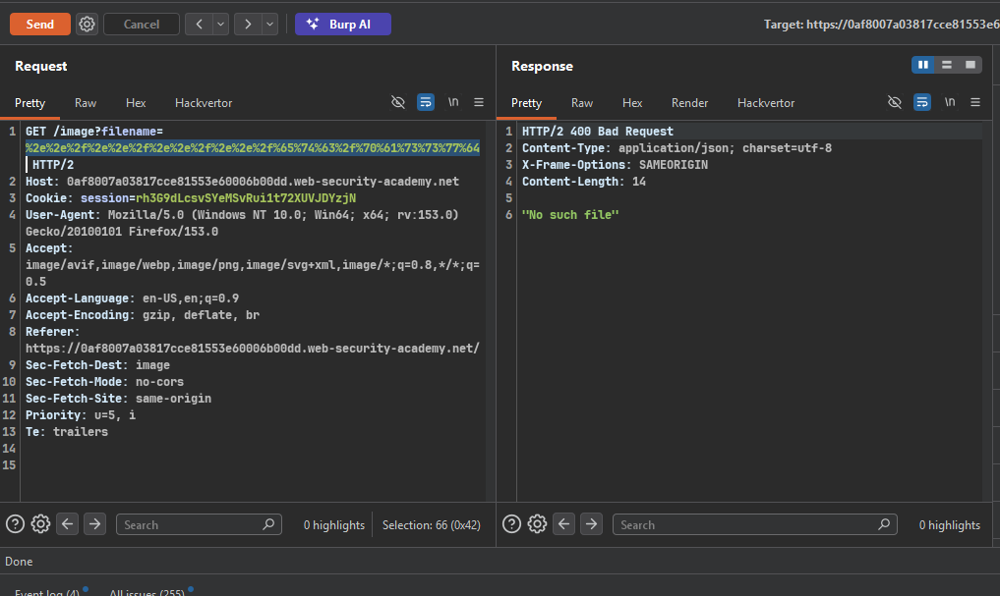
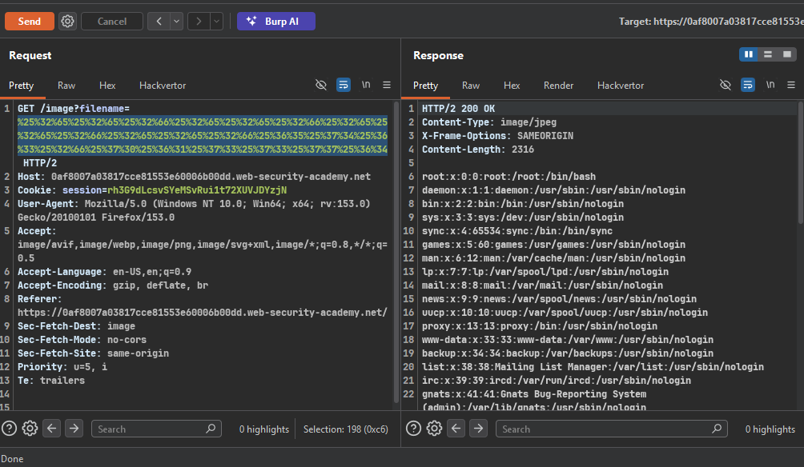

### Target Lab: File path traversal, traversal sequences stripped with superfluous URL-decode

---
**Vuln**
- in product image

**Goal**
- retrieve the contents of the /etc/passwd file.

---

### Steps:
1. #### On burp proxy and see images request in proxy history.
2. #### send image request to repeater
    - try `../../../etc/passwd` and some other payloads
    - 
    - they did not work
    - try single URL-encoding the payload: `%2e%2e%2f%2e%2e%2f%2e%2e%2fetc%2fpasswd`
    -> 
    - still did not work so use double encoding: `..%252f..%252f..%252fetc%252fpasswd`
    - 
    - this worked and we can see the content of /etc/passwd file in response.
3. #### solve the lab
    - 

**Key Takeaway:**
> Root cause = decoding AFTER filter validation instead of BEFORE.
> Filter validates a still-encoded string, but the value used in the actual
> file operation is decoded again post-validation — creating a mismatch
> between "what was checked" and "what was used".