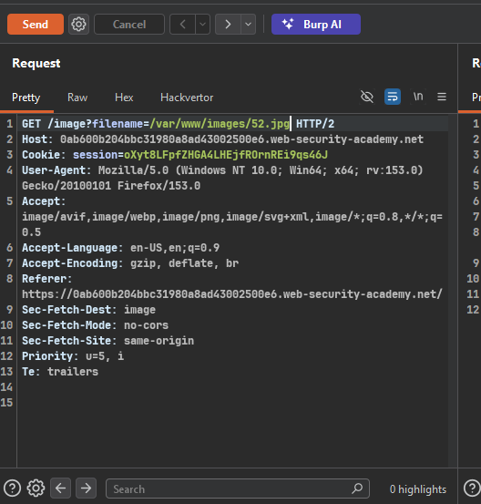
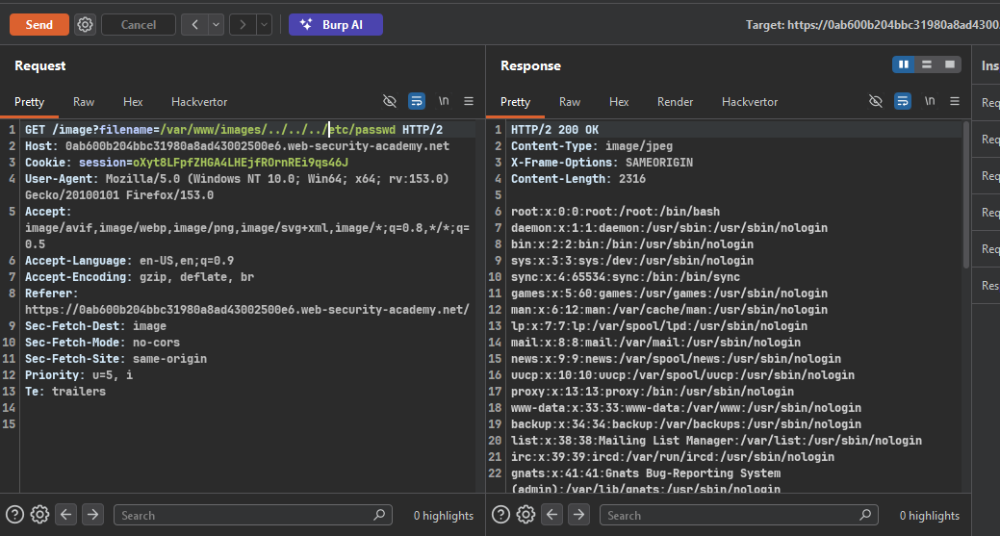

### Target Lab: File path traversal, validation of start of path

---
**Vuln**
- in product image

**Goal**
- retrieve the contents of the /etc/passwd file.

---

### Steps:
1. #### On burp proxy, capture the image request in proxy history
    - request sends full path as parameter, not just filename:
    - `GET /image?filename=/var/www/images/52.jpg`
    - 

2. #### Understand the validation
    - App checks if `filename` parameter **starts with** the expected
      folder (`/var/www/images/`)
    - Since full path is user-controlled, we can keep the required
      prefix and append traversal sequences after it

3. #### Craft bypass payload
    - Payload: `/var/www/images/../../../etc/passwd`
    - Logic:
      - Validation check: does path start with `/var/www/images/`? → YES, passes
      - File resolution: `../../../` traverses up and out to `/etc/passwd`
    - 
    - Worked! Response returns `/etc/passwd` contents.

4. #### Solve the lab
    - Lab marked as solved after retrieving `/etc/passwd` content.

---

**Key Takeaway:**
> Root cause = validation only checks the START of the path (prefix
> whitelist), not the fully resolved path. Since the app trusts the
> user-supplied path is safe just because it begins correctly, an
> attacker can satisfy the prefix check and still append traversal
> sequences afterward to escape the intended directory.