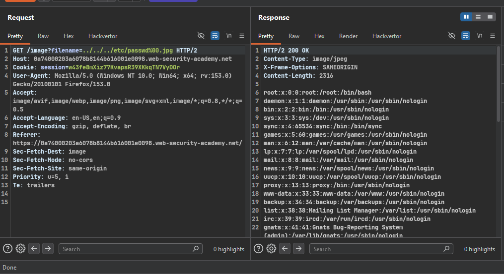

### Target Lab: File path traversal, validation of file extension with null byte bypass

---
**Vuln**
- in product image

**Goal**
- retrieve the contents of the /etc/passwd file.

---

### Steps:
1. #### On burp proxy, capture the image request
    - `GET /image?filename=../../../etc/passwd%00.jpg`

2. #### Understand the validation
    - App checks if filename ENDS WITH `.jpg` (extension whitelist check)
    - Plain traversal payload `../../../etc/passwd` fails this check
      (doesn't end in `.jpg`)

3. #### Bypass using Null Byte
    - Payload: `../../../etc/passwd%00.jpg`
    - Logic (two layers, two different views of the same string):
      - High-level app validation (length-prefixed string) sees the
        FULL string → it DOES end with `.jpg` → validation PASSES
      - Low-level OS file API (null-terminated string) stops reading
        at `%00` (null byte) → effectively reads `../../../etc/passwd`
        only, `.jpg` part is discarded
    - 
    - Worked! Response returns /etc/passwd content.

4. #### Solve the lab
    - Lab marked solved after retrieving file contents.

---

**Key Takeaway:**
> Root cause = mismatch between how validation layer interprets the
> string (full string check) vs how the OS/filesystem layer interprets
> it (null-terminated, cuts off after %00). Validation checks the
> extension on data it never actually uses to open the file — the
> string used for the file read differs from the string that was
> validated.
> Note: patched in modern PHP (5.3.4+)/Java — legacy-era vulnerability.